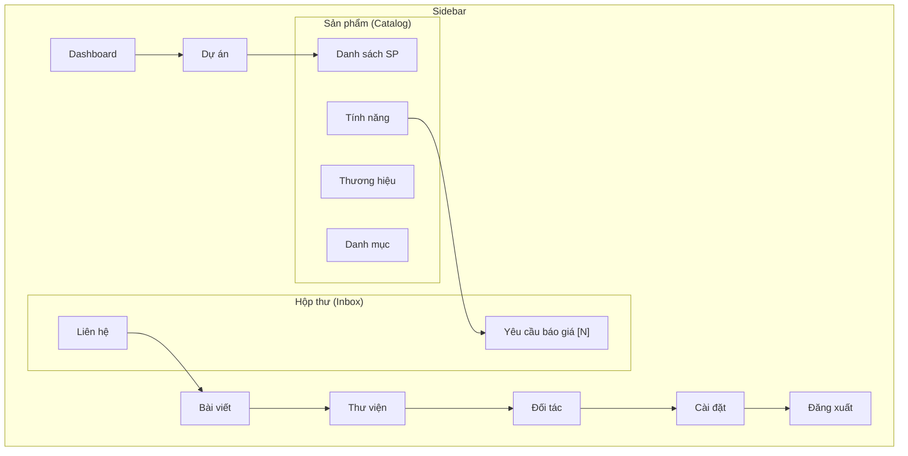

# Design: Admin UX Restructure — Sidebar & Quotation UI

## Overview

This design restructures the Admin Panel sidebar to separate "Catalog Management" from "Lead Management" by introducing a new **"Hộp thư" (Inbox)** collapsible group. It also refines the Quotation detail UI with Zalo integration, email copy, improved status color coding, and a more prominent Excel download button.

## Architecture

### Current Sidebar Structure
```
Dashboard
Dự án
▼ Sản phẩm
  ├ Danh sách sản phẩm
  ├ Thương hiệu
  ├ Danh mục
  ├ Tính năng
  └ Yêu cầu báo giá  ← OUT OF PLACE
Bài viết
Thư viện
Đối tác
Liên hệ                 ← STANDALONE
Cài đặt
───────
Đăng xuất
```

### New Sidebar Structure
```
Dashboard
Dự án
▼ Sản phẩm (Catalog Management)
  ├ Danh sách sản phẩm
  ├ Thương hiệu
  ├ Danh mục
  └ Tính năng
▼ Hộp thư (Lead Management)    ← NEW GROUP
  ├ Yêu cầu báo giá [badge]   ← MOVED + BADGE
  └ Liên hệ                    ← MOVED
Bài viết
Thư viện
Đối tác
Cài đặt
───────
Đăng xuất
```

### Sidebar Diagram



## Detailed Design

### 1. AdminLayout.tsx — Sidebar Restructure

#### Changes to Data Structures

**Remove** `quotations` from `productSubItems`:
```typescript
const productSubItems = [
  { to: "/admin/products", icon: List, label: "Danh sách sản phẩm" },
  { to: "/admin/brands", icon: Tags, label: "Thương hiệu" },
  { to: "/admin/categories", icon: Layers, label: "Danh mục" },
  { to: "/admin/features", icon: Sparkles, label: "Tính năng" },
  // REMOVED: quotations
];
```

**Add** new `inboxSubItems`:
```typescript
const inboxSubItems = [
  { to: "/admin/quotations", icon: ClipboardList, label: "Yêu cầu báo giá" },
  { to: "/admin/contacts", icon: Mail, label: "Liên hệ" },
];
```

**Remove** `contacts` from `bottomNavItems`:
```typescript
const bottomNavItems = [
  { to: "/admin/posts", icon: FileText, label: "Bài viết" },
  { to: "/admin/gallery", icon: Image, label: "Thư viện" },
  { to: "/admin/partners", icon: Handshake, label: "Đối tác" },
  // REMOVED: contacts
  { to: "/admin/settings", icon: Settings, label: "Cài đặt" },
];
```

#### Route Checker Functions

**Update** `isProductRoute` — remove quotations:
```typescript
function isProductRoute(pathname: string): boolean {
  return ["/admin/products", "/admin/brands", "/admin/categories", "/admin/features"]
    .some(p => pathname === p || pathname.startsWith(p + "/"));
}
```

**Add** `isInboxRoute`:
```typescript
function isInboxRoute(pathname: string): boolean {
  return ["/admin/quotations", "/admin/contacts"]
    .some(p => pathname === p || pathname.startsWith(p + "/"));
}
```

#### Collapsible Menu Implementation

The new "Hộp thư" group follows the exact same pattern as "Sản phẩm":
- `useState` for `inboxMenuOpen` (auto-expand if on inbox route)
- `useEffect` to keep it open when navigating within inbox routes
- Same chevron toggle button pattern
- Same slide animation with `max-h` transition
- Icon: `Inbox` from lucide-react
- Optional: badge count for new RFQs (fetched on mount)

#### Badge Count (Optional Enhancement)

Fetch the count of "new" quotation requests on component mount:
```typescript
const [newQuoteCount, setNewQuoteCount] = useState(0);

useEffect(() => {
  adminApi.quotations.list({ status: "new", limit: 1 })
    .then(r => setNewQuoteCount(r.total))
    .catch(() => {});
}, []);
```

Display as a small pill badge in the sidebar next to "Yêu cầu báo giá":
```tsx
{newQuoteCount > 0 && (
  <span className="ml-auto inline-flex h-5 min-w-[20px] items-center justify-center rounded-full bg-red-500 px-1.5 text-[10px] font-bold text-white">
    {newQuoteCount > 99 ? "99+" : newQuoteCount}
  </span>
)}
```

### 2. AdminQuotations.tsx — UI Refinements

#### 2a. Zalo Integration (Phone Number)

In the expanded detail customer info section, change the phone link:

**Before:**
```tsx
<a href={`tel:${detail.phone}`} className="text-blue-600 hover:underline">
  {detail.phone}
</a>
```

**After:**
```tsx
<a href={`https://zalo.me/${detail.phone}`} target="_blank" rel="noopener noreferrer"
   className="inline-flex items-center gap-1.5 text-blue-600 hover:underline">
  {detail.phone}
  
</a>
```

> **Note:** We'll use an inline SVG for the Zalo icon to avoid external dependency. The icon will be embedded as a small component.

#### 2b. Email Copy Action

Add a copy button next to the email:
```tsx
<button
  onClick={(e) => {
    e.stopPropagation();
    navigator.clipboard.writeText(detail.email);
    toast.success("Đã sao chép email");
  }}
  className="ml-1 rounded p-0.5 text-slate-400 hover:bg-slate-100 hover:text-slate-600"
  title="Sao chép email"
>
  <Copy className="h-3.5 w-3.5" />
</button>
```

#### 2c. Status Color Refinement

Update `STATUS_CONFIG` to use more distinct colors per the requirement:

```typescript
const STATUS_CONFIG = {
  new:        { label: "Mới",        color: "text-blue-700",   bg: "bg-blue-50 border-blue-200" },
  processing: { label: "Đang xử lý", color: "text-amber-700",  bg: "bg-amber-50 border-amber-200" },
  sent:       { label: "Đã gửi",    color: "text-indigo-700", bg: "bg-indigo-50 border-indigo-200" },
  completed:  { label: "Hoàn tất",  color: "text-green-700",  bg: "bg-green-50 border-green-200" },
};
```

Changes from current:
- `sent`: changed from emerald to **indigo** (to differentiate from completed)
- `completed`: changed from slate to **green** (to indicate positive completion)

#### 2d. Prominent "Tải Excel" Button

Upgrade the "Tải Excel" button from `variant="outline"` to a more visually prominent style:
```tsx
<Button
  size="sm"
  onClick={...}
  className="bg-blue-600 text-white hover:bg-blue-700 shadow-sm"
>
  <Download className="mr-1.5 h-4 w-4" />
  Tải Excel
</Button>
```

## File Changes Summary

| File | Action | Description |
|------|--------|-------------|
| `src/components/admin/AdminLayout.tsx` | MODIFY | Restructure sidebar (new Hộp thư group, remove quotations from products, remove contacts from bottom nav) |
| `src/pages/admin/AdminQuotations.tsx` | MODIFY | Add Zalo link, email copy, update status colors, enhance Excel button |

## Risks & Mitigations

| Risk | Mitigation |
|------|------------|
| Badge count API call adds latency | Use fire-and-forget useEffect, non-blocking |
| Zalo link may not work for all phone formats | Vietnamese phone numbers standard, works with `zalo.me/0xxx` |
| Clipboard API not available in HTTP | Site uses HTTPS in production; fallback toast for error |
