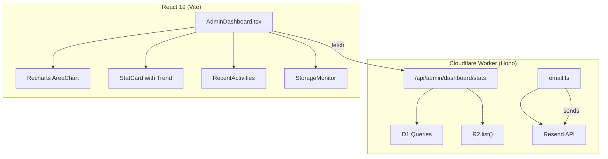

# Design: Admin Visual Intelligence

## Architecture Overview



---

## Module 1: Email Template Refinement

### Target Files

- `server/src/services/email.ts` — all 3 template functions

### HTML Email Design System (Inline CSS Only)

#### Base Layout

```
┌────────────────────────────────────────┐
│  [LOGO_IMG]  │  Title Text             │  ← Header row
│              │  Subtitle / Date        │
├──────────────┴─────────────────────────┤  ← 3px #3C5DAA divider
│                                        │
│  ┌──────────────────────────────────┐  │
│  │  LABEL: text-xs, uppercase, gray │  │  ← Info Card
│  │  VALUE: text-sm, medium, #1e293b │  │
│  └──────────────────────────────────┘  │
│                                        │
│  ┌──────────────────────────────────┐  │
│  │  Product Table (striped rows)    │  │  ← Data Table
│  │  Roboto Mono for numbers         │  │
│  └──────────────────────────────────┘  │
│                                        │
│  [ Xem chi tiết trong Admin ]          │  ← Primary CTA (#3C5DAA)
│  Chat Zalo  •  Soạn Mail               │  ← Secondary CTAs (links)
│                                        │
│  ─────────────────────────────────── │  ← Footer divider
│  Song Linh Technologies                │
│  0968.811.911 • songlinh@sltech.vn    │
│  www.sltech.vn                         │
└────────────────────────────────────────┘
```

#### Design Tokens (Inline CSS Values)

| Token | Value | Usage |
|-------|-------|-------|
| Brand Blue | `#3C5DAA` | Header accent, CTA button, divider |
| Slate 900 | `#0f172a` | Value text |
| Slate 500 | `#64748b` | Label text (uppercase, small) |
| Slate 100 | `#f1f5f9` | Striped row background |
| Card BG | `#ffffff` | Card background |
| Wrapper BG | `#f8fafc` | Email body background |
| Border | `#e2e8f0` | Card borders, table borders |
| Warning BG | `#fffbeb` | Note callout background |
| Warning Border | `#f59e0b` | Note callout left border |

#### Shared HTML Helpers to Create

1. **`buildEmailHeader(title: string, subtitle?: string)`** — Logo (left) + Title (right) + 3px blue divider. Logo URL sourced from `env.SITE_URL + "/logo-email.png"` with text fallback.
2. **`buildInfoRow(label: string, value: string)`** — Uppercase `text-xs` label + medium value.
3. **`buildEmailFooter(env: Env)`** — Company info + sltech.vn link.
4. **`buildActionButtons(env: Env, adminPath: string, phone?: string, email?: string)`** — Primary CTA button + optional Zalo/Email text links.

#### Template Changes

| Function | Changes |
|----------|---------|
| `sendQuotationAdminEmail` | Use new header, info cards for customer data, striped product table, action buttons with Zalo + Email compose links, footer |
| `sendContactAdminEmail` | Use new header, info cards for contact data, message callout, action buttons with Zalo + Email compose links, footer |
| `sendQuotationCustomerEmail` | Use new header (customer-facing, no admin CTA), professional body text, branded footer |

---

## Module 2: Dashboard Overhaul

### Target Files

- `server/src/routes/admin.ts` — `/dashboard/stats` endpoint (add trend data + storage stats)
- `src/types/index.ts` — `DashboardStats` type (add trends + storage fields)
- `src/pages/admin/AdminDashboard.tsx` — complete UI rewrite
- `src/lib/admin-api.ts` — no changes needed (already fetches from `/dashboard/stats`)

### Backend: Enhanced Stats Endpoint

**New queries to add to `/api/admin/dashboard/stats`:**

```sql
-- Trend: quotes this week vs last week
SELECT COUNT(*) as cnt FROM quotation_requests
WHERE deleted_at IS NULL
  AND created_at >= date('now', '-7 days');

SELECT COUNT(*) as cnt FROM quotation_requests
WHERE deleted_at IS NULL
  AND created_at >= date('now', '-14 days')
  AND created_at < date('now', '-7 days');

-- Trend: contacts this week vs last week
SELECT COUNT(*) as cnt FROM contacts
WHERE deleted_at IS NULL
  AND created_at >= date('now', '-7 days');

SELECT COUNT(*) as cnt FROM contacts
WHERE deleted_at IS NULL
  AND created_at >= date('now', '-14 days')
  AND created_at < date('now', '-7 days');

-- Daily quotation chart (last 30 days)
SELECT strftime('%Y-%m-%d', created_at) as day, COUNT(*) as cnt
FROM quotation_requests
WHERE deleted_at IS NULL
  AND created_at >= date('now', '-30 days')
GROUP BY day
ORDER BY day ASC;

-- Storage: D1 row counts
SELECT
  (SELECT COUNT(*) FROM products WHERE deleted_at IS NULL) as products,
  (SELECT COUNT(*) FROM projects WHERE deleted_at IS NULL) as projects,
  (SELECT COUNT(*) FROM contacts WHERE deleted_at IS NULL) as contacts,
  (SELECT COUNT(*) FROM quotation_requests WHERE deleted_at IS NULL) as quotations,
  (SELECT COUNT(*) FROM posts WHERE deleted_at IS NULL) as posts;
```

**R2 storage** via `c.env.IMAGES.list()` — returns object count. Total size is not directly available from R2 list, so we'll report object count only.

### Updated `DashboardStats` Type

```typescript
export interface DashboardStats {
  // Stat cards
  totalProducts: number;
  featuredProjects: number;
  unreadQuotes: number;
  unreadContacts: number;
  // Trend deltas (this week vs last week)
  trends: {
    quotesThisWeek: number;
    quotesLastWeek: number;
    contactsThisWeek: number;
    contactsLastWeek: number;
  };
  // Chart: daily quotation requests (last 30 days)
  dailyQuotesChart: Array<{ day: string; cnt: number }>;
  // Recent quotes (top 5)
  recentQuotes: Array<{
    id: number;
    customer_name: string;
    project_name: string | null;
    status: string;
    created_at: string;
  }>;
  // Storage monitoring
  storage: {
    d1: {
      products: number;
      projects: number;
      contacts: number;
      quotations: number;
      posts: number;
    };
    r2ObjectCount: number;
  };
}
```

### Frontend: Dashboard Layout

```
┌─────────────────────────────────────────────────────┐
│  Business Intelligence                               │
│  Tổng quan hiệu suất vận hành hệ thống SLTECH      │
├─────────┬─────────┬─────────┬───────────────────────┤
│ Products│ Projects│ Quotes  │ Contacts              │
│  42     │  8      │  5      │  3                    │
│         │         │ +2 ▲    │ +1 ▲                  │  ← Trend badges
├─────────┴─────────┴─────────┴───────────────────────┤
│                                                       │
│  ┌───────────────────────────────────────────────┐   │
│  │  Recharts AreaChart — Quotation Requests      │   │
│  │  (Last 30 Days)                                │   │
│  │  stroke: #3C5DAA, fill: gradient              │   │
│  └───────────────────────────────────────────────┘   │
│                                                       │
├──────────────────────────┬──────────────────────────┤
│ Recent Activities        │ Storage Usage            │
│ (Top 5 Quotations)      │ ┌─ D1 Database ────────┐ │
│ #12 Nguyễn Văn A  [Mới] │ │ Products:   42 rows  │ │
│ #11 Trần B    [Đang xử] │ │ Quotes:    127 rows  │ │
│ ...                      │ │ Contacts:   35 rows  │ │
│                          │ └─ R2 Storage ─────────┘ │
│                          │   156 objects             │
└──────────────────────────┴──────────────────────────┘
```

### Component Breakdown

1. **StatCard** — Reuse existing shadcn `Card` with added trend badge (green ▲ / red ▼ / gray —).
2. **QuotationAreaChart** — New component using `recharts` `AreaChart`, `Area`, `XAxis`, `YAxis`, `Tooltip`, `ResponsiveContainer`. Stroke `#3C5DAA`, fill with `linearGradient` from `#3C5DAA` (opacity 0.3) to transparent.
3. **RecentActivities** — Existing table with status badges (already built, keep as-is).
4. **StorageMonitor** — New card with `Progress` indicators for D1 entities and R2 object count.

---

## Design Decisions

| Decision | Rationale |
|----------|-----------|
| Recharts over Chart.js | Recharts is React-native, tree-shakable, and smaller for the specific chart type we need (AreaChart only). |
| Daily granularity (30 days) over monthly (6 months) | Daily data shows actionable patterns (weekday vs. weekend demand). Monthly aggregation is too coarse for a B2B operation. |
| Inline CSS for emails | Email client compatibility. No `<style>` blocks (Gmail, Outlook strip them). |
| Logo via URL not data:URI | Gmail has a ~10KB limit on data URIs before stripping them. A hosted image URL is more reliable. |
| R2 object count only (no size) | R2 `.list()` returns keys but not aggregated size without iterating. Object count is sufficient for monitoring. |

## Security

- No changes to auth. Dashboard stats endpoint already behind `requireAuth` middleware.
- Email templates don't expose any sensitive data not already sent (customer info is intentional).

## Performance

- Dashboard stats query is already bounded (COUNT queries on indexed tables + LIMIT 5 for recent quotes).
- Adding 4 more COUNT queries and a 30-day aggregation is negligible on D1.
- R2 `.list()` without prefix returns up to 1000 keys by default — sufficient for monitoring, no pagination needed.
- Recharts is lazy-loaded since the admin dashboard is already code-split via React Router.
