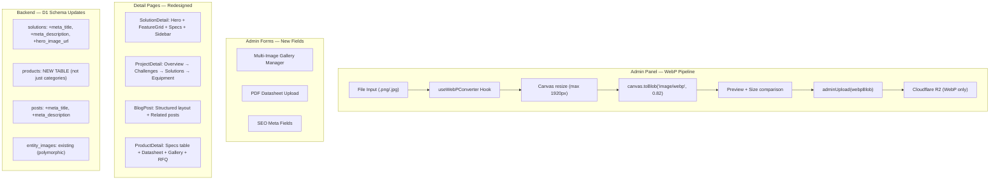

# Design — B2B Platform Comprehensive Upgrade

## Architecture Overview



## Data Models

### EXISTING: `products` Table (D1) — needs ALTER TABLE

> **Note**: Table `products` already exists (from `0001_initial_schema.sql`) with basic columns. Need to ADD new columns.

```sql
-- Products: add detailed B2B fields
ALTER TABLE products ADD COLUMN brand TEXT DEFAULT '';
ALTER TABLE products ADD COLUMN model_number TEXT DEFAULT '';
ALTER TABLE products ADD COLUMN specifications TEXT DEFAULT '{}';  -- JSON {"resolution":"4MP","lens":"2.8mm"}
ALTER TABLE products ADD COLUMN features TEXT DEFAULT '[]';        -- JSON ["IP67","PoE","AI"]
ALTER TABLE products ADD COLUMN meta_title TEXT;
ALTER TABLE products ADD COLUMN meta_description TEXT;
ALTER TABLE products ADD COLUMN updated_at TEXT DEFAULT (datetime('now'));
```

### ALTER TABLE Migrations

```sql
-- Solutions: add hero_image_url + SEO
ALTER TABLE solutions ADD COLUMN hero_image_url TEXT;
ALTER TABLE solutions ADD COLUMN meta_title TEXT;
ALTER TABLE solutions ADD COLUMN meta_description TEXT;

-- Posts: add SEO
ALTER TABLE posts ADD COLUMN meta_title TEXT;
ALTER TABLE posts ADD COLUMN meta_description TEXT;

-- Projects: add SEO (system_types etc. already exist)
ALTER TABLE projects ADD COLUMN meta_title TEXT;
ALTER TABLE projects ADD COLUMN meta_description TEXT;
```

### TypeScript Types Update

```typescript
// New product type (admin-api.ts)
export interface Product {
  id: number;
  slug: string;
  name: string;
  description: string;
  category_id: number | null;
  brand: string;
  model_number: string;
  image_url: string | null;
  spec_sheet_url: string | null;
  specifications: string; // JSON
  features: string;       // JSON
  sort_order: number;
  is_active: number;
  meta_title: string | null;
  meta_description: string | null;
  // Joined
  category?: { name: string; slug: string };
  images?: EntityImage[];
}

// SEO mixin for all entities
interface SEOMeta {
  meta_title: string | null;
  meta_description: string | null;
}
```

## Components

### A. WebP Converter Hook

```typescript
// src/hooks/useWebPConverter.ts
function useWebPConverter(options?: {
  maxWidth?: number;  // default 1920
  quality?: number;   // default 0.82
}): {
  convert: (file: File) => Promise<{ blob: Blob; previewUrl: string; originalSize: number; convertedSize: number }>;
  isConverting: boolean;
  progress: number;
}
```

**Logic flow:**
1. `FileReader` → load image into ``
2. Draw onto `<canvas>` (resize if > maxWidth)
3. `canvas.toBlob('image/webp', quality)` → WebP Blob
4. Create `URL.createObjectURL()` for preview
5. Return blob + preview + size comparison

### B. Admin Image Upload Component

```
┌──────────────────────────────────────────────┐
│  📷 Upload hình ảnh                          │
│  ┌──────────┐  ┌──────────┐  ┌──────────┐   │
│  │  img.webp │  │  img.webp │  │   + Add  │   │
│  │  125 KB   │  │  89 KB   │  │          │   │
│  │   [✕]     │  │   [✕]    │  │          │   │
│  └──────────┘  └──────────┘  └──────────┘   │
│                                              │
│  Converting: [████████░░] 80%  →  -65% size  │
└──────────────────────────────────────────────┘
```

### C. SolutionDetail Redesign

```
┌─────────────────────────────────────────────────────┐
│  ▌Hero Section (hero_image_url + overlay + title)   │
├───────────────────────────────────┬──────────────────┤
│  Feature Grid (2x2 or 3-col)     │  Sidebar          │
│  ┌────────┐  ┌────────┐          │  ┌──────────────┐ │
│  │ Icon   │  │ Icon   │          │  │ CTA: Liên hệ │ │
│  │ Title  │  │ Title  │          │  ├──────────────┤ │
│  │ Desc   │  │ Desc   │          │  │ Related      │ │
│  └────────┘  └────────┘          │  │ Solutions    │ │
│  ┌────────┐  ┌────────┐          │  └──────────────┘ │
│  │ Icon   │  │ Icon   │          │                    │
│  └────────┘  └────────┘          │                    │
├───────────────────────────────────┴──────────────────┤
│  Technical Specs / Content (prose)                    │
│  Gallery (entity_images)                              │
└─────────────────────────────────────────────────────┘
```

### D. ProjectDetail Case Study Sections

Current layout already has MetricsBar, SystemsList, ComplianceBadges. Enhancement:
- Parse `content_md` into sections: `## Tổng quan`, `## Thách thức kỹ thuật`, `## Giải pháp triển khai`, `## Thiết bị sử dụng`
- Render each as styled card/section instead of flat prose
- Add table-of-contents sidebar on desktop

### E. ProductDetail Enhanced Template

```
┌─────────────────────────────────────────────────────┐
│  Breadcrumb: Sản phẩm > Category > Product name     │
├───────────────────────────┬─────────────────────────┤
│  Image Gallery            │  Product Info            │
│  ┌──────────────────┐     │  Brand badge             │
│  │                  │     │  Product Name (H1)       │
│  │  Main Image      │     │  Model: ABC-123          │
│  │                  │     │  Description             │
│  └──────────────────┘     │                          │
│  [thumb] [thumb] [thumb]  │  [Thêm vào RFQ]          │
│                           │  [Tải Datasheet PDF]     │
├───────────────────────────┴─────────────────────────┤
│  Specifications Table                                 │
│  ┌──────────────┬──────────────────────────────────┐ │
│  │ Resolution   │ 4MP (2560×1440)                  │ │
│  │ Lens         │ 2.8mm fixed                      │ │
│  │ Night Vision │ 30m EXIR 2.0                     │ │
│  └──────────────┴──────────────────────────────────┘ │
├─────────────────────────────────────────────────────┤
│  Key Features (badge list)                            │
│  [IP67] [PoE] [AI Detection] [H.265+] [ONVIF]       │
└─────────────────────────────────────────────────────┘
```

## API Design

### New Admin Endpoints

| Method | Endpoint | Mô tả |
|--------|---------|-------|
| GET | `/api/admin/products/items/all` | List all products |
| POST | `/api/admin/products/items` | Create product |
| PUT | `/api/admin/products/items/:id` | Update product |
| DELETE | `/api/admin/products/items/:id` | Delete product |
| POST | `/api/admin/upload` | Upload file (unchanged, but now receives WebP) |

### Updated Public Endpoints

| Method | Endpoint | Changes |
|--------|---------|---------|
| GET | `/api/products` | Returns products (not just categories) |
| GET | `/api/products/:slug` | Returns product with parsed specs JSON |
| GET | `/api/solutions/:slug` | Now includes `hero_image_url`, `meta_*` |
| GET | `/api/projects/:slug` | Now includes `meta_*` |
| GET | `/api/posts/:slug` | Now includes `meta_*` |

## Design Decisions

| Decision | Rationale |
|----------|-----------|
| Client-side WebP conversion | Workers CPU limit (10ms free tier); Canvas API is fast and universal |
| Resize to max 1920px | Hero images don't need > 1920px; saves 60-70% bandwidth |
| Quality 0.82 | Sweet spot: visually identical to JPEG 90, ~40% smaller |
| Separate `products` table (not just categories) | Categories existed but had no actual products in them |
| JSON specs in TEXT column | D1 doesn't support JSONB; parse on client is trivial |
| Content section parsing via `##` headings | Backward compatible — old content_md renders as before |

## Security

- WebP conversion runs entirely client-side → no server attack vector
- PDF upload: validate MIME type + max 10MB on backend
- SEO fields: sanitize on save (strip HTML tags)
- img upload: max 5MB per file, max 10 images per entity

## Performance

- WebP reduces image sizes by 25-40% vs JPEG, 60-80% vs PNG
- Client-side resize prevents uploading 5000px images
- `products` table uses indexed `category_id` + `is_active`
- SolutionDetail hero image: `fetchpriority="high"` for LCP
- Specs parsed client-side (`JSON.parse` < 1ms)
