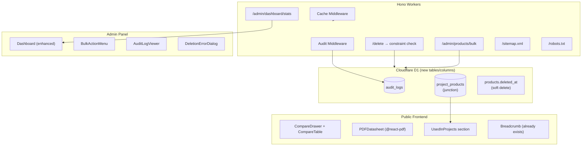

# B2B Ecosystem Finalize — Design

## Architecture Overview



## Data Models

### Migration: `0013_b2b_ecosystem.sql`

```sql
-- 1) Soft delete for products
ALTER TABLE products ADD COLUMN deleted_at TEXT DEFAULT NULL;

-- 2) Audit logs
CREATE TABLE IF NOT EXISTS audit_logs (
  id INTEGER PRIMARY KEY AUTOINCREMENT,
  entity_type TEXT NOT NULL,        -- 'product', 'category', 'brand', 'feature'
  entity_id INTEGER NOT NULL,
  action TEXT NOT NULL,             -- 'create', 'update', 'delete', 'restore'
  changes TEXT DEFAULT '{}',        -- JSON diff of changed fields
  performed_by TEXT DEFAULT 'admin',
  created_at TEXT NOT NULL DEFAULT (datetime('now'))
);

CREATE INDEX IF NOT EXISTS idx_audit_entity
  ON audit_logs(entity_type, entity_id);
CREATE INDEX IF NOT EXISTS idx_audit_created
  ON audit_logs(created_at);

-- 3) Product-Project junction (social proof)
CREATE TABLE IF NOT EXISTS project_products (
  project_id INTEGER NOT NULL REFERENCES projects(id) ON DELETE CASCADE,
  product_id INTEGER NOT NULL REFERENCES products(id) ON DELETE CASCADE,
  PRIMARY KEY (project_id, product_id)
);
```

### Updated TypeScript Types

```typescript
// Audit log entry
interface AuditLog {
  id: number;
  entity_type: 'product' | 'category' | 'brand' | 'feature';
  entity_id: number;
  action: 'create' | 'update' | 'delete' | 'restore';
  changes: string; // JSON
  performed_by: string;
  created_at: string;
}

// Dashboard stats
interface DashboardStats {
  totalProducts: number;
  totalBrands: number;
  totalCategories: number;
  totalProjects: number;
  recentProducts: Array<{
    id: number;
    name: string;
    slug: string;
    image_url: string | null;
    brand_name: string | null;
    created_at: string;
  }>;
}
```

## API Design

### Task 1: Data Integrity

#### DELETE /api/admin/product-categories/:id (Enhanced)
```
Before delete: COUNT products WHERE category_id = :id AND deleted_at IS NULL
If count > 0 → 409 Conflict
  { "success": false, "error": "Không thể xóa danh mục đang có {count} sản phẩm" }
If count = 0 → proceed with DELETE
```

#### DELETE /api/admin/brands/:id (Enhanced)
```
Before delete: COUNT products WHERE brand_id = :id AND deleted_at IS NULL
If count > 0 → 409 Conflict
  { "success": false, "error": "Không thể xóa thương hiệu đang có {count} sản phẩm" }
```

#### DELETE /api/admin/products/:id (Soft Delete)
```
Instead of: DELETE FROM products WHERE id = :id
Now:        UPDATE products SET deleted_at = datetime('now') WHERE id = :id
```

#### POST /api/admin/products/:id/restore (New)
```
UPDATE products SET deleted_at = NULL WHERE id = :id
```

#### All public GET queries: Add `AND deleted_at IS NULL` to WHERE clause.

### Task 2: Admin Efficiency

#### POST /api/admin/products/bulk (New)
```json
Request: {
  "action": "update-status" | "change-category" | "delete",
  "product_ids": [1, 2, 3],
  "value": "draft" | 5   // status string or category_id
}
Response: { "success": true, "affected": 3 }
```

#### GET /api/admin/dashboard/stats (New)
```json
Response: {
  "totalProducts": 45,
  "totalBrands": 12,
  "totalCategories": 8,
  "totalProjects": 15,
  "recentProducts": [
    { "id": 3, "name": "TestSpCam", "slug": "testspcam", ... }
  ]
}
```

#### GET /api/admin/audit-logs (New)
```
Query params: ?entity_type=product&entity_id=3&page=1&limit=20
Response: paginated list of AuditLog entries
```

### Task 3: B2B UX

#### GET /api/products/compare?ids=1,2,3 (New)
```json
Response: [
  { "id": 1, "name": "...", "specifications": {...}, "features": [...], ... },
  { "id": 2, "name": "...", "specifications": {...}, "features": [...], ... }
]
```

#### GET /api/products/:slug — Enhanced to include `used_in_projects`
```json
{
  ...existingProduct,
  "used_in_projects": [
    { "id": 1, "title": "Bệnh viện Hạnh Phúc", "slug": "bv-hanh-phuc", "thumbnail_url": "..." }
  ]
}
```

### Task 4: SEO & Performance

#### GET /sitemap.xml (New route on main worker)
Dynamic XML with:
- All active products: `/san-pham/{slug}`
- All active projects: `/du-an/{slug}`
- All active solutions: `/giai-phap/{slug}`
- Static pages: `/`, `/gioi-thieu`, `/san-pham`, `/du-an`, `/lien-he`

#### GET /robots.txt (New)
```
User-agent: *
Allow: /
Disallow: /admin/
Sitemap: https://sltech.vn/sitemap.xml
```

#### Cache-Control Headers
```
GET /api/products        → Cache-Control: public, s-maxage=300 (5 min)
GET /api/product-features → Cache-Control: public, s-maxage=3600 (1 hr)
GET /api/products/:slug  → Cache-Control: public, s-maxage=600 (10 min)
Admin endpoints          → Cache-Control: no-store
```

## Components

### 1. DeletionErrorDialog (Admin)
```
┌─────────────────────────────────────┐
│ ⚠️ Không thể xóa                    │
│                                      │
│ Danh mục "Camera giám sát" đang     │
│ được sử dụng bởi 5 sản phẩm.       │
│                                      │
│ Vui lòng chuyển sản phẩm sang danh  │
│ mục khác trước khi xóa.             │
│                                      │
│                        [Đã hiểu]     │
└─────────────────────────────────────┘
```

### 2. BulkActionMenu (Admin Product List)
```
┌──────────────────────────────────────────────┐
│ ☑ Chọn tất cả    3 đã chọn                   │
│ ┌──────────────────────────────────────────┐  │
│ │ Hành động hàng loạt ▾                    │  │
│ │  ├─ 📝 Đổi trạng thái → Active/Draft    │  │
│ │  ├─ 📁 Đổi danh mục → [Select]          │  │
│ │  └─ 🗑 Xóa đã chọn                      │  │
│ └──────────────────────────────────────────┘  │
└──────────────────────────────────────────────┘
```

### 3. CompareDrawer (Frontend)
```
┌──────────────────────────────────────────────┐
│ So sánh sản phẩm (2/3)                       │
│ ┌──────┐ ┌──────┐ ┌──────────────┐           │
│ │ PROD1│ │ PROD2│ │ ＋ Thêm SP   │           │
│ │  ✕   │ │  ✕   │ │              │           │
│ └──────┘ └──────┘ └──────────────┘           │
│                              [So sánh ngay →] │
└──────────────────────────────────────────────┘
```

### 4. CompareTable (Full page modal/sheet)
```
┌──────────────────────────────────────────────┐
│         │ Hikvision DS-2CD  │ Dahua IPC-HDW  │
│─────────┼───────────────────┼────────────────│
│ Hình ảnh│ [img]             │ [img]          │
│ Thương  │ Hikvision         │ Dahua          │
│ Danh mục│ Camera giám sát   │ Camera giám sát│
│ ─── Thông số kỹ thuật ───                    │
│ Độ phân │ 4K                │ 2MP            │
│ IR Range│ 30m               │ 20m            │
│ ─── Tính năng ───                            │
│ PoE     │ ✅                │ ✅             │
│ AI      │ ✅                │ ❌             │
└──────────────────────────────────────────────┘
```

### 5. PDFDatasheet (Client-side)
Using `@react-pdf/renderer`:
- Header: SLTECH logo + company info
- Product image + name + brand
- Specifications table
- Feature badges (rendered as text)
- Footer: contact info + QR code to product page

### 6. UsedInProjects (ProductDetail section)
```
┌──────────────────────────────────────────────┐
│ 🏢 Dự án sử dụng sản phẩm này               │
│ ┌────────────┐ ┌────────────┐                │
│ │ [thumb]    │ │ [thumb]    │                │
│ │ BV Hạnh    │ │ Lotus      │                │
│ │ Phúc       │ │ Tower      │                │
│ └────────────┘ └────────────┘                │
└──────────────────────────────────────────────┘
```

### 7. Enhanced AdminDashboard
```
┌─────────────────────────────────────────────────┐
│ Dashboard                                        │
│ ┌────────┐ ┌────────┐ ┌────────┐ ┌────────┐    │
│ │📦 45   │ │🏷 12  │ │📁 8   │ │🏗 15  │    │
│ │Products│ │Brands  │ │Categ. │ │Projects│    │
│ └────────┘ └────────┘ └────────┘ └────────┘    │
│                                                  │
│ ┌──────────────────────────────────────────────┐│
│ │ Sản phẩm mới thêm gần đây                   ││
│ │ ┌──┬──────────────┬──────────┬──────────┐    ││
│ │ │  │ TestSpCam     │ Hikvision│ 31/03    │    ││
│ │ │  │ Camera AI X   │ Dahua    │ 30/03    │    ││
│ │ └──┴──────────────┴──────────┴──────────┘    ││
│ └──────────────────────────────────────────────┘│
│                                                  │
│ ┌──────────────────────────────────────────────┐│
│ │ Liên hệ mới (existing)                       ││
│ └──────────────────────────────────────────────┘│
└─────────────────────────────────────────────────┘
```

## Design Decisions

| Decision | Choice | Rationale |
|----------|--------|-----------|
| Deletion constraints | Application-level check | D1 doesn't enforce FK at runtime |
| Soft delete | `deleted_at` column | Reversible, audit-friendly |
| Audit log storage | Same D1 database | Low volume, no need for external service |
| PDF generation | `@react-pdf/renderer` | Rich styling, client-side, no Workers overhead |
| Product comparison | Max 3 products | UX best practice for side-by-side |
| Social proof link | Junction table `project_products` | Clean M:N, admin-assignable |
| Caching strategy | `Cache-Control` headers | Native Cloudflare, no extra config |
| Sitemap | Server-generated XML | Dynamic, auto-updated |

## Security

- All admin endpoints unchanged — require `X-API-Key` header
- Audit logs are append-only — no DELETE endpoint for logs
- Soft-deleted products invisible to public API but visible in admin
- Bulk actions require auth + validate all IDs exist

## Performance

- **Edge caching**: 5-min TTL on product lists = ~90% cache hit for catalog browsing
- **Dashboard stats**: Single SQL query with sub-queries, < 50ms
- **Sitemap**: Generated on-demand, cached 1 hour at edge
- **PDF**: Client-side generation, zero server cost
- **Audit log writes**: Async (don't block the response)
