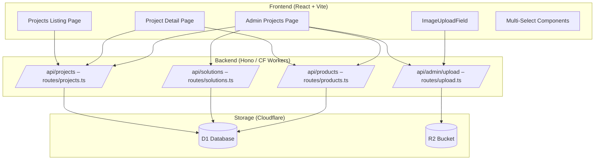

# B2B Professional Portfolio — Design

## Architecture Overview



## Data Models

### Updated `projects` Table Schema

```sql
-- Migration 0016: B2B Portfolio upgrade
ALTER TABLE projects ADD COLUMN completion_year TEXT;
-- e.g. "2024", "Q1 2024", "2023–2024"

ALTER TABLE projects ADD COLUMN related_solutions TEXT DEFAULT '[]';
-- JSON array of solution IDs: [1, 3, 5]

ALTER TABLE projects ADD COLUMN related_products TEXT DEFAULT '[]';
-- JSON array of product IDs: [12, 45, 67]
```

> **Note**: `location`, `client_name`, `year`, `meta_title`, `meta_description` already exist in the schema. `completion_year` is added as a more flexible TEXT alternative to the existing `year` INTEGER field. Existing `entity_images` table handles gallery. No new `gallery` or `seo_metadata` JSON columns needed since these are already covered.

### Updated TypeScript Types

```typescript
// server/src/types.ts — ProjectRow additions
export interface ProjectRow {
  // ... existing fields ...
  completion_year: string | null;    // NEW
  related_solutions: string;         // NEW — JSON: '[1, 3, 5]'
  related_products: string;          // NEW — JSON: '[12, 45, 67]'
}

// src/types/index.ts — Project additions
export interface Project {
  // ... existing fields ...
  completion_year?: string | null;
  related_solutions?: string;
  related_products?: string;
  // Populated by API join
  linked_solutions?: Array<{ id: number; title: string; slug: string; icon: string }>;
  linked_products?: Array<{ id: number; name: string; slug: string; image_url: string | null }>;
}
```

### Existing `entity_images` Table (Gallery)

```sql
-- Already exists — no changes needed
CREATE TABLE IF NOT EXISTS entity_images (
  id INTEGER PRIMARY KEY AUTOINCREMENT,
  entity_type TEXT NOT NULL,  -- 'project'
  entity_id INTEGER NOT NULL,
  image_url TEXT NOT NULL,
  caption TEXT,
  sort_order INTEGER NOT NULL DEFAULT 0
);
```

### Existing `project_products` Junction Table

```sql
-- Already exists from migration 0015
CREATE TABLE IF NOT EXISTS project_products (
  project_id INTEGER NOT NULL REFERENCES projects(id) ON DELETE CASCADE,
  product_id INTEGER NOT NULL REFERENCES products(id) ON DELETE CASCADE,
  PRIMARY KEY (project_id, product_id)
);
```

> **Decision**: We'll use both `project_products` junction table AND `related_products` JSON. The JSON field provides quick reads for the API, while the junction table provides referential integrity for admin operations. During save, we'll sync both.

## API Design

### GET /api/projects/:slug (Enhanced)

**Change**: Include linked solutions and products in the response via JOIN queries.

```typescript
// Response shape
{
  success: true,
  data: {
    // ... all project fields ...
    images: [{ id, image_url, caption, sort_order }],
    linked_solutions: [{ id, title, slug, icon }],
    linked_products: [{ id, name, slug, image_url, category_name }]
  }
}
```

### PUT /api/admin/projects/:id (Enhanced)

**Change**: Accept `related_solutions`, `related_products` fields and sync `project_products` table.

```typescript
// Request body additions
{
  completion_year?: string;
  related_solutions?: string; // JSON array of IDs
  related_products?: string;  // JSON array of IDs
}
```

### GET /api/solutions (Existing — used for admin selector)

Already returns `{ data: Solution[] }`. Used as-is for the multi-select in admin form.

### GET /api/products (Existing — used for admin selector)

Already returns paginated products. Used as-is with search param for the multi-select.

## Components

### Task 2 — Admin Project Management

#### `AdminProjects.tsx` Modifications:

1. **List View Enhancements**:
   - Add quick toggle buttons for `is_featured` and `is_active` with inline PATCH mutations
   - Display thumbnail more prominently in the table
   - Show `completion_year` and `client_name` in columns

2. **Form Enhancements**:
   - Add `completion_year` input field (text, not number)
   - Add `RelationalMultiSelect` for Solutions (searchable, shows icons)
   - Add `RelationalMultiSelect` for Products (searchable, shows images)
   - All existing fields remain unchanged

#### New Component: `RelationalMultiSelect.tsx`

```tsx
interface RelationalMultiSelectProps {
  label: string;
  value: number[];             // Selected IDs
  onChange: (ids: number[]) => void;
  fetchFn: () => Promise<any[]>;  // API fetch function
  labelKey: string;            // e.g. 'title' or 'name'
  imageKey?: string;           // e.g. 'image_url'
  searchable?: boolean;
}
```

A reusable searchable multi-select dropdown that:
- Fetches options from API on mount
- Shows selected items as removable chips
- Supports keyboard search/filter
- Displays images/icons alongside labels

### Task 3 — Project Listing Page

#### `Projects.tsx` Modifications:

1. **Card uniformity**: Already using `flex-col` with `mt-auto` for CTA button ✅
2. **Cover images**: Already using `aspect-video` ✅
3. **Title clamp**: Already using `line-clamp-2` ✅
4. **Category filtering**: Already implemented client-side without reload ✅

> **Assessment**: Projects listing page is already well-implemented. Minor refinements only:
> - Ensure consistent card minimum height
> - Add hover animation polish
> - Verify filter tab styling is premium

### Task 4 — Project Detail Page (Major Redesign)

#### New Layout Structure:

```
┌─────────────────────────────────────────┐
│           HERO SECTION                  │
│  Large cover image with overlay         │
│  Project title + Breadcrumbs            │
└─────────────────────────────────────────┘
┌───────────────────────┬─────────────────┐
│                       │  PROJECT INFO   │
│   CONTENT AREA        │   SIDEBAR       │
│                       │                 │
│   - Description       │  ┌───────────┐  │
│   - Markdown content  │  │ Client    │  │
│   - Metrics bar       │  │ Location  │  │
│   - Systems & brands  │  │ Year      │  │
│   - Compliance        │  │ Scale     │  │
│                       │  │ Industry  │  │
│                       │  │ Duration  │  │
│                       │  └───────────┘  │
│                       │                 │
│                       │  CTA Buttons    │
│                       │                 │
└───────────────────────┴─────────────────┘
┌─────────────────────────────────────────┐
│          IMAGE GALLERY                  │
│  Grid/Slider of gallery images          │
│  with lightbox on click                 │
└─────────────────────────────────────────┘
┌─────────────────────────────────────────┐
│       USED EQUIPMENT                    │
│  "Sản phẩm đã sử dụng" section         │
│  Product cards from linked_products     │
└─────────────────────────────────────────┘
┌─────────────────────────────────────────┐
│         RELATED CTA                     │
│  Two-column CTA cards                   │
└─────────────────────────────────────────┘
```

#### New/Modified Components:

1. **`ProjectHero.tsx`** — Full-width hero with cover image, gradient overlay, title, breadcrumbs
2. **`ProjectInfoSidebar.tsx`** — Sticky sidebar with project metadata and icons
3. **`ProjectGallery.tsx`** — Image gallery grid with lightbox modal
4. **`ProjectUsedEquipment.tsx`** — Grid of linked product cards

## Design Decisions

| # | Decision | Rationale |
|---|----------|-----------|
| DD1 | Use `entity_images` table for gallery (not JSON column) | Already exists, provides proper DB normalization, admin already syncs via `gallery_urls` |
| DD2 | Add `related_solutions` and `related_products` as JSON columns | Low cardinality (< 20 items), simpler than new junction tables for solutions |
| DD3 | Keep `project_products` junction table in sync | Provides referential integrity + enables future joins |
| DD4 | Add `completion_year` as TEXT | Flexibility for "Q1 2024", "2023–2024" format strings |
| DD5 | 2-column layout for project detail | Professional B2B standard, sidebar provides quick-reference info |
| DD6 | Inline toggles in admin list view | Reduces clicks for common operations (featured/active toggling) |

## Security

- All admin mutations continue to require `requireAuth` middleware (API key auth)
- No new authentication endpoints needed
- All file uploads go through existing R2 upload route with size/type validation
- SQL injection prevented by parameterized queries (existing pattern)

## Performance

- **Gallery images**: Lazy loading with `loading="lazy"` attribute
- **Related data**: Single additional query per detail page load (JOIN on solutions/products)
- **Admin selectors**: Solutions/Products fetched once on form open, cached by React Query
- **Listing page**: Existing pagination + client-side category filter for instant UX
- **Image optimization**: WebP conversion already handled by `ImageUploadField` + `useWebPConverter`
