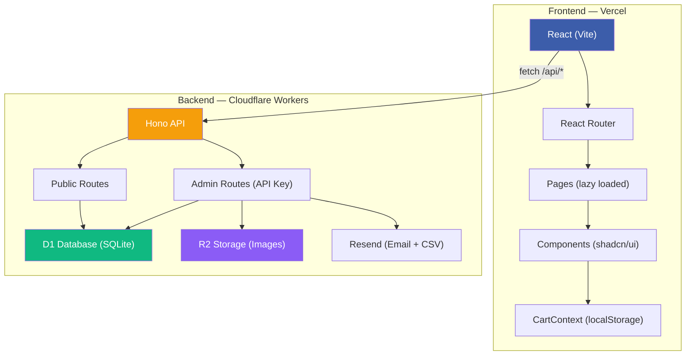

# Design — SLTECH B2B Website Rebuild

## Architecture Overview



## Brand & Design System

### Color Palette (từ Logo thật)

| Token | Hex | Dùng cho |
|-------|-----|----------|
| `--primary` | `#3C5DAA` | Logo blue, headings, borders, primary buttons |
| `--primary-dark` | `#1e3356` | Header/Footer background, dark sections |
| `--accent` | `#2563eb` | CTA buttons, links, interactive elements |
| `--background` | `#f8fafc` | Page background (light mode) |
| `--card` | `#ffffff` | Card backgrounds |
| `--foreground` | `#0f172a` | Body text |
| `--muted` | `#64748b` | Secondary text, captions |
| `--success` | `#10b981` | Success states |
| `--destructive` | `#ef4444` | Error states |

### Typography

| Element | Font | Weight | Size |
|---------|------|--------|------|
| H1 | Inter | Bold (700) | 36-48px |
| H2 | Inter | Semibold (600) | 28-32px |
| H3 | Inter | Semibold (600) | 20-24px |
| Body | Inter | Regular (400) | 16px |
| Caption | Inter | Regular (400) | 14px |
| Specs/Numbers | JetBrains Mono | Medium (500) | 14px |

## Data Models

### Database Schema (D1 — 11 bảng, đã tạo)

```
solutions           — 11 giải pháp (slug, title, description, icon, content_md)
product_categories  — 7 danh mục (slug, name, parent_id for tree)
products            — Sản phẩm B2B KHÔNG GIÁ (slug, name, description, spec_sheet_url)
projects            — Dự án / Case Study (slug, title, location, client_name, category, year)
posts               — Tin tức / Blog (slug, title, excerpt, content_md, tags)
gallery_albums      — Album ảnh
gallery_images      — Ảnh trong album
partners            — 10 đối tác (name, logo_url, website_url)
contacts            — Form liên hệ
site_config         — Key-value settings
quote_requests      — Yêu cầu báo giá (customer_name, company, phone, items JSON)
entity_images       — Polymorphic images (solution/project/product)
```

## API Design

### Public API (no auth)

| Method | Endpoint | Mô tả |
|--------|---------|-------|
| GET | `/api/solutions` | List giải pháp (paginated) |
| GET | `/api/solutions/:slug` | Chi tiết giải pháp |
| GET | `/api/products` | List sản phẩm (?category=&search=&page=) |
| GET | `/api/products/:slug` | Chi tiết sản phẩm |
| GET | `/api/products/categories` | Category tree |
| GET | `/api/projects` | List dự án (?featured=&category=&page=) |
| GET | `/api/projects/:slug` | Chi tiết dự án |
| GET | `/api/posts` | List bài viết (?page=) |
| GET | `/api/posts/:slug` | Chi tiết bài viết |
| GET | `/api/partners` | List đối tác |
| GET | `/api/gallery` | Albums + images |
| GET | `/api/site-config` | Settings |
| POST | `/api/contact` | Gửi form liên hệ (rate-limited) |
| POST | `/api/quotes` | Gửi yêu cầu báo giá (rate-limited) |

### Admin API (X-API-Key header)

| Method | Endpoint | Mô tả |
|--------|---------|-------|
| POST/PUT/DELETE | `/api/admin/{entity}` | CRUD cho mỗi entity |
| GET | `/api/admin/quotes` | List báo giá (?status=) |
| GET | `/api/admin/quotes/:id/export` | Export CSV |
| PUT | `/api/admin/quotes/:id/status` | Cập nhật trạng thái |
| POST | `/api/admin/upload` | Upload ảnh → R2 |

## Components

### Page Structure

```
Layout
├── Header (Logo, Nav, Cart Badge, ThemeToggle, Mobile menu)
├── Page Content
│   ├── Home (Hero gradient, Stats, Solutions by group, Process 3-step, Projects, Partners, CTA)
│   ├── Solutions (Grouped: An ninh / Bãi xe / Hạ tầng → Detail)
│   ├── Products (Sidebar categories + Grid + Search)
│   ├── Projects (Grid → Case Study detail)
│   ├── About (Company info, Vision/Mission, Certificates, Partners)
│   ├── Blog (List → Detail)
│   ├── Gallery (Albums → Lightbox)
│   └── Contact (Form + Map + Info)
├── CartDrawer (slide-out, persistent via localStorage)
├── QuoteForm (modal on cart submit)
└── Footer (Company info, Links, Social)
```

### Key Shared Components

| Component | Mô tả |
|-----------|-------|
| `PageHero` | Hero section với breadcrumbs (đã có) |
| `AddToCartButton` | Nút "Thêm vào báo giá" (tái sử dụng) |
| `CartDrawer` | Slide-out giỏ hàng |
| `QuoteForm` | Modal form yêu cầu báo giá |
| `CartBadge` | Badge count trên header |
| `ProductCard` | Card sản phẩm (ảnh, tên, category, CTA) |
| `ProjectCard` | Card dự án (ảnh, title, client, location) |
| `SolutionCard` | Card giải pháp (icon, title, description) |
| `PartnerLogos` | Logo grid/marquee đối tác |
| `StatsBar` | Dãy số liệu ấn tượng (10+ năm, 200+ dự án, 50+ đối tác) |
| `ProcessTimeline` | Timeline **3 bước**: Tư vấn & Thiết kế → Cung cấp & Thi công → Bảo trì & Đào tạo |
| `ThemeToggle` | Dark/Light mode switch |
| `Toast` | Notification system |
| `Skeleton` | Loading placeholder (đã có) |

## Design Decisions

| Quyết định | Lý do |
|-----------|-------|
| CSV thay XLSX | Workers environment không support heavy libraries. CSV + BOM hoạt động tốt trong Excel |
| localStorage cho Cart | Đơn giản, không cần auth cho giỏ hàng. Cart persist across sessions |
| API Key auth (không JWT) | Solo admin, API key đủ bảo mật. Tránh complexity JWT/sessions |
| Hono framework | Lightweight, TypeScript-first, designed for Cloudflare Workers |
| shadcn/ui components | Customizable, không lock-in, works with Tailwind v4 |
| No price in schema | B2B model — giá thảo luận riêng, không public |
| Dark mode | Design system hỗ trợ sẵn (oklch tokens), user yêu cầu cho v1 |
| Giải pháp phân nhóm | 3 nhóm (An ninh & Giám sát / Bãi xe & Giao thông / Hạ tầng & Quản lý) dễ navigate hơn flat 11 items |
| Quy trình 3 bước | Giữ đúng profile gốc: Tư vấn → Thi công → Bảo trì |

## Security

- Admin routes protected by `X-API-Key` header middleware
- Rate limiting on public POST endpoints (contact, quotes: 5 req/hour)
- CORS configured per environment
- API key stored as Cloudflare Secret (not in code)
- Input validation on all POST endpoints
- HTML escaping in email templates

## Performance

- React lazy loading (code splitting per page) — đã setup
- Cloudflare Edge deployment (global CDN)
- D1 database queries with proper indexes
- R2 for image hosting (edge-cached)
- Pagination on all list endpoints (default limit: 12)
- KV cache for frequently accessed data (site-config, partners)
