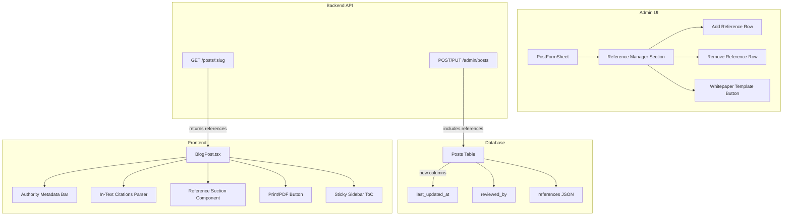

# Blog Authority — Design Document

## Architecture Overview



## Data Models

### Migration 0019 — Posts Authority Fields
```sql
-- Migration: 0019 — Blog Authority & Expert References
ALTER TABLE posts ADD COLUMN last_updated_at TEXT;
ALTER TABLE posts ADD COLUMN reviewed_by TEXT;
ALTER TABLE posts ADD COLUMN references TEXT NOT NULL DEFAULT '[]';
```

**Field details:**
| Field | Type | Default | Description |
|-------|------|---------|-------------|
| `last_updated_at` | TEXT (ISO datetime) | NULL | Thời điểm cập nhật nội dung lần cuối |
| `reviewed_by` | TEXT | NULL | Tên kỹ sư kiểm duyệt |
| `references` | TEXT (JSON) | `'[]'` | Mảng JSON `ReferenceItem[]` |

### Reference Item Type
```typescript
interface ReferenceItem {
  title: string;           // "TCVN 7336:2021 — Phòng cháy chữa cháy"
  url: string;             // "https://..."
  type: 'law' | 'standard' | 'news' | 'vendor';
}
```

### Updated PostRow (server/src/types.ts)
```typescript
export interface PostRow {
  // ... existing fields ...
  last_updated_at: string | null;  // NEW
  reviewed_by: string | null;      // NEW
  references: string;              // NEW — JSON array string
}
```

### Updated Post type (src/lib/admin-api.ts)
```typescript
export interface Post {
  // ... existing fields ...
  last_updated_at: string | null;  // NEW
  reviewed_by: string | null;      // NEW
  references: string;              // NEW — JSON array string
}
```

### Updated PostFormData (PostFormSheet.tsx)
```typescript
export interface PostFormData {
  // ... existing fields ...
  reviewed_by?: string | null;     // NEW
  references?: ReferenceItem[];    // NEW (parsed)
}
```

## API Design

### Backend Changes (server/src/routes/posts.ts)

#### GET /api/posts/:slug — Enhanced Response
Returns `references` field (parsed JSON) along with existing data:
```json
{
  "data": {
    "id": 1,
    "title": "...",
    "last_updated_at": "2026-04-06T08:00:00Z",
    "reviewed_by": "Nguyễn Văn A — Kỹ sư trưởng",
    "references": [
      { "title": "TCVN 7336:2021", "url": "https://...", "type": "standard" },
      { "title": "Nghị định 136/2020/NĐ-CP", "url": "https://...", "type": "law" }
    ],
    "related": [...]
  }
}
```

#### POST/PUT /api/admin/posts — Accept New Fields
Body now accepts:
```json
{
  "reviewed_by": "Nguyễn Văn A",
  "references": "[{\"title\":\"...\",\"url\":\"...\",\"type\":\"law\"}]"
}
```
- `last_updated_at` is auto-set on PUT to `CURRENT_TIMESTAMP`
- `references` stored as JSON string in DB

## Components

### 1. ReferenceManager (New — Admin Side)
**File**: `src/components/admin/PostFormSheet.tsx` (inline section)

```
┌─────────────────────────────────────────┐
│ TÀI LIỆU THAM KHẢO                    │
├─────────────────────────────────────────┤
│ [1] TCVN 7336:2021         🔗 URL  [×] │
│     Type: [Standard ▾]                  │
│ [2] Nghị định 136/2020     🔗 URL  [×] │
│     Type: [Law ▾]                       │
│ ──────────────────────────────────      │
│ [+ Thêm tài liệu tham khảo]           │
└─────────────────────────────────────────┘
```

**Functionality:**
- Dynamic add/remove rows
- Each row: title (input), URL (input), type (select: law | standard | news | vendor)
- Auto-numbered [1], [2], ...
- Stored as JSON array in form state

### 2. AuthorityMetadata (New — Frontend)
**Location**: Inside `BlogPost.tsx`, replaces current meta bar

```
┌──────────────────────────────────────────────────────────┐
│ 📅 Ngày đăng: 5 tháng 4, 2026  │  🔄 Cập nhật: 6/4/2026│
│ ✅ Kiểm duyệt bởi: Nguyễn Văn A — KS Trưởng            │
│ ⏱ 8 phút đọc  │  👁 1,234 lượt xem  │  🖨 In/PDF       │
└──────────────────────────────────────────────────────────┘
```

### 3. InTextCitations (Transform Logic)
**Location**: Inside `BlogPost.tsx`, added to content pipeline

Logic:
- Scan rendered HTML for patterns like `[1]`, `[2]`, etc.
- Transform to `<sup><a href="#ref-1" class="citation-link">[1]</a></sup>`
- Only transform if references array has corresponding index

### 4. ReferenceSection (New — Frontend)
**Location**: Inside `BlogPost.tsx`, after article content

```
┌──────────────────────────────────────────────────────────┐
│ ⚖ TÀI LIỆU THAM KHẢO & CĂN CỨ PHÁP LÝ               │
├──────────────────────────────────────────────────────────┤
│ ⚖ [1] TCVN 7336:2021 — Phòng cháy chữa cháy           │
│        → https://vanban.chinhphu.vn/...     ↗           │
│ ⚙ [2] IEEE 802.3af — Power over Ethernet               │
│        → https://standards.ieee.org/...     ↗           │
│ 🌐 [3] Báo Xây Dựng: Xu hướng BMS 2026               │
│        → https://baoxaydung.vn/...          ↗           │
└──────────────────────────────────────────────────────────┘
```

**Icon mapping:**
| Type | Icon | Color |
|------|------|-------|
| `law` | Scale | amber-600 |
| `standard` | Cog | blue-600 |
| `news` | Globe | emerald-600 |
| `vendor` | Building2 | violet-600 |

### 5. WhitepaperTemplate (Admin Template)
**Location**: `PostFormSheet.tsx` — new template option

```markdown
## Giới thiệu giải pháp
[Tổng quan về giải pháp kỹ thuật, bối cảnh thị trường]

## Căn cứ pháp lý & Tiêu chuẩn áp dụng
- **TCVN 7336:2021** — Phòng cháy chữa cháy [1]
- **Nghị định 136/2020/NĐ-CP** — Quy định chi tiết [2]

## Giải pháp kỹ thuật chi tiết

### Kiến trúc hệ thống
[Mô tả kiến trúc, sơ đồ kết nối]

### Thiết bị & Thông số kỹ thuật
| Thiết bị | Model | Thông số | Ghi chú |
|----------|-------|----------|---------|

### So sánh giải pháp
[Bảng so sánh với giải pháp thay thế]

## Kết luận & Khuyến nghị
[Tóm tắt và khuyến nghị triển khai]
```

### 6. PrintStyles (CSS Enhancement)
**Location**: Global CSS or inline in BlogPost

- `@media print` CSS to hide navigation, sidebar, header, footer
- Show references section prominently
- Professional print layout with proper margins

## Design Decisions

### DD-1: References as JSON Column (not separate table)
**Decision**: Store references in JSON column on posts table  
**Rationale**: 
- Data is always read/written together with the post
- No cross-post querying needed for references
- Simpler schema, no JOIN overhead
- Consistent with existing patterns (tags, key_metrics are JSON)

### DD-2: In-text Citations via HTML Transform
**Decision**: Parse `[1]`, `[2]` patterns in rendered HTML  
**Rationale**:
- Authors can write naturally in Markdown using `[1]` notation
- Transform happens in the same pipeline as callouts/tables
- No markdown plugin needed

### DD-3: Print via window.print() with CSS
**Decision**: Use native `window.print()` with `@media print` styles  
**Rationale**:
- No external library dependency
- Browser-native PDF save option
- Simpler implementation, works cross-browser

### DD-4: auto-update last_updated_at on PUT
**Decision**: Backend automatically sets `last_updated_at` on every PUT  
**Rationale**:
- Ensures timestamp is always accurate
- No need for admin to manually set it
- Distinct from `updated_at` (which tracks any field change) — `last_updated_at` only for content revisions

## Security
- All new fields follow existing auth pattern (X-API-Key for admin operations)
- Reference URLs rendered with `rel="nofollow noopener noreferrer"` for SEO safety
- No user input rendered without sanitization (HTML already sanitized through markdown pipeline)

## Performance
- No additional database queries — new fields are on the same posts table
- References JSON parsed once in useMemo, not on every render
- Lazy-loaded citation tooltips
- Print CSS via media query (no JS overhead)
