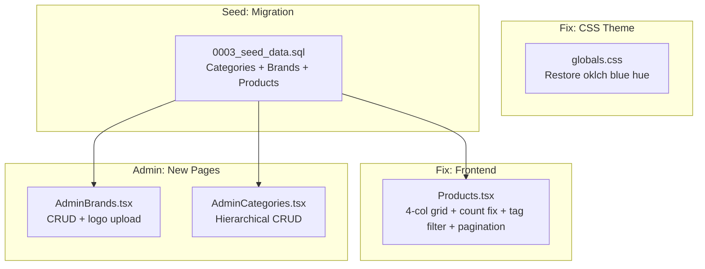

# Product Module v2 — Design Document

## Architecture Overview
No new services needed — extends existing Cloudflare D1 + Hono API + React frontend.

## Sprint Breakdown

### Sprint A: Brand Color Fix (CSS)
**Root Cause**: `--primary` in `:root` (light) and `.dark` are wrong:
- Light: `oklch(0.205 0 0)` → pure dark gray (chroma=0, hue=0)
- Dark: `oklch(0.922 0 0)` → pure light gray

**Fix**: Restore SLTECH brand blue `#3C5DAA` → `oklch(0.44 0.16 264)` (light) and brighter for dark mode.
Also fix `--accent`, `--ring`, `--sidebar-primary` to use blue hues.

#### [MODIFY] [globals.css](file:///d:/GitHub/SongLinh_Website/src/styles/globals.css)
- Fix `:root` `--primary` → `oklch(0.44 0.16 264)` (Brand Blue)
- Fix `:root` `--accent` → subtle blue instead of gray
- Fix `.dark` `--primary` → `oklch(0.65 0.18 264)` (lighter blue for dark bg)

---

### Sprint B: Seed Data Migration
Create `0003_seed_data.sql` to populate categories, brands, and products for testing.

#### [NEW] [0003_seed_data.sql](file:///d:/GitHub/SongLinh_Website/server/migrations/0003_seed_data.sql)

**Categories** (with parent_id hierarchy):
| slug | name | parent_id |
|------|------|-----------|
| camera-giam-sat | Camera giám sát | NULL |
| camera-ip | Camera IP | camera-giam-sat |
| camera-analog | Camera Analog | camera-giam-sat |
| dau-ghi-hinh | Đầu ghi hình NVR/DVR | camera-giam-sat |
| kiem-soat-ra-vao | Kiểm soát ra vào | NULL |
| bao-chay | PCCC & Báo cháy | NULL |
| ha-tang-mang | Hạ tầng mạng | NULL |
| am-thanh-thong-bao | Âm thanh thông báo | NULL |
| thiet-bi-dien-nhe | Thiết bị điện nhẹ | NULL |
| tong-dai | Tổng đài điện thoại | NULL |

**Brands**: Use existing 10 seeded brands from `0002_product_module.sql` + add Grandstream, Legrand.

**Products**: Seed all 14 SAMPLE_PRODUCTS from `constants.ts` into the DB with proper `category_id`, `brand_id`, `specifications` JSON, and `features` JSON.

---

### Sprint C: Frontend Fixes (Products.tsx)

#### [MODIFY] [Products.tsx](file:///d:/GitHub/SongLinh_Website/src/pages/Products.tsx)
1. **Product count**: Change `productsData?.total ?? products.length` to `products.length` when using fallback
2. **Grid 4-col**: `grid-cols-1 sm:grid-cols-2 lg:grid-cols-3 xl:grid-cols-4`
3. **Feature tag filter**: Add a multi-select tag filter (checkboxes for common features like IP67, PoE, AI, H.265+) that filters the products array client-side
4. **Pagination fix**: Client-side pagination for sample data (8 items/page), server pagination for API data

---

### Sprint D: Admin Pages

#### [NEW] [AdminBrands.tsx](file:///d:/GitHub/SongLinh_Website/src/pages/admin/AdminBrands.tsx)
- List brands with name, logo, slug, website, status
- Create/Edit form: name, slug, logo (ImageUploadField), description, website_url, sort_order, is_active
- Delete with confirmation
- Use existing `DataTable`, `FormDialog`, `CrudHelpers` pattern from `AdminProducts.tsx`

#### [MODIFY] [AdminProducts.tsx](file:///d:/GitHub/SongLinh_Website/src/pages/admin/AdminProducts.tsx)
- Add brand_id selector (dropdown from brands query) alongside the text brand field
- Show brand column in table

#### Admin Categories page — verify if `AdminCategories.tsx` already exists or needs to be created with parent_id selector

#### Admin Router — register new AdminBrands + AdminCategories routes

#### [MODIFY] [admin-api.ts](file:///d:/GitHub/SongLinh_Website/src/lib/admin-api.ts)
- Add `brands` CRUD methods to `adminApi`
- Add Brand type export

---

## Design Decisions
1. **Client-side tag filter** — Feature tags exist as JSON arrays in each product. Client-side filtering is fast and works with both sample and API data without backend changes.
2. **Seed via migration** — All test data goes into `0003_seed_data.sql` so it's reproducible and can be run on any D1 instance.
3. **oklch color values** — Use oklch to match shadcn/ui v4 convention. Brand blue `#3C5DAA` ≈ `oklch(0.44 0.16 264)`.

## Verification Plan
1. Visual check: brand blue visible in navbar, buttons, links, badges
2. Products page: 4/row grid, correct count, tag filter works, pagination works
3. Admin: brands CRUD works, categories CRUD works, products show brand selector
4. TypeScript build: zero errors
