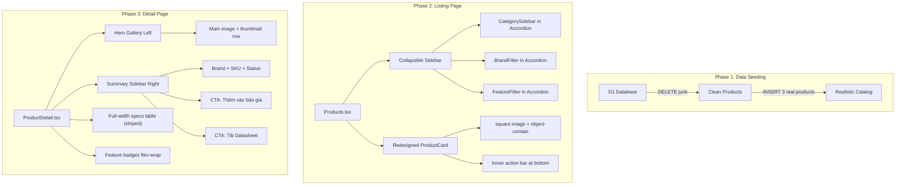

# Design: Product UI Sync

## Architecture Overview



## Data Models

No schema changes. Uses existing tables:
- `products` — main product data including `specifications` JSON, `features` JSON
- `product_categories` — category hierarchy
- `brands` — brand master data with logos
- `product_features` + `product_to_features` — junction for feature tags
- `entity_images` — gallery images

### Product Specs JSON (existing `specifications` column)

```json
{
  "Độ phân giải": "4MP",
  "Tầm xa hồng ngoại": "30m",
  "Chuẩn chống nước": "IP67"
}
```

## API Design

No API changes. All existing endpoints are reused:
- `GET /api/products` — listing with filters
- `GET /api/products/:slug` — detail with images/features/related
- `GET /api/product-categories` — sidebar categories
- `GET /api/brands` — brand filter options

## Components

### Phase 2: Listing Page Components

#### `Products.tsx` — Sidebar Refactoring
- Wrap each filter section (`CategorySidebar`, `BrandFilter`, `GroupedFeatureFilter`) inside a shadcn `Accordion.Item`
- Default: first item open, others collapsed
- Mobile: all collapsed by default

#### `Products.tsx` — ProductCard Redesign
| Element | Current | New |
|---------|---------|-----|
| Image | `aspect-square object-contain` | Keep, add `mix-blend-multiply` for white-bg consistency |
| Action buttons | Absolutely positioned, always visible | Move to a bottom bar that reveals on hover (inside the card) |
| Heights | Inconsistent due to description length | Use `flex-col` with strict `min-h` and `line-clamp` |

### Phase 3: Detail Page Components

#### Hero Gallery (Left column)
- Large main image with `cursor-zoom-in` + `group-hover:scale-110` (already exists)
- Thumbnail row below main image (already exists, keep)

#### Summary Sidebar (Right column, sticky)
- Brand logo + name
- Product name (h1)
- SKU / Model number
- Inventory status badge
- Warranty info
- **Primary CTA**: "Thêm vào báo giá" (full-width button)
- **Secondary CTA**: "Tải Datasheet" (only if `spec_sheet_url` exists)
- Compare button
- ⚠️ Do NOT render full specs here — only CTAs and key identifiers

#### Specs Table (Main content, below gallery)
- Full-width, professional striped table
- Alternating row backgrounds (`bg-muted/20` / `bg-background`)
- Hover highlight `hover:bg-primary/5`
- Already exists — keep current implementation

#### Features Badges (Main content, below specs)
- Flex-wrap horizontal layout using existing `FeatureBadge` component
- Already exists — keep but move above specs for better visibility

## Design Decisions

1. **Accordion for sidebar** — Saves vertical space, familiar UX pattern. Using shadcn's built-in component for consistency.
2. **Hover action bar** — Instead of absolute-positioned buttons, embed actions inside the card as a bottom bar that appears on hover. This prevents z-index issues and is more touch-friendly.
3. **mix-blend-multiply** — Ensures product images on white backgrounds blend naturally with the card background.
4. **No new tables** — The user explicitly prohibits new DB tables. All data uses existing schema.

## Security

No security changes. Data seeding uses admin API or direct D1 SQL (admin-only operations).

## Performance

- Product images already use `loading="lazy"` — no change needed.
- Accordion uses no extra API calls — purely client-side collapse/expand.
- No additional data fetching for the redesigned components.
