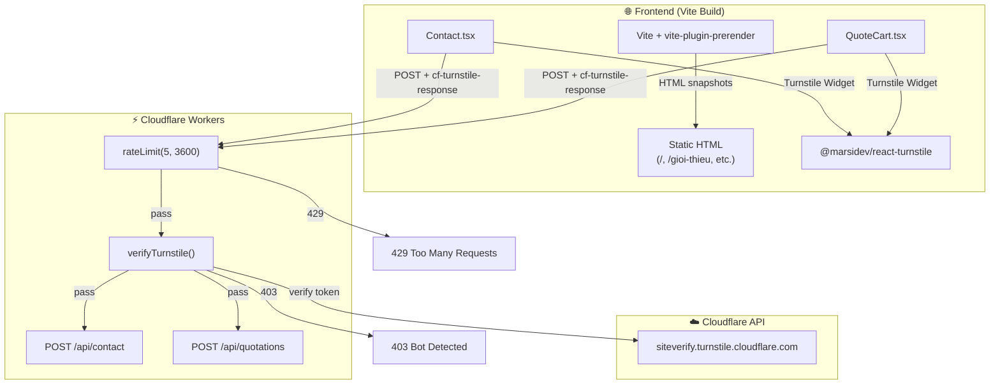

# Design — Production Readiness (Security & SEO Hardening)

## Architecture Overview

No architectural changes — this feature activates existing infrastructure (rate limiter) and adds two thin integration layers (Turnstile, prerender).



## Phase 1: Rate Limiting Activation

### Current State
The rate limiter middleware (`server/src/middleware/rate-limit.ts`) is **already fully implemented** with both KV and in-memory fallback. It is already applied to both `POST /api/contact` and `POST /api/quotations`.

### Finding
**No code changes needed.** After re-reading `contact.ts` (line 11) and `quotations.ts` (line 23), both routes already call `rateLimit(5, 3600)`. The architecture doc stating "Rate Limiting (chưa active)" was **stale documentation**.

### Action
- Update `docs/architecture.md` to mark rate limiting as **ACTIVE**.
- No code changes.

## Phase 2: Cloudflare Turnstile Integration

### Frontend Changes

**Package:** `@marsidev/react-turnstile` (lightweight React wrapper for Cloudflare Turnstile)

**New shared component:** `src/components/ui/TurnstileWidget.tsx`

```typescript
// Renders Turnstile widget only when VITE_TURNSTILE_SITE_KEY is set
// Exposes token via onSuccess callback
// Gracefully hidden when site key is empty (local dev)
interface TurnstileWidgetProps {
  onSuccess: (token: string) => void;
  onExpire?: () => void;
}
```

**Form Integration Pattern (Contact.tsx, QuoteCart.tsx):**
1. Add `<TurnstileWidget onSuccess={setTurnstileToken} />` before submit button.
2. Include `turnstileToken` in the API request body as `cf_turnstile_response`.
3. Disable submit button until Turnstile token is set (or site key is empty).

### Backend Changes

**New utility:** `server/src/lib/turnstile.ts`

```typescript
export async function verifyTurnstile(
  token: string,
  secretKey: string,
  ip?: string,
): Promise<boolean> {
  const res = await fetch("https://challenges.cloudflare.com/turnstile/v0/siteverify", {
    method: "POST",
    headers: { "Content-Type": "application/x-www-form-urlencoded" },
    body: new URLSearchParams({
      secret: secretKey,
      response: token,
      ...(ip ? { remoteip: ip } : {}),
    }),
  });
  const data = await res.json() as { success: boolean };
  return data.success;
}
```

**Route Changes (contact.ts, quotations.ts):**
- Extract `cf_turnstile_response` from request body.
- If `TURNSTILE_SECRET_KEY` is set in env, call `verifyTurnstile()`. Return `403` on failure.
- If secret key is NOT set (local dev), skip verification.

### Environment Variables

| Variable | Location | Purpose |
|---|---|---|
| `VITE_TURNSTILE_SITE_KEY` | `.env` (FE) | Turnstile widget site key |
| `TURNSTILE_SECRET_KEY` | Wrangler Secret (BE) | Server-side token verification |

## Phase 3: SEO Prerendering

### Approach: `vite-plugin-prerender`

**Why not SSR/SSG frameworks?** The project is a Vite SPA deployed to Vercel. Adding Next.js would require a full rewrite. `vite-plugin-prerender` uses Puppeteer at build time to snapshot the SPA into static HTML files — zero runtime cost, zero architecture change.

### Routes to Prerender

| Route | Priority | Rationale |
|---|---|---|
| `/` | 🔴 Critical | Homepage — must be fully indexed |
| `/gioi-thieu` | 🔴 Critical | About page — company credibility |
| `/giai-phap` | 🟡 High | Solutions listing — primary service pages |
| `/san-pham` | 🟡 High | Product catalog entry point |
| `/du-an` | 🟡 High | Project portfolio |
| `/tin-tuc` | 🟡 High | Blog listing |
| `/lien-he` | 🟢 Medium | Contact page |

> [!NOTE]
> Dynamic routes (`/san-pham/:slug`, `/tin-tuc/:slug`) are **NOT prerendered** because they require API data. These are handled by React Helmet's meta tags + the existing `/sitemap.xml` dynamic sitemap.

### Vite Config Changes

```typescript
// vite.config.ts
import prerender from 'vite-plugin-prerender';
const Renderer = prerender.PuppeteerRenderer;

export default defineConfig({
  plugins: [
    react(),
    tailwindcss(),
    prerender({
      staticDir: path.resolve(__dirname, 'dist'),
      routes: ['/', '/gioi-thieu', '/giai-phap', '/san-pham', '/du-an', '/tin-tuc', '/lien-he'],
      renderer: new Renderer({
        renderAfterTime: 3000, // Wait 3s for React to render
        headless: true,
      }),
    }),
  ],
  // ... existing config
});
```

### How Google Bot Reads the Content
1. During `vite build`, Puppeteer launches a headless browser.
2. Each route is loaded, React renders the full component tree including API-fetched data.
3. The resulting DOM is serialized into static `.html` files in `dist/`.
4. Vercel serves these HTML files directly — Google Bot receives pre-rendered content.
5. After the initial HTML load, React hydrates and the SPA takes over for client-side navigation.

## Design Decisions

1. **Turnstile over reCAPTCHA** — Cloudflare Turnstile is privacy-first, GDPR-compliant, and integrates natively with the existing Cloudflare ecosystem. No Google dependency.
2. **Opt-in pattern for Turnstile** — Both FE and BE gracefully skip Turnstile when keys are not configured, enabling frictionless local development.
3. **Prerender over SSR** — Zero-runtime-cost static HTML generation fits the existing Vercel + SPA architecture. No server required.
4. **renderAfterTime: 3000ms** — Gives React Query enough time to fetch and render API data before snapshotting.

## Security

- Turnstile token is verified server-side before any DB write or email send.
- Rate limiter runs BEFORE Turnstile verification (cheaper check first).
- `TURNSTILE_SECRET_KEY` is stored as a Wrangler secret, never exposed to frontend.

## Performance

- Prerendered HTML improves Time to First Contentful Paint (FCP) for crawlers.
- Turnstile widget loads asynchronously — no impact on page load time.
- Rate limiter uses O(1) Map lookup — negligible overhead.
