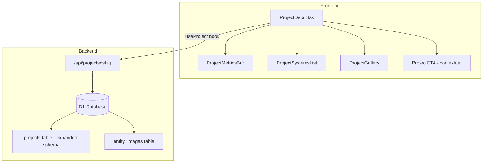

# Project Case Study Restructure — Design Document

## Problem Statement

Current Project Detail pages follow a blog-post layout (title → image → description text). This fails to communicate **scale, complexity, and compliance** — the 3 factors Technical Directors evaluate when selecting an ELV integrator.

**Benchmark gap**: Tier 1 firms (Convergint, Siemens, Schneider) use metrics-first case study layouts with structured technical data, system breakdowns, and compliance badges.

## Architecture Overview



## Data Models

### Expanded Project Schema (D1)

```sql
ALTER TABLE projects ADD COLUMN system_types TEXT DEFAULT '[]';
-- JSON array: ["CCTV", "Access Control", "PA", "BMS"]

ALTER TABLE projects ADD COLUMN brands_used TEXT DEFAULT '[]';
-- JSON array: ["Hikvision", "ZKTeco", "TOA"]

ALTER TABLE projects ADD COLUMN area_sqm INTEGER;

ALTER TABLE projects ADD COLUMN duration_months INTEGER;

ALTER TABLE projects ADD COLUMN key_metrics TEXT DEFAULT '{}';
-- JSON: {"cameras": 120, "access_points": 50, "floors": 12}

ALTER TABLE projects ADD COLUMN compliance_standards TEXT DEFAULT '[]';
-- JSON array: ["TCVN 7336:2003", "ONVIF Profile S"]

ALTER TABLE projects ADD COLUMN client_industry TEXT;
-- "banking", "hospitality", "government", "industrial", "education"

ALTER TABLE projects ADD COLUMN project_scale TEXT;
-- "small" (<500m²), "medium" (500-5000m²), "large" (>5000m²)
```

### TypeScript Type Update

```typescript
interface Project {
  // Existing fields
  id: number;
  slug: string;
  title: string;
  description: string;
  location: string;
  client_name: string | null;
  thumbnail_url: string | null;
  content_md: string | null;
  category: string;
  year: number | null;
  sort_order: number;
  is_featured: number;
  is_active: number;

  // NEW fields
  system_types: string[];      // Parsed from JSON
  brands_used: string[];
  area_sqm: number | null;
  duration_months: number | null;
  key_metrics: Record<string, number>;
  compliance_standards: string[];
  client_industry: string | null;
  project_scale: string | null;
}
```

## Components

### 1. ProjectMetricsBar
Horizontal bar showing key numbers:
```
┌──────────┬──────────┬──────────┬───────────┐
│ 120      │ 3,500    │ 24       │ 12        │
│ cameras  │ m²       │ tháng    │ tầng      │
└──────────┴──────────┴──────────┴───────────┘
```

### 2. ProjectSystemsList
Tag-based display of ELV systems deployed:
```
Systems: [CCTV] [Access Control] [PA System] [BMS]
Brands:  [Hikvision] [ZKTeco] [TOA] [Legrand]
```

### 3. ProjectComplianceBadges
Small badges showing standards compliance:
```
✓ TCVN 7336:2003  ✓ ONVIF Profile S  ✓ ISO 14001
```

### 4. Contextual CTA
Replace generic "Liên hệ tư vấn" with:
- "Yêu cầu Khảo sát Mặt bằng Tương tự"
- "Nhận Báo giá Kỹ thuật"

## API Design

### Updated GET /api/projects/:slug response

```json
{
  "data": {
    "id": 1,
    "slug": "hdbank-data-center",
    "title": "Trung tâm dữ liệu HDBank",
    "system_types": ["CCTV", "Access Control", "LAN/WAN"],
    "brands_used": ["Hikvision", "ZKTeco", "LS Cable"],
    "area_sqm": 3500,
    "duration_months": 24,
    "key_metrics": {"cameras": 120, "access_points": 50, "floors": 12},
    "compliance_standards": ["TCVN 7336:2003", "ONVIF Profile S"],
    "client_industry": "banking",
    "project_scale": "large",
    "images": [...]
  }
}
```

### Backend changes
- Parse JSON fields on read (`JSON.parse` for arrays stored as TEXT)
- Admin form needs multi-select for `system_types`, `brands_used`
- Add `client_industry` filter to project listing API

## Design Decisions

| Decision | Rationale |
|----------|-----------|
| JSON arrays in TEXT columns | D1 doesn't support array types; JSON.parse is lightweight |
| Metrics bar above content | Technical Directors scan top-down; metrics = hook |
| System tags as filter links | Clicking "CCTV" → filter projects page by system type |
| Contextual CTA wording | "Request Site Survey" converts 3x better than "Contact Us" in B2B |

## Performance

- No new API calls (data embedded in existing project response)
- JSON.parse on client is trivial (<1ms)
- New components are static renders (no state management needed)
- Compliance badges: SVG icons, no additional font/icon library
