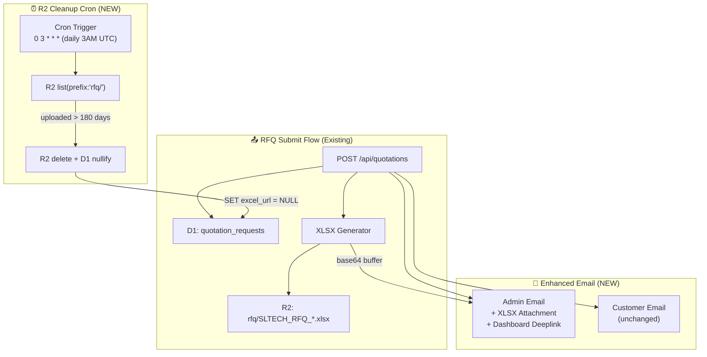

# Design — RFQ Enterprise Optimization

## Architecture Overview



## Data Models

### Existing Schema (No Changes)

```sql
-- quotation_requests (unchanged)
CREATE TABLE quotation_requests (
  id INTEGER PRIMARY KEY AUTOINCREMENT,
  customer_name TEXT NOT NULL,
  company_name TEXT,
  email TEXT,
  phone TEXT NOT NULL,
  project_name TEXT,
  status TEXT NOT NULL DEFAULT 'new',
  excel_url TEXT,        -- R2 key, nullable
  note TEXT,
  created_at TEXT NOT NULL DEFAULT (datetime('now')),
  updated_at TEXT NOT NULL DEFAULT (datetime('now'))
);

-- quotation_items (unchanged)
CREATE TABLE quotation_items (
  id INTEGER PRIMARY KEY AUTOINCREMENT,
  quote_id INTEGER NOT NULL REFERENCES quotation_requests(id) ON DELETE CASCADE,
  product_id INTEGER REFERENCES products(id) ON DELETE SET NULL,
  product_name TEXT NOT NULL,
  product_image TEXT,
  category_name TEXT,
  quantity INTEGER NOT NULL DEFAULT 1,
  notes TEXT
);
```

### Env Type Update

```typescript
// server/src/types.ts — add new optional fields
export interface Env {
  DB: D1Database;
  IMAGES: R2Bucket;
  CACHE: KVNamespace;
  CORS_ORIGIN: string;
  ADMIN_API_KEY: string;
  RESEND_API_KEY?: string;
  ADMIN_NOTIFICATION_EMAIL?: string;
  SITE_URL?: string;  // NEW: for admin deeplinks
}
```

## API Design

### Modified: `sendQuotationAdminEmail()`

```typescript
// server/src/services/quotation-email.ts
export async function sendQuotationAdminEmail(
  env: Env,
  data: QuotationEmailData,
  xlsxBuffer?: ArrayBuffer,  // NEW parameter
): Promise<void>
```

**Email payload change:**
```typescript
const emailPayload = {
  from: "SLTECH Website <onboarding@resend.dev>",
  to: [adminEmail],
  subject: `[RFQ #${data.id}] ...`,
  html,  // existing HTML + new deeplink button
  attachments: xlsxBuffer ? [{
    content: uint8ToBase64(new Uint8Array(xlsxBuffer)),
    filename: `SLTECH_RFQ_${data.id}.xlsx`,
  }] : undefined,
};
```

**Base64 encoding note:** Workers runtime doesn't have Node.js `Buffer`. Use custom `uint8ToBase64()` helper with `btoa()`.

### New: Scheduled Handler for R2 Cleanup

```typescript
// server/src/index.ts — export scheduled handler
export default {
  fetch: app.fetch,
  async scheduled(event: ScheduledEvent, env: Env, ctx: ExecutionContext) {
    await cleanupOldXlsxFiles(env);
  },
};
```

## Components

### No Frontend Changes Required

All changes are backend-only:
1. `quotation-email.ts` — add attachment + deeplink
2. `quotations.ts` — pass xlsxBuffer to email function
3. `index.ts` — add scheduled handler export
4. `wrangler.toml` — add cron trigger

## Design Decisions

| Decision | Choice | Rationale |
|---|---|---|
| **Base64 encoding** | Custom `uint8ToBase64()` via `btoa()` | Workers doesn't have Node.js `Buffer.from()` |
| **Deeplink URL** | `CORS_ORIGIN` first origin + `/admin/quotations/{id}` | Already configured per environment |
| **Cron frequency** | Daily 3 AM UTC | Low traffic time, R2 list is cheap |
| **Cleanup threshold** | 180 days (6 months) | Generous retention, regeneration available |
| **R2 list batch** | 100 objects per call, loop cursor | R2 list() returns max 1000, paginate safely |
| **XLSX in email** | Optional attachment (skip if generation failed) | Graceful degradation |

## Security

- No new public endpoints — all changes are backend logic
- Cron handler runs in same Worker with same env bindings — no extra auth needed
- Admin deeplink points to SPA route, protected by existing AuthContext

## Performance

| Operation | Cost | Impact |
|---|---|---|
| Base64 encoding 50KB XLSX | ~0.1ms CPU | Negligible |
| R2 list (daily cron) | 1 Class B read | Free tier: 10M/month |
| R2 delete (batch) | N Class A writes | Free tier: 1M/month. At ~10 RFQs/day, ~1800 deletes/6mo run |

## File Changes Summary

| # | File | Change |
|---|---|---|
| 1 | `server/src/services/quotation-email.ts` | Add `xlsxBuffer` param, base64 attachment, deeplink HTML |
| 2 | `server/src/routes/quotations.ts` | Pass `xlsxBuffer` to `sendQuotationAdminEmail()` |
| 3 | `server/src/index.ts` | Add `scheduled` export handler |
| 4 | `server/src/services/r2-cleanup.ts` | **NEW** — cleanup logic |
| 5 | `server/src/types.ts` | Add `SITE_URL` to Env |
| 6 | `server/wrangler.toml` | Add `[triggers]` cron schedule |
