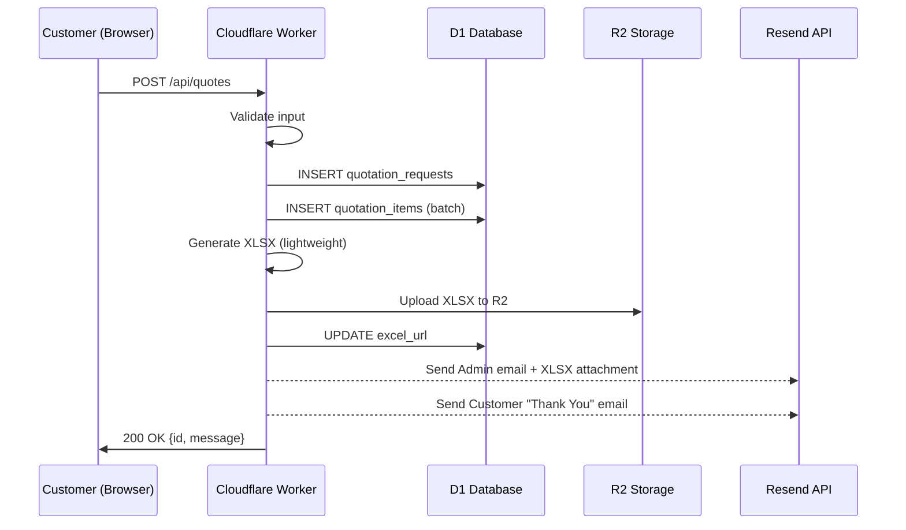

# Design — Professional B2B RFQ System

## Architecture Overview

```mermaid
graph TB
    subgraph "Frontend — Vite SPA"
        A1["ProductCard / ProductDetail"] -->|"Thêm vào báo giá"| A2["CartContext (localStorage)"]
        A2 --> A3["/gio-hang-bao-gia Page"]
        A3 --> A4["QuoteForm (Project Name, Customer Info)"]
        A4 -->|"POST /api/quotes"| API
    end

    subgraph "Backend — Cloudflare Workers (Hono)"
        API["POST /api/quotes"] --> V["Validation + Rate Limit"]
        V --> D1["D1: quotation_requests + quotation_items"]
        V --> XL["XLSX Generator (lightweight)"]
        V --> R2["R2: Store XLSX file"]
        V --> EM1["Resend: Admin Notification + XLSX attachment"]
        V --> EM2["Resend: Customer 'Thank You' email"]
    end

    subgraph "Admin Panel"
        AD1["Sidebar: 'Yêu cầu báo giá'"] --> AD2["AdminQuotes List"]
        AD2 --> AD3["Status Toggle (New → Processing → Sent → Completed)"]
        AD2 --> AD4["Detail View"]
        AD4 --> AD5["Download XLSX"]
    end

    subgraph "D1 Database"
        QR["quotation_requests"] --> QI["quotation_items"]
        QI --> P["products (FK)"]
        P --> PC["product_categories (FK + RESTRICT)"]
        P --> B["brands (FK + RESTRICT)"]
    end
```



## Data Models

### NEW: `quotation_requests` Table

```sql
CREATE TABLE IF NOT EXISTS quotation_requests (
  id INTEGER PRIMARY KEY AUTOINCREMENT,
  -- Customer info
  customer_name TEXT NOT NULL,
  company_name TEXT,
  email TEXT,
  phone TEXT NOT NULL,
  project_name TEXT,             -- NEW: tên dự án
  -- Status workflow
  status TEXT NOT NULL DEFAULT 'new',  -- new | processing | sent | completed
  -- Generated files
  excel_url TEXT,                -- R2 URL to generated XLSX
  -- Metadata
  note TEXT,
  created_at TEXT NOT NULL DEFAULT (datetime('now')),
  updated_at TEXT NOT NULL DEFAULT (datetime('now'))
);

CREATE INDEX IF NOT EXISTS idx_quotation_requests_status
  ON quotation_requests(status);
CREATE INDEX IF NOT EXISTS idx_quotation_requests_created
  ON quotation_requests(created_at DESC);
```

### NEW: `quotation_items` Table

```sql
CREATE TABLE IF NOT EXISTS quotation_items (
  id INTEGER PRIMARY KEY AUTOINCREMENT,
  quote_id INTEGER NOT NULL REFERENCES quotation_requests(id) ON DELETE CASCADE,
  product_id INTEGER REFERENCES products(id) ON DELETE SET NULL,
  product_name TEXT NOT NULL,     -- Snapshot tên sản phẩm tại thời điểm gửi
  product_image TEXT,             -- Snapshot URL ảnh
  category_name TEXT,             -- Snapshot category
  quantity INTEGER NOT NULL DEFAULT 1,
  notes TEXT,                     -- Ghi chú cho từng item
  UNIQUE(quote_id, product_id)
);

CREATE INDEX IF NOT EXISTS idx_quotation_items_quote
  ON quotation_items(quote_id);
```

### Deletion Constraints (ALTER existing)

```sql
-- Ensure products cannot be orphaned
-- D1/SQLite: Need to recreate tables or use triggers
-- Approach: Add trigger-based constraints

-- Prevent deletion of categories that have products
CREATE TRIGGER IF NOT EXISTS prevent_category_delete
  BEFORE DELETE ON product_categories
  FOR EACH ROW
  WHEN (SELECT COUNT(*) FROM products WHERE category_id = OLD.id AND deleted_at IS NULL) > 0
BEGIN
  SELECT RAISE(ABORT, 'Cannot delete category with active products');
END;

-- Prevent deletion of brands that have products
CREATE TRIGGER IF NOT EXISTS prevent_brand_delete
  BEFORE DELETE ON brands
  FOR EACH ROW
  WHEN (SELECT COUNT(*) FROM products WHERE brand_id = OLD.id AND deleted_at IS NULL) > 0
BEGIN
  SELECT RAISE(ABORT, 'Cannot delete brand with active products');
END;
```

### TypeScript Types Update

```typescript
// Frontend types/index.ts additions
export interface QuotationRequest {
  id: number;
  customer_name: string;
  company_name: string | null;
  email: string | null;
  phone: string;
  project_name: string | null;
  status: QuoteStatus;
  excel_url: string | null;
  note: string | null;
  created_at: string;
  updated_at: string;
  items?: QuotationItem[];
}

export interface QuotationItem {
  id: number;
  quote_id: number;
  product_id: number | null;
  product_name: string;
  product_image: string | null;
  category_name: string | null;
  quantity: number;
  notes: string | null;
}

export type QuoteStatus = 'new' | 'processing' | 'sent' | 'completed';

// Updated QuoteFormData
export interface QuoteFormData {
  company_name: string;
  customer_name: string;
  phone: string;
  email: string;
  project_name: string;  // NEW
  notes: string;
}
```

### Server Types Update

```typescript
// server/src/types.ts additions
export interface QuotationRequestRow {
  id: number;
  customer_name: string;
  company_name: string | null;
  email: string | null;
  phone: string;
  project_name: string | null;
  status: string;
  excel_url: string | null;
  note: string | null;
  created_at: string;
  updated_at: string;
}

export interface QuotationItemRow {
  id: number;
  quote_id: number;
  product_id: number | null;
  product_name: string;
  product_image: string | null;
  category_name: string | null;
  quantity: number;
  notes: string | null;
}
```

## API Design

### New/Updated Endpoints

| Method | Endpoint | Auth | Description |
|--------|---------|------|-------------|
| POST | `/api/quotes` | Public (rate-limited) | Submit RFQ → save to `quotation_requests` + `quotation_items` → generate XLSX → send emails |
| GET | `/api/admin/quotations` | Admin | List quotation requests (paginated, filterable by status) |
| GET | `/api/admin/quotations/:id` | Admin | Single quotation detail with items |
| PUT | `/api/admin/quotations/:id/status` | Admin | Update status (new → processing → sent → completed) |
| GET | `/api/admin/quotations/:id/excel` | Admin | Download/regenerate XLSX |
| DELETE | `/api/admin/quotations/:id` | Admin | Delete quotation request + cascade items |

### POST `/api/quotes` Request Body

```json
{
  "customer_name": "Nguyễn Văn A",
  "company_name": "Công ty TNHH ABC",
  "email": "nguyen@abc.com",
  "phone": "0901234567",
  "project_name": "Tòa nhà XYZ - Phase 2",
  "note": "Cần hàng gấp trong tháng 4",
  "items": [
    {
      "product_id": 5,
      "product_name": "Hikvision DS-2CD2143G2-IU",
      "product_image": "https://r2.sltech.vn/products/hikvision-xxx.webp",
      "category_name": "Camera IP",
      "quantity": 50,
      "notes": "Outdoor, IP67"
    }
  ]
}
```

### Response Flow



## Components

### A. `/gio-hang-bao-gia` Page Layout

```
┌─────────────────────────────────────────────────────┐
│  Breadcrumb: Trang chủ > Giỏ hàng báo giá          │
│                                                      │
│  ┌───────────────────────────────────────────────┐   │
│  │  📋 Danh sách sản phẩm báo giá (3 sản phẩm)  │   │
│  ├──────┬────────────┬──────────┬────┬──────┬────┤   │
│  │ Ảnh  │ Sản phẩm   │ Danh mục │ SL │ Ghi │ ✕  │   │
│  ├──────┼────────────┼──────────┼────┼──────┼────┤   │
│  │ [img]│ Camera IP  │ CCTV     │[5 ]│      │ ✕  │   │
│  │ [img]│ Switch PoE │ Network  │[2 ]│      │ ✕  │   │
│  │ [img]│ NVR 32CH   │ CCTV     │[1 ]│      │ ✕  │   │
│  └──────┴────────────┴──────────┴────┴──────┴────┘   │
│                                                      │
│  ┌───────────────────────────────────────────────┐   │
│  │  📝 Thông tin liên hệ                         │   │
│  │  ┌──────────────────┐  ┌──────────────────┐   │   │
│  │  │ Tên công ty *    │  │ Tên dự án        │   │   │
│  │  ├──────────────────┤  ├──────────────────┤   │   │
│  │  │ Người liên hệ * │  │ Số điện thoại *  │   │   │
│  │  ├──────────────────┤  ├──────────────────┤   │   │
│  │  │ Email *          │  │ Ghi chú          │   │   │
│  │  └──────────────────┘  └──────────────────┘   │   │
│  │                                                │   │
│  │  [============ GỬI YÊU CẦU BÁO GIÁ =========] │   │
│  └───────────────────────────────────────────────┘   │
│                                                      │
│  ┌───────────────────────────────────────────────┐   │
│  │  ℹ️ Quy trình:                                │   │
│  │  1. Chọn sản phẩm → 2. Gửi yêu cầu →        │   │
│  │  3. Nhận báo giá qua email trong 24h          │   │
│  └───────────────────────────────────────────────┘   │
└─────────────────────────────────────────────────────┘
```

### B. Admin Quotation Dashboard

```
┌─────────────────────────────────────────────────────┐
│  📋 Yêu cầu báo giá          [Filter: ▼ All Status]│
│                                                      │
│  ┌──────┬──────────┬──────────┬──────┬──────┬──────┐│
│  │ #ID  │ Khách    │ Công ty  │ SL   │ Ngày │Status││
│  ├──────┼──────────┼──────────┼──────┼──────┼──────┤│
│  │ #125 │ Nguyễn A │ ABC Ltd  │ 5 SP │ 31/3 │[NEW ]││
│  │ #124 │ Trần B   │ XYZ Corp │ 3 SP │ 30/3 │[PROC]││
│  │ #123 │ Lê C     │ DEF Inc  │ 8 SP │ 29/3 │[SENT]││
│  └──────┴──────────┴──────────┴──────┴──────┴──────┘│
│                                                      │
│  ── Detail Panel ───────────────────────────────────│
│  Customer: Nguyễn A | Phone: 090xxx | Email: a@b.c  │
│  Project: Tòa nhà XYZ Phase 2                       │
│  ┌──────────────┬──────────┬────┐                    │
│  │ Sản phẩm     │ Danh mục │ SL │                    │
│  │ Camera IP    │ CCTV     │ 50 │                    │
│  │ Switch PoE   │ Network  │ 10 │                    │
│  └──────────────┴──────────┴────┘                    │
│  [📥 Tải Excel] [🔄 Đổi trạng thái]                 │
└─────────────────────────────────────────────────────┘
```

### C. XLSX Template Structure

```
┌──────────────────────────────────────────────────────┐
│  [SLTECH Logo]  SONG LINH TECHNOLOGY CO., LTD       │
│  Hệ thống tích hợp ELV & ICT                        │
│  ────────────────────────────────────────────────     │
│                                                       │
│  PHIẾU YÊU CẦU BÁO GIÁ — Mã: SLTECH_RFQ_125       │
│  Ngày: 31/03/2026                                    │
│                                                       │
│  THÔNG TIN KHÁCH HÀNG                                │
│  Công ty: Công ty TNHH ABC                           │
│  Người liên hệ: Nguyễn Văn A                        │
│  SĐT: 0901234567 | Email: nguyen@abc.com            │
│  Dự án: Tòa nhà XYZ - Phase 2                       │
│                                                       │
│  DANH SÁCH SẢN PHẨM                                 │
│  ┌────┬────────────┬──────────┬────┬──────┬────────┐ │
│  │STT │ Sản phẩm   │ Danh mục │ SL │ Đ.Giá│ T.Tiền│ │
│  ├────┼────────────┼──────────┼────┼──────┼────────┤ │
│  │ 1  │ Camera IP  │ CCTV     │ 50 │      │        │ │
│  │ 2  │ Switch PoE │ Network  │ 10 │      │        │ │
│  └────┴────────────┴──────────┴────┴──────┴────────┘ │
│                                                       │
│  Ghi chú: Cần hàng gấp trong tháng 4                │
│  ────────────────────────────────────────────────     │
│  SLTECH — songlinh@sltech.vn — sltech.vn            │
└──────────────────────────────────────────────────────┘
```

### D. Email Templates

#### Admin Notification Email
- **To**: songlinh@sltech.vn
- **Subject**: `[Báo giá #125] Nguyễn Văn A — Công ty TNHH ABC (5 sản phẩm)`
- **Body**: HTML table with customer info + product list (reuse existing template, enhanced)
- **Attachment**: `SLTECH_RFQ_125_20260331.xlsx`

#### Customer Confirmation Email
- **To**: customer email
- **Subject**: `SLTECH — Xác nhận yêu cầu báo giá #125`
- **Body**: Professional HTML template:
  - Thank you message
  - RFQ summary (number, date, product count)
  - Expected response time (24-48h)
  - SLTECH contact info

## Design Decisions

| Decision | Rationale |
|----------|-----------|
| New `quotation_requests` table instead of ALTER `quote_requests` | Cleaner schema, normalized items, no breaking changes to existing data |
| SQLite triggers for deletion constraints | D1 doesn't support ALTER CONSTRAINT; triggers provide same protection |
| Snapshot product data in `quotation_items` | Products may change after quote; historical accuracy required |
| XLSX via lightweight approach | Workers 1MB bundle limit — full ExcelJS too heavy. Use minimal XML generation or `xlsx-js-style` (lightweight fork) |
| R2 storage for XLSX files | Persistent, CDN-cached, sharable URLs. Admin can re-download anytime |
| CartContext kept as-is | Already works well with localStorage persistence. Just add `project_name` to form data |
| Dedicated `/gio-hang-bao-gia` page | Better UX than drawer for B2B users who need to review before submitting |

## Security

- **Admin Route Protection**: Client-side `AuthContext` redirect (SPA limitation). Backend routes already require `X-API-Key` header via `requireAuth` middleware.
- **robots.txt**: `Disallow: /admin` to prevent search engine indexing
- **Rate Limiting**: POST `/api/quotes` already rate-limited (5 requests/hour per IP)
- **Input Sanitization**: HTML strip on all text fields. Email format validation. Phone format validation.
- **XLSX Security**: Generated server-side, no user-uploaded macros
- **Honeypot**: Existing honeypot field preserved in form

## Performance

- **XLSX Generation**: Lightweight approach — < 50ms for typical 10-item quote
- **R2 Upload**: Async, non-blocking — response returns before upload completes (best-effort)
- **Email Sending**: Async, non-blocking — wrapped in try/catch, quote save succeeds even if email fails
- **Cart Persistence**: localStorage — instant access, no network calls
- **Admin List**: Paginated with D1 indices on `status` and `created_at`
- **Image Optimization**: Product thumbnails already WebP pipeline
