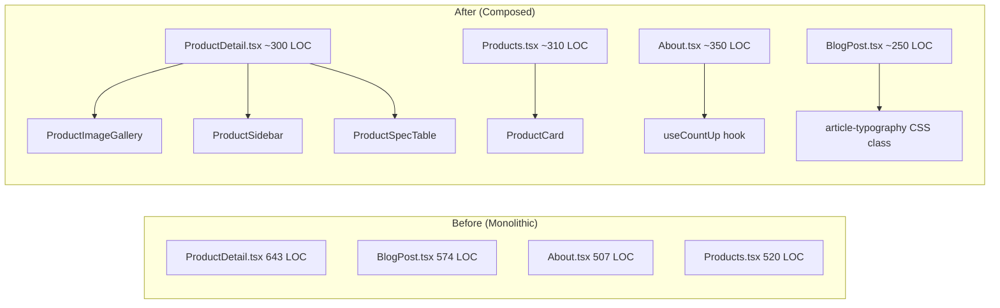

# Design — Simplify Codebase

## Architecture Overview

No architectural changes — this is a refactoring that preserves the existing structure while reducing file-level complexity.



## Component Extractions

### From ProductDetail.tsx (643 → ~300 LOC)

| New File | Lines Extracted | Responsibility |
|---|---|---|
| `components/products/ProductImageGallery.tsx` | L199–257 | Main image + thumbnail gallery with click-to-select |
| `components/products/ProductSidebar.tsx` | L497–636 | Sticky sidebar: tech summary card + B2B CTA + compare |
| `components/products/ProductSpecTable.tsx` | L342–388 | Technical specifications table with striped rows |
| `components/products/LinkedProjectsSection.tsx` | L390–439 | Social proof section showing linked projects |
| `components/products/RelatedProductsGrid.tsx` | L441–493 | Related products grid |

### From Products.tsx (520 → ~310 LOC)

| New File | Lines Extracted | Responsibility |
|---|---|---|
| `components/products/ProductCard.tsx` | L307–519 | Full product card with image, badges, action buttons |

### From About.tsx (507 → ~350 LOC)

| New File | Lines Extracted | Responsibility |
|---|---|---|
| `hooks/useCountUp.ts` | L45–78 | IntersectionObserver-based count-up animation hook |
| `components/common/CountUpStat.tsx` | L80–88 | Stat display using useCountUp |
| Move `parseConfigArray` | L103–113 | → `lib/utils.ts` |

### From BlogPost.tsx (574 → ~250 LOC)

| Change | Approach |
|---|---|
| 50-line prose className | Move to `styles/article-typography.css` using `@apply` |

## Shared Utilities

### `useProductActions` hook (new)

```typescript
// hooks/useProductActions.ts
export function useProductActions(product: {
  id: number;
  slug: string;
  name: string;
  image_url: string | null;
  brand_name?: string | null;
}) {
  const { add, remove, isInCompare, isFull } = useCompare();
  const { addItem, items } = useCart();
  
  return {
    inCompare: isInCompare(product.id),
    inCart: items.some(i => i.productId === product.id),
    isFull,
    toggleCompare: () => { /* ... */ },
    addToCart: (categoryName?: string | null) => { /* ... */ },
  };
}
```

### `buildDynamicUpdate` backend helper (new)

```typescript
// server/src/lib/query-builder.ts
export function buildDynamicUpdate<T extends Record<string, unknown>>(
  body: T,
  allowedFields: string[],
): { sets: string[]; values: unknown[] } {
  const sets: string[] = [];
  const values: unknown[] = [];
  for (const field of allowedFields) {
    if (body[field] !== undefined) {
      sets.push(`${field} = ?`);
      values.push(body[field]);
    }
  }
  return { sets, values };
}
```

### `lazyRoute` router helper (new)

```typescript
// In router.tsx
function lazyRoute(Component: React.LazyExoticComponent<() => JSX.Element>) {
  return {
    element: (
      <ErrorBoundary>
        <Suspense fallback={<LoadingSpinner />}>
          <Component />
        </Suspense>
      </ErrorBoundary>
    ),
  };
}
```

### `CategoryTreeNode` type (new)

```typescript
// types/index.ts
export interface CategoryTreeNode {
  id: number;
  slug: string;
  name: string;
  parent_id: number | null;
  sort_order: number;
  children: CategoryTreeNode[];
}
```

## Design Decisions

1. **Extract, don't abstract** — Components are extracted as-is, not abstracted into generic patterns. Readability over DRY.
2. **Co-locate with domain** — Extracted product components go to `components/products/`, not a generic `components/common/`.
3. **CSS @apply for prose** — The 50-line Tailwind className is moved to a CSS file using `@apply`, keeping the same utility classes but in a maintainable location.
4. **Backend helper is opt-in** — `buildDynamicUpdate` is a helper, not a framework. Routes can still use manual builders if needed.

## Security

No security implications — all changes are internal refactoring.

## Performance

No performance implications — component extraction with React.memo is not needed (these are page-level components rendered once).
