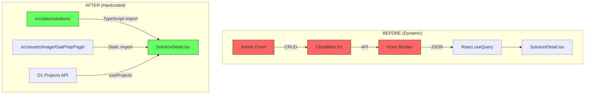

# Solution Hardcode Redesign — Design

## Architecture Overview



## Data Model

### SolutionData Type (`src/data/solutions/types.ts`)

```typescript
export interface SolutionData {
  slug: string;
  title: string;
  subtitle: string; // Value proposition sub-headline
  icon: string; // Lucide icon name
  heroImage: string; // Imported image path
  description: string;

  // Technical Excellence Grid
  capabilities: {
    icon: string;
    title: string;
    description: string;
  }[];

  // System Architecture
  architecture: {
    title: string;
    description: string;
    diagramUrl?: string; // Placeholder image
    integrations: string[];
  };

  // Technical Specs Table
  specs: {
    label: string;
    value: string;
    category?: string;
  }[];

  // Brands/Equipment
  brands: string[];

  // Related project slugs (dynamic fetch)
  relatedProjectSlugs: string[];

  // SEO
  metaTitle?: string;
  metaDescription?: string;
}
```

---

## Component Architecture

### Directory Structure
```
src/
├── data/solutions/
│   ├── types.ts           # SolutionData interface
│   ├── index.ts           # Export all solutions array
│   ├── cctv.ts            # Hệ thống giám sát an ninh AI
│   ├── access-control.ts  # Kiểm soát ra vào
│   ├── face-id.ts         # Nhận diện khuôn mặt
│   ├── parking.ts         # CAR PARKING thông minh
│   ├── parking-guide.ts   # Chỉ dẫn bãi đậu xe
│   ├── ups.ts             # Lưu điện UPS
│   ├── video-wall.ts      # Màn hình ghép
│   ├── turnstile.ts       # Phân làn tự động
│   ├── intercom.ts        # Video intercom
│   ├── vms.ts             # Phần mềm quản lý trung tâm
│   └── data-center.ts     # Hạ tầng mạng Data Center
├── components/solutions/
│   ├── SolutionHero.tsx        # Hero with industry bg
│   ├── TechExcellenceGrid.tsx  # Bento/Feature cards
│   ├── SystemArchitecture.tsx  # Diagram + integrations
│   ├── TechSpecsTable.tsx      # shadcn table
│   ├── ImplementationWorkflow.tsx # 5-step timeline
│   ├── RelatedProjects.tsx     # Dynamic from D1
│   └── ConsultCTA.tsx          # Sticky sidebar + inline CTA
```

### Component Details

#### 1. SolutionHero
- Full-width hero with `heroImage` background
- Gradient overlay (from-black/70)
- Breadcrumbs: Trang chủ > Giải pháp > {title}
- `subtitle` as value proposition
- CTA button: "Yêu cầu khảo sát kỹ thuật"

#### 2. TechExcellenceGrid
- 2×3 or 3×2 bento grid
- Each cell: Lucide icon + title + description
- Subtle industrial shadows, brand blue accent

#### 3. SystemArchitecture
- Left: diagram placeholder image
- Right: description + integration list badges

#### 4. TechSpecsTable
- shadcn/ui Table
- Grouped by `spec.category`
- Alternate row shading
- Roboto Mono for values

#### 5. ImplementationWorkflow
- 5-step horizontal timeline: Tư vấn → Thiết kế → Thi công → Kiểm tra → Bàn giao
- Connected dots with brand blue line
- Step description below each dot

#### 6. RelatedProjects
- Fetch projects from D1 API (`useProjects`)
- Filter by `relatedProjectSlugs`
- Display as compact cards with thumbnail + title

#### 7. ConsultCTA
- Sticky sidebar on desktop (position: sticky, top: 100px)
- Brand blue bg, white text
- CTA: "Tư vấn chuyên gia" + phone icon
- Secondary: "Yêu cầu khảo sát kỹ thuật"

---

## Visual Design Guidelines

| Element | Specification |
|---------|--------------|
| Font headings | Inter, 700 weight |
| Font specs/code | Roboto Mono, 500 weight |
| Brand accent | Primary blue (#1e40af) |
| Background | White (#ffffff) / Light gray (#f8fafc) |
| Card shadow | `0 1px 3px rgba(0,0,0,0.08)` |
| Spacing | 8px grid system |
| Max content width | 1280px |

## Backend Cleanup

### [DELETE] `server/src/routes/solutions.ts`
Remove entire file (137 lines).

### [MODIFY] `server/src/index.ts`
Remove lines:
- `import solutions from "./routes/solutions";`
- `app.route("/api/solutions", solutions);`
- `app.route("/api/admin/solutions", solutions);`

### [DELETE] `src/pages/admin/AdminSolutions.tsx`
Remove entire admin CRUD page.

### [MODIFY] `src/hooks/useApi.ts`
Remove `useSolutions()` and `useSolution()` functions.
