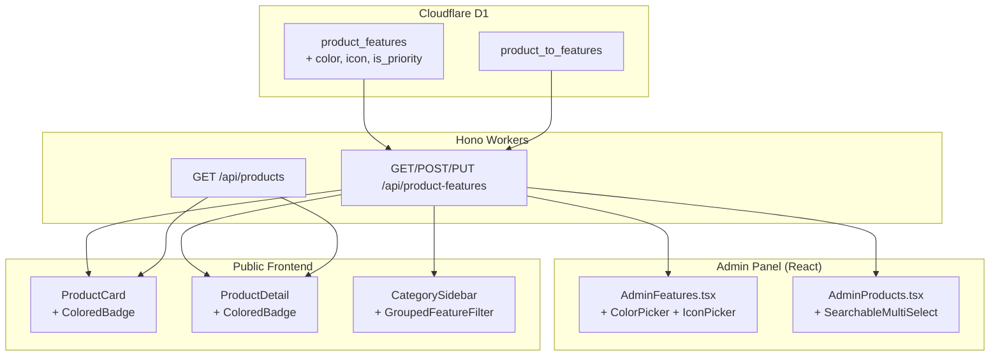

# Visual Feature System — Design

## Architecture Overview



## Data Models

### Migration: `0012_feature_visual_fields.sql`

```sql
-- Add visual fields to product_features
ALTER TABLE product_features ADD COLUMN color TEXT DEFAULT NULL;
ALTER TABLE product_features ADD COLUMN icon TEXT DEFAULT NULL;
ALTER TABLE product_features ADD COLUMN is_priority INTEGER DEFAULT 0;
```

**Notes:**
- D1 hỗ trợ `ALTER TABLE ... ADD COLUMN` nhưng không hỗ trợ `ALTER COLUMN` hay `DROP COLUMN`
- `color`: Hex string (e.g., `#3B82F6`), nullable → null = dùng default primary color
- `icon`: Lucide icon name (e.g., `wifi`, `shield`, `camera`), nullable → null = no icon
- `is_priority`: 0/1, features có `is_priority = 1` hiển thị trước trên product card

### Updated TypeScript Types

```typescript
// server/src/routes/features.ts
interface ProductFeatureRow {
  id: number;
  name: string;
  slug: string;
  group_name: string;
  sort_order: number;
  is_active: number;
  color: string | null;      // NEW
  icon: string | null;       // NEW
  is_priority: number;       // NEW
  created_at: string;
  updated_at: string;
}

// src/types/index.ts & src/lib/admin-api.ts
export interface ProductFeature {
  id: number;
  name: string;
  slug: string;
  group_name: string;
  sort_order?: number;
  is_active?: number;
  color?: string | null;     // NEW
  icon?: string | null;      // NEW
  is_priority?: number;      // NEW
  product_count?: number;
}
```

## API Design

### Endpoints (No new endpoints — extend existing)

#### `POST /api/admin/product-features`
Request body thêm fields:
```json
{
  "name": "PoE+",
  "slug": "poe-plus",
  "group_name": "Kết nối",
  "sort_order": 2,
  "is_active": 1,
  "color": "#3B82F6",
  "icon": "plug-zap",
  "is_priority": 1
}
```

#### `PUT /api/admin/product-features/:id`
Partial update — chỉ gửi fields cần thay đổi.

#### `GET /api/product-features` (Public)
Response thêm `color`, `icon`, `is_priority`:
```json
[
  {
    "id": 1,
    "name": "PoE",
    "slug": "poe",
    "group_name": "Kết nối",
    "sort_order": 1,
    "color": "#3B82F6",
    "icon": "plug-zap",
    "is_priority": 1
  }
]
```

#### `GET /api/product-features/by-product/:productId`
Response thêm `color`, `icon`.

## Components

### 1. `ColorPickerField` (New UI Component)

**Location:** `src/components/admin/ColorPickerField.tsx`

```
┌─────────────────────────────┐
│ Màu badge                   │
│ ┌────────────────────┐ ┌──┐ │
│ │ #3B82F6            │ │██│ │
│ └────────────────────┘ └──┘ │
│ ┌──┬──┬──┬──┬──┬──┬──┬──┐  │
│ │🟥│🟧│🟨│🟩│🟦│🟪│⬛│⬜│  │
│ └──┴──┴──┴──┴──┴──┴──┴──┘  │
└─────────────────────────────┘
```

- Hex input (validated `#RRGGBB` format)
- Color swatch preview
- Preset palette (8-10 curated B2B colors)
- Popover on click for more choices

**Preset Colors:**
```typescript
const PRESET_COLORS = [
  "#3B82F6", // blue
  "#10B981", // emerald
  "#F59E0B", // amber
  "#EF4444", // red
  "#8B5CF6", // violet
  "#EC4899", // pink
  "#06B6D4", // cyan
  "#6B7280", // gray
  "#F97316", // orange
  "#14B8A6", // teal
];
```

### 2. `IconPickerField` (New UI Component)

**Location:** `src/components/admin/IconPickerField.tsx`

```
┌────────────────────────────────┐
│ Icon                           │
│ ┌────────────────────────┐ ┌──┐│
│ │ 🔍 Tìm icon...        │ │⚡││
│ └────────────────────────┘ └──┘│
│ ┌──┬──┬──┬──┬──┬──┬──┬──┐     │
│ │📡│📷│🛡│⚡│🔌│📶│🔥│🌐│     │
│ │📱│🔒│👁│📊│🖥│📦│🔊│💡│     │
│ └──┴──┴──┴──┴──┴──┴──┴──┘     │
│ Showing 16 of 1500+ icons      │
└────────────────────────────────┘
```

- Searchable input
- Grid of Lucide icons (lazy-loaded, virtualized if needed)
- Curated "suggested" icons for ELV domain at top
- Selected icon preview with name

**Curated ELV Icons (prioritized):**
```typescript
const SUGGESTED_ICONS = [
  "wifi", "camera", "shield", "plug-zap", "radio",
  "network", "server", "lock", "eye", "flame",
  "thermometer", "speaker", "monitor", "fingerprint",
  "scan-face", "router", "cable", "hard-drive",
];
```

### 3. `FeatureBadge` (Shared UI Component)

**Location:** `src/components/ui/FeatureBadge.tsx`

Renders a feature badge with dynamic color + icon:
```tsx
<FeatureBadge
  name="PoE"
  color="#3B82F6"
  icon="plug-zap"
/>
// → Blue badge with lightning plug icon and "PoE" text
```

**Auto-contrast logic:**
```typescript
function getContrastColor(hex: string): "white" | "black" {
  const r = parseInt(hex.slice(1, 3), 16);
  const g = parseInt(hex.slice(3, 5), 16);
  const b = parseInt(hex.slice(5, 7), 16);
  // WCAG luminance formula
  const luminance = (0.299 * r + 0.587 * g + 0.114 * b) / 255;
  return luminance > 0.5 ? "black" : "white";
}
```

### 4. `SearchableFeatureSelect` (Admin Component)

**Location:** `src/components/admin/SearchableFeatureSelect.tsx`

Multi-select combobox replacing the current checkbox grid:

```
┌─────────────────────────────────┐
│ Tính năng (5 đã chọn)          │
│ ┌─────────────────────────────┐ │
│ │ 🔍 Tìm tính năng...        │ │
│ └─────────────────────────────┘ │
│ ┌─────────────────────────────┐ │
│ │ ▸ Kết nối                   │ │
│ │   ☑ PoE        ☑ WiFi      │ │
│ │   ☐ TCP/IP    ☑ Wiegand    │ │
│ │ ▸ Hình ảnh                  │ │
│ │   ☑ 4K Ultra HD ☐ H.265+  │ │
│ │   ☐ DarkFighter            │ │
│ │ ▸ An toàn                   │ │
│ │   ☐ Chống cháy             │ │
│ └─────────────────────────────┘ │
│ Selected: PoE, WiFi, 4K, Wiegand│
│         [x PoE] [x WiFi] ...    │
└─────────────────────────────────┘
```

- Grouped by `group_name`
- Search filters across all groups
- Selected items shown as removable badges below

### 5. `GroupedFeatureFilter` (Frontend Component)

**Location:** `src/components/products/GroupedFeatureFilter.tsx`

Replaces flat tag list in sidebar with collapsible groups:

```
┌──────────────────────────┐
│ Tính năng                │
│ ▾ Kết nối                │
│   [●PoE] [WiFi] [TCP/IP]│
│ ▾ Hình ảnh               │
│   [●4K] [DarkFighter]   │
│ ▸ An toàn (collapsed)    │
│ ▸ PCCC (collapsed)       │
└──────────────────────────┘
```

## Design Decisions

| Decision | Choice | Rationale |
|----------|--------|-----------|
| Icon storage | Lucide name string | Lucide đã installed, tree-shakeable, 1500+ icons |
| Color format | Hex `#RRGGBB` | Simple, universal, CSS-compatible |
| Contrast algorithm | WCAG luminance | Industry standard, ensures readability |
| Multi-select approach | Custom combobox | shadcn Popover + Command combo đã quen thuộc |
| Icon picker virtualization | Simple search filter | < 50 commonly used → curated list + search |

## Security

- Không có thay đổi security — các endpoint admin vẫn require `X-API-Key` authentication
- Color/icon values validated server-side (hex format, known icon names)

## Performance

- **Icon import**: Dynamic import `lucide-react` icons → bundled statically (React tree-shaking)
- **Feature badge render**: Memoized `FeatureBadge` component, no heavy computation
- **Multi-select**: Debounced search (200ms), no API call needed (all features pre-fetched)
- **Sidebar filter**: Client-side grouping, groups default collapsed → instant interaction
