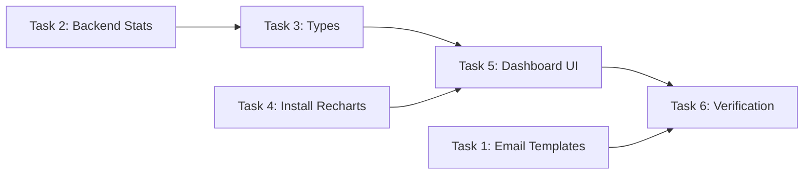

# Planning: Admin Visual Intelligence

## Task Breakdown

### Task 1: Email Template Refinement (Backend)
**File:** `server/src/services/email.ts`
**Effort:** Medium
**Subtasks:**
- [ ] 1.1 Create shared HTML builder functions: `buildEmailHeader`, `buildInfoRow`, `buildEmailFooter`, `buildActionButtons`
- [ ] 1.2 Refactor `sendQuotationAdminEmail` to use new builders with branded layout (logo, info cards, striped table, Zalo + Email CTAs, footer)
- [ ] 1.3 Refactor `sendContactAdminEmail` to use new builders
- [ ] 1.4 Refactor `sendQuotationCustomerEmail` to use new builders (customer-facing, no admin CTA)
- [ ] 1.5 Verify TypeScript compilation (`npx tsc --noEmit` in server/)

### Task 2: Dashboard Backend Enhancement
**File:** `server/src/routes/admin.ts`
**Effort:** Small
**Subtasks:**
- [ ] 2.1 Add trend queries (quotes this week vs last week, contacts this week vs last week)
- [ ] 2.2 Replace 6-month chart query with 30-day daily granularity query
- [ ] 2.3 Add D1 row count queries (products, projects, contacts, quotations, posts)
- [ ] 2.4 Add R2 storage monitoring via `c.env.IMAGES.list()`
- [ ] 2.5 Update response shape to include `trends`, `dailyQuotesChart`, and `storage`

### Task 3: Update DashboardStats Type
**Files:** `src/types/index.ts`, `src/lib/admin-api.ts`
**Effort:** Small
**Subtasks:**
- [ ] 3.1 Update `DashboardStats` interface to include `trends`, `dailyQuotesChart`, and `storage` fields
- [ ] 3.2 Remove old `quotesChart` field

### Task 4: Install Recharts
**Effort:** Trivial
**Subtasks:**
- [ ] 4.1 Run `npm install recharts`

### Task 5: Dashboard Frontend Overhaul
**File:** `src/pages/admin/AdminDashboard.tsx`
**Effort:** Large
**Subtasks:**
- [ ] 5.1 Update stat cards to show trend badges (▲/▼/—) based on `trends` data
- [ ] 5.2 Replace CSS bar chart with Recharts `AreaChart` (30-day daily, #3C5DAA stroke, gradient fill)
- [ ] 5.3 Keep/improve existing recent quotations table (already good)
- [ ] 5.4 Add StorageMonitor section (D1 row counts per entity + R2 object count with progress bars)
- [ ] 5.5 Adjust responsive grid layout (chart full-width, split bottom: 2/3 activities + 1/3 storage)

### Task 6: Verification
**Effort:** Small
**Subtasks:**
- [ ] 6.1 Run `npx tsc --noEmit` in server/
- [ ] 6.2 Run `npx tsc --noEmit` in root
- [ ] 6.3 Visual check via dev server: verify dashboard loads with charts and live data
- [ ] 6.4 Submit a test RFQ via the website and verify email formatting

## Dependencies

- Tasks 1 and 2 are independent — can be done in parallel.
- Task 3 depends on Task 2 (must know the exact response shape).
- Task 4 is a prerequisite for Task 5 (Recharts must be installed).
- Task 5 depends on Tasks 3 and 4.
- Task 6 depends on all prior tasks.

## Implementation Order

1. **Task 1** — Email Templates (isolated, no cross-dependencies)
2. **Task 2** — Backend Stats Enhancement
3. **Task 3** — Update TypeScript Types
4. **Task 4** — Install Recharts
5. **Task 5** — Dashboard Frontend Overhaul
6. **Task 6** — Verification

## Risks

| Risk | Likelihood | Mitigation |
|------|-----------|------------|
| Email logo image not accessible from email client | Medium | Use text-only fallback header. Only reference a publicly accessible URL. |
| R2 `.list()` returns truncated results | Low | R2 returns up to 1000 keys by default. Use `truncated` flag to show "1000+" if truncated. |
| Recharts bundle size impact | Low | Admin pages are lazy-loaded via code splitting. No impact on public pages. |
| D1 COUNT queries adding latency | Very Low | COUNT on indexed columns is fast. All queries already run in parallel via `Promise.all`. |
