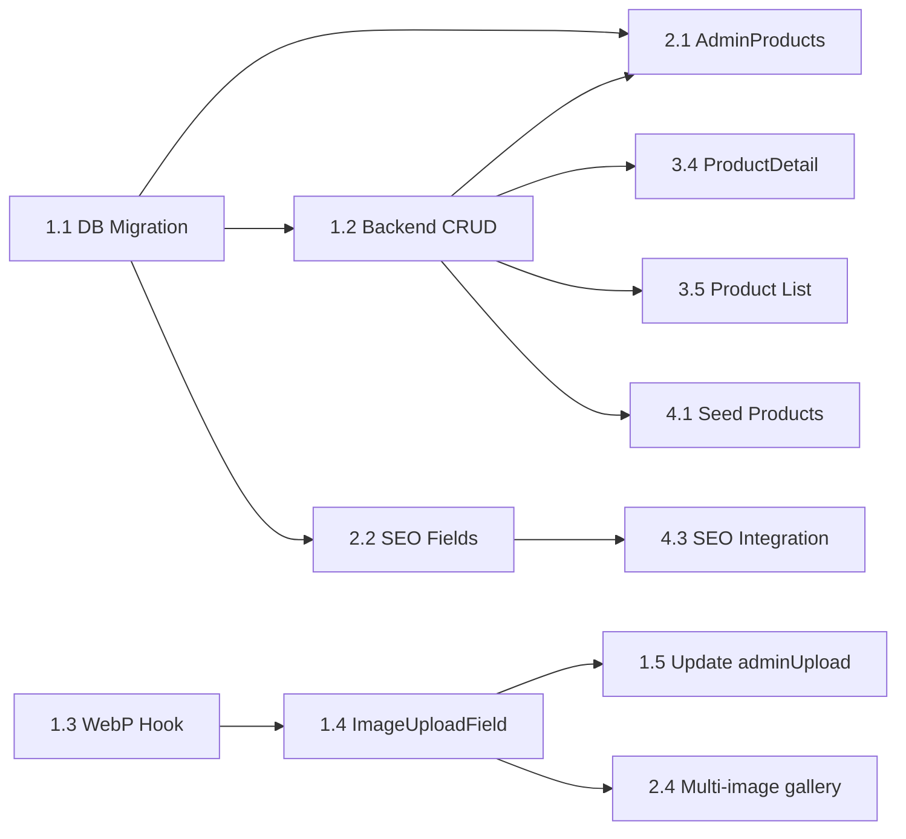

# Planning — B2B Platform Comprehensive Upgrade

## Task Breakdown

### Sprint 1: Asset Pipeline + DB Foundation (Est: 4-6h)

| # | Task | Subtasks | Effort |
|---|------|----------|--------|
| 1.1 | **D1 Schema Migration** | Write & run ALTER TABLE for solutions, projects, posts (SEO fields); CREATE TABLE products | 30min |
| 1.2 | **Backend CRUD cho products** | Add Hono routes: GET/POST/PUT/DELETE for products table; update existing GET endpoints to include new fields | 1.5h |
| 1.3 | **`useWebPConverter` hook** | Canvas resize + toBlob + preview URL + size comparison | 1h |
| 1.4 | **`ImageUploadField` component** | Multi-image upload UI with WebP auto-convert, spinner, preview, delete | 1.5h |
| 1.5 | **Update `adminUpload()`** | Intercept file → convert WebP → send to R2 | 30min |
| 1.6 | **Verify Pipeline** | Upload .png in admin → check R2 stores .webp → verify size reduction | 30min |

### Sprint 2: Admin Forms Enhancement (Est: 3-4h)

| # | Task | Subtasks | Effort |
|---|------|----------|--------|
| 2.1 | **AdminProducts page refactor** | From categories-only → full products CRUD with all fields (specs JSON editor, features tags, brand, model) | 2h |
| 2.2 | **SEO Meta Fields** | Add meta_title + meta_description inputs to AdminSolutions, AdminProjects, AdminPosts forms | 45min |
| 2.3 | **PDF Upload Field** | Reusable component for `spec_sheet_url` — file picker + upload to R2 + link display | 30min |
| 2.4 | **Multi-image gallery** | Integrate `ImageUploadField` in AdminProjects, AdminSolutions, AdminProducts | 45min |

### Sprint 3: Content & Layout Refinement (Est: 5-7h)

| # | Task | Subtasks | Effort |
|---|------|----------|--------|
| 3.1 | **SolutionDetail redesign** | Hero section (hero_image_url), feature grid (parse content_md sections), sidebar refine, specs section | 2h |
| 3.2 | **ProjectDetail case study** | Section parser for content_md (Overview/Challenges/Solutions/Equipment), TOC sidebar, styled section cards | 1.5h |
| 3.3 | **BlogPost structured layout** | Featured image hero, reading time, structured sections, related posts sidebar | 1h |
| 3.4 | **ProductDetail enhanced** | Specs table, features badges, image gallery carousel, datasheet button, brand badge | 1.5h |
| 3.5 | **Product List page** | Grid with search + category filter + brand filter (connected to new products API) | 1h |

### Sprint 4: Product Seeding + Polish (Est: 2-3h)

| # | Task | Subtasks | Effort |
|---|------|----------|--------|
| 4.1 | **Seed B2B product data** | 15-20 products across categories: CCTV (Hikvision, Bosch), Fire (Honeywell), Networking (Cisco), Access Control (ZKTeco) | 1.5h |
| 4.2 | **Update TypeScript types** | Sync `admin-api.ts` types with new DB columns; update `useApi.ts` hooks | 30min |
| 4.3 | **SEO integration** | Use meta_title/meta_description in `<SEO>` component per detail page | 30min |

## Dependencies

## Implementation Order

1. **DB Migration** (foundation — everything depends on this)
2. **Backend CRUD** (products routes)
3. **WebP Hook + ImageUploadField** (reusable across admin forms)
4. **AdminProducts refactor** (needs backend + image upload)
5. **SEO Meta Fields** in admin forms
6. **Detail page redesigns** (SolutionDetail → ProjectDetail → ProductDetail → BlogPost)
7. **Product seeding** (after admin CRUD works)
8. **Polish + Verification**

## Risks

| Risk | Impact | Mitigation |
|------|--------|------------|
| Safari WebP encoding support | Old Safari (< 16) can't encode WebP | Detect support; fallback to JPEG if unsupported |
| Large images freeze UI during conversion | UX lag | Use `createImageBitmap()` + OffscreenCanvas if available |
| D1 ALTER TABLE limitations | D1 doesn't support all ALTER TABLE variants | Test migration on dev D1 first |
| Content_md parsing breaks existing data | Old data doesn't have structured headings | Graceful fallback: if no `##` found, render as prose |
| Product seed data accuracy | Using public specs | Mark as "reference data" — admin can edit later |

## Verification Plan

### Automated Browser Tests
1. **WebP Pipeline Test**: Open admin → upload .png → verify spinner shows → verify preview is WebP → verify R2 receives WebP
2. **Product CRUD Test**: Create product with all fields → verify appears in product list → edit → delete
3. **Detail Page Visual Test**: Navigate to Solution/Project/Product/Blog detail → verify sections render correctly

### Manual Verification (by Project Owner)
1. Upload 3 different image formats (.png, .jpg, .bmp) through admin → confirm all convert to WebP
2. Check R2 dashboard → verify only .webp files stored
3. Browse each redesigned detail page → visual quality check
4. Verify product catalog page shows seeded data with specs + datasheet links
5. Check SEO: inspect `<title>` and `<meta description>` on detail pages
