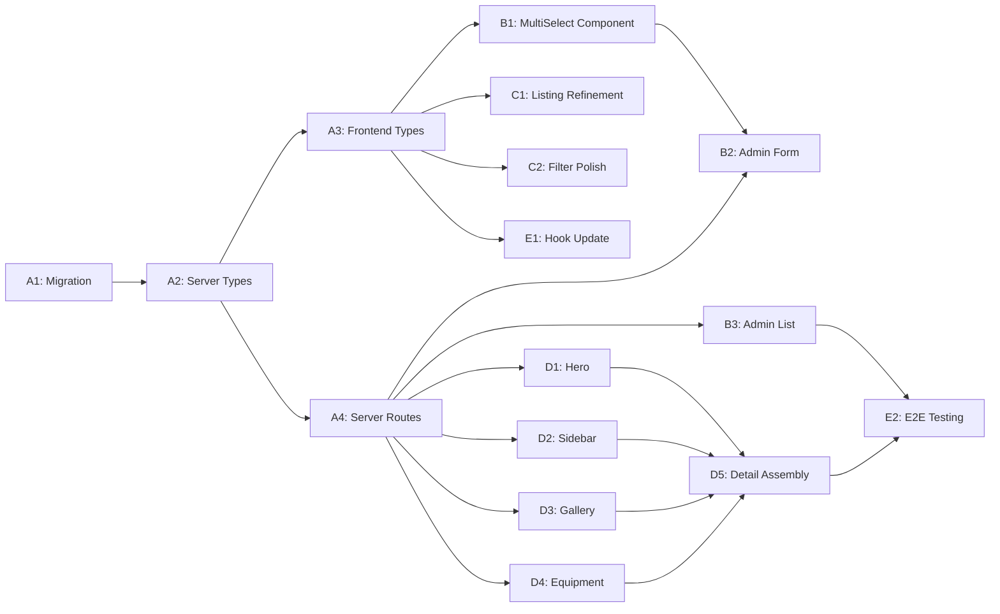

# B2B Professional Portfolio — Planning

## Task Breakdown

### Phase A: Database & Schema (TASK 1)

- [ ] **A1**: Create migration `0016_b2b_portfolio.sql`
  - Add `completion_year TEXT` to projects
  - Add `related_solutions TEXT DEFAULT '[]'` to projects
  - Add `related_products TEXT DEFAULT '[]'` to projects
  - Effort: S (15 min)

- [ ] **A2**: Update server types (`server/src/types.ts`)
  - Add `completion_year`, `related_solutions`, `related_products` to `ProjectRow`
  - Effort: S (10 min)

- [ ] **A3**: Update frontend types (`src/types/index.ts`)
  - Add new fields + `linked_solutions` and `linked_products` populated types to `Project`
  - Effort: S (10 min)

- [ ] **A4**: Update server routes (`server/src/routes/projects.ts`)
  - **GET /:slug**: Add JOIN queries for solutions and products by parsing `related_solutions`/`related_products` JSON
  - **POST /**: Accept and store new fields
  - **PUT /:id**: Accept and store new fields, sync `project_products` junction table
  - Effort: M (30 min)

### Phase B: Admin Project Management (TASK 2)

- [ ] **B1**: Create `RelationalMultiSelect` component (`src/components/admin/RelationalMultiSelect.tsx`)
  - Searchable dropdown with chip-based selection
  - Fetches options from API
  - Displays labels, optional images/icons
  - Effort: M (45 min)

- [ ] **B2**: Update `AdminProjects.tsx` — Form enhancements
  - Add `completion_year` text input
  - Add `RelationalMultiSelect` for Solutions (fetch from `/api/solutions`)
  - Add `RelationalMultiSelect` for Products (fetch from `/api/products`)
  - Parse/serialize JSON for `related_solutions` and `related_products`
  - Effort: M (30 min)

- [ ] **B3**: Update `AdminProjects.tsx` — List view enhancements
  - Add inline toggle for `is_featured` (star icon button with PATCH mutation)
  - Add inline toggle for `is_active` (switch/badge with PATCH mutation)
  - Display `completion_year` and `client_name` columns
  - Improve thumbnail display
  - Effort: M (30 min)

### Phase C: Project Listing Page (TASK 3)

- [ ] **C1**: Review and refine `Projects.tsx`
  - Verify `flex-col` + `mt-auto` for uniform card heights (already implemented)
  - Verify `aspect-video` for cover images (already implemented)
  - Verify `line-clamp-2` for titles (already implemented)
  - Add minimum card height for consistency
  - Polish hover animations and transitions
  - Effort: S (20 min)

- [ ] **C2**: Verify category tab filtering
  - Confirm smooth no-reload filtering (already implemented via React state)
  - Enhance filter tab styling to premium look
  - Add active count or subtle animation on tab switch
  - Effort: S (15 min)

### Phase D: Project Detail Page (TASK 4)

- [ ] **D1**: Create `ProjectHero.tsx` component
  - Full-width hero with cover image
  - Gradient overlay (from-black/60 to-transparent)
  - Project title overlay with glass effect
  - Breadcrumbs on top
  - Effort: M (30 min)

- [ ] **D2**: Create `ProjectInfoSidebar.tsx` component
  - Client name with Building2 icon
  - Location with MapPin icon
  - Completion year with Calendar icon
  - Scale/area with Ruler icon
  - Industry with Briefcase icon
  - Duration with Clock icon
  - Styled as a bordered card (sticky on scroll)
  - Effort: M (30 min)

- [ ] **D3**: Create `ProjectGallery.tsx` component
  - Responsive image grid (2-3 columns)
  - Click-to-expand lightbox modal
  - Image counter and navigation in lightbox
  - Smooth transitions
  - Effort: M (45 min)

- [ ] **D4**: Create `ProjectUsedEquipment.tsx` component
  - Section title "Sản phẩm đã sử dụng"
  - Grid of product cards (image, name, category)
  - Links to product detail page
  - Only renders if `linked_products` has items
  - Effort: M (30 min)

- [ ] **D5**: Rewrite `ProjectDetail.tsx` — Assemble new layout
  - Replace current single-column layout
  - Integrate ProjectHero, 2-column content+sidebar grid, ProjectGallery, ProjectUsedEquipment
  - Use existing ProjectMetricsBar, ProjectSystemsList, ProjectComplianceBadges
  - Responsive: sidebar collapses below content on mobile
  - Effort: L (60 min)

### Phase E: Integration & Testing

- [ ] **E1**: Update `useApi.ts` hooks for new project data shape
  - Ensure `useProject()` returns linked solutions/products
  - Effort: S (10 min)

- [ ] **E2**: End-to-end testing
  - Admin: Create project with all fields → verify in DB
  - Admin: Edit project, change linked solutions/products → verify sync
  - Frontend: Visit listing page → verify card uniformity
  - Frontend: Visit detail page → verify all sections render
  - Effort: M (30 min)

## Dependencies

## Implementation Order

1. **A1 → A2 → A3 → A4**: Database & backend first (foundation)
2. **B1 → B2 → B3**: Admin panel (data entry)
3. **C1 → C2**: Listing page refinements (quick wins)
4. **D1 → D2 → D3 → D4 → D5**: Detail page components (the showcase)
5. **E1 → E2**: Integration & verification

## Risks

| # | Risk | Probability | Impact | Mitigation |
|---|------|-------------|--------|------------|
| R1 | D1 migration breaks existing data | Low | High | Migration is additive only (ALTER TABLE ADD COLUMN) |
| R2 | Related solutions/products JSON out of sync with actual records | Medium | Medium | Validate IDs on save; gracefully handle missing records on read |
| R3 | Lightbox library compatibility | Low | Low | Use custom implementation with React portals, no external dependency |
| R4 | Image gallery performance with many images | Medium | Medium | Lazy loading + limit gallery to 8 images in admin |
| R5 | Admin form too long/complex | Medium | Low | Group related fields with collapsible sections |

## Effort Estimates

| Phase | Tasks | Total Effort |
|-------|-------|-------------|
| A: Database & Schema | 4 | ~65 min |
| B: Admin Management | 3 | ~105 min |
| C: Listing Page | 2 | ~35 min |
| D: Detail Page | 5 | ~195 min |
| E: Integration | 2 | ~40 min |
| **Total** | **16** | **~440 min (~7.5h)** |
