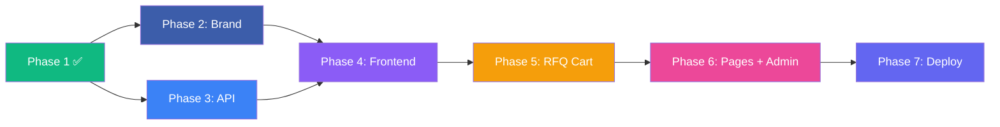

# Planning — SLTECH B2B Website Rebuild

## Task Breakdown

### Phase 1: Foundation & Data (P0) — ✅ DONE

| # | Task | Effort | Status |
|---|------|--------|--------|
| 1.1 | Cloudflare setup (wrangler.toml, D1, R2) | 0.5d | ✅ Done |
| 1.2 | Review schema (11 bảng) | 0.5d | ✅ Done |
| 1.3 | Seed data (0002_seed_data.sql) | 1d | ✅ Done |
| 1.4 | Quotes route (CRUD + email + CSV) | 1d | ✅ Done |
| 1.5 | Email service (Resend + HTML template) | 0.5d | ✅ Done |
| 1.6 | CSV export utility | 0.5d | ✅ Done |

---

### Phase 2: Brand & Design System (P0) — ✅ DONE

> Brand colors updated #3C5DAA, dark mode ThemeProvider/ThemeToggle, frontend project scaffolded

| # | Task | Effort | Status |
|---|------|--------|--------|
| 2.1 | Cập nhật `globals.css` primary → `#3C5DAA` | 0.5d | ✅ Done |
| 2.2 | ThemeProvider + ThemeToggle + tích hợp | 0.5d | ✅ Done |
| 2.3 | Frontend project setup (package.json, tsconfig, vite, index.html) | 0.5d | ✅ Done |
| 2.4 | Fix dependencies (radix-ui, sonner) + TypeScript verify | 0.25d | ✅ Done |

---

### Phase 3: API Complete (P1) — ✅ DONE

| # | Task | Effort | Status |
|---|------|--------|--------|
| 3.1 | Solutions: GET list/detail, search | 0.5d | ✅ Done |
| 3.2 | Products: GET list/detail, filter by category, search | 0.5d | ✅ Done |
| 3.3 | Product categories: GET tree with product count | 0.25d | ✅ Done |
| 3.4 | Projects: GET list/detail, filter by featured/category | 0.5d | ✅ Done |
| 3.5 | Posts: GET list/detail, tag filter | 0.25d | ✅ Done |
| 3.6 | Partners, Gallery, Site-config: hoàn thiện | 0.5d | ✅ Done |
| 3.7 | Pagination helper chuẩn hóa | 0.25d | ✅ Done |

---

### Phase 4: Frontend Core Pages (P1) — ✅ DONE

| # | Task | Effort | Status |
|---|------|--------|--------|
| 4.1 | API client (`src/lib/api.ts`) + custom hooks | 0.5d | ✅ Done |
| 4.2 | **Homepage** (7 sections: Hero, Stats, Solutions, Process, Projects, Partners, CTA) | 1.5d | ✅ Done |
| 4.3 | **Giải pháp** (list grid + detail page) | 0.5d | ✅ Done |
| 4.4 | **Sản phẩm** (sidebar categories + grid + search + detail) | 1d | ✅ Done |
| 4.5 | **Dự án** (list + case study detail) | 0.5d | ✅ Done |
| 4.6 | UX/UI review + fixes (Hero CTA, image fallbacks, animation) | 0.5d | ✅ Done |

---

### Phase 5: RFQ Cart & Quote Flow (P2) — ✅ DONE

| # | Task | Effort | Status |
|---|------|--------|--------|
| 5.1 | CartContext (localStorage, add/remove/update) | 0.5d | ✅ Done |
| 5.2 | CartDrawer (slide-out) + CartBadge (header) | 0.5d | ✅ Done |
| 5.3 | AddToCartButton (shared component) | 0.25d | ✅ Done |
| 5.4 | QuoteForm (modal: company, name, phone, email, note) | 0.5d | ✅ Done |
| 5.5 | Integration: submit → API → email + CSV | 0.5d | ✅ Done |
| 5.6 | Toast notifications | 0.25d | ✅ Done |

---

### Phase 6: Remaining Pages & Admin (P2) — ✅ Public Pages DONE

| # | Task | Effort | Status |
|---|------|--------|--------|
| 6.1 | About page (company info, vision/mission, values, partners) | 0.5d | ✅ Done |
| 6.2 | Blog (list + detail) | 0.5d | ✅ Done |
| 6.3 | Contact (form + map + info) | 0.5d | ✅ Done |
| 6.4 | Gallery (albums + lightbox) | 0.5d | ✅ Done |
| 6.5 | Admin CRUD (solutions, products, projects, posts) | 1d | ✅ Already built |
| 6.6 | Admin: Quote management + export | 0.5d | Pending |
| 6.7 | Admin: Image upload → R2 | 0.5d | Pending |
| 6.8 | **About: Chứng nhận đối tác** (6 certificates grid, user cung cấp ảnh sau) | 0.25d | ✅ Done |

---

### Phase 7: Polish & Deploy (P3) — ~2 ngày

| # | Task | Effort | Notes |
|---|------|--------|-------|
| 7.1 | SEO (React Helmet: title, meta, OG per page) | 0.5d | ✅ Done — đã có `react-helmet-async` + Schema.org |
| 7.2 | Loading skeletons + error boundaries | 0.25d | ✅ Done — `ErrorBoundary` + inline skeletons |
| 7.3 | Empty states | 0.25d | ✅ Done — `EmptyState` component |
| 7.4 | Responsive testing + fixes | 0.5d | ✅ Done — mobile 375px tested OK |
| 7.5 | `wrangler deploy` → production | 0.25d | Pending |
| 7.6 | Vercel deploy + env vars | 0.25d | Pending |
| 7.7 | Zalo widget + GA4 | 0.25d | ✅ Done — `ZaloWidget` + `useGA4` |
| 7.8 | Smoke test toàn bộ | 0.5d | Pending |
| 7.9 | **EmailJS: Setup + Contact form** | 0.25d | ✅ Done — `email.ts` service + `Contact.tsx` |
| 7.10 | **EmailJS: Quote form integration** | 0.25d | ✅ Done — `QuoteForm.tsx` best-effort |
| 7.11 | **Anti-spam: honeypot + rate limit** | 0.25d | ✅ Done — honeypot + 3/hour rate limit |

---

## Dependencies

## Implementation Order

1. ✅ **Phase 1** — Done
2. ✅ **Phase 2 + 3** — Done
3. ✅ **Phase 4** — Done
4. ✅ **Phase 5** — Done
5. ✅ **Phase 6** — Public pages done, admin pending
6. **Phase 7** — Polish + EmailJS + Deploy

## Risks

| Risk | Impact | Mitigation |
|------|--------|-----------|
| D1 UUID chưa tạo thật | Deploy fail | Tạo trước khi deploy, dùng `--local` cho dev |
| ~~Resend API key chưa setup~~ | ~~Email không gửi~~ | Chuyển sang EmailJS (free <200/tháng) |
| Content chưa đủ | Website trống | Seed data mẫu đủ demo, thêm qua Admin sau |
| Brand blue (#3C5DAA) render khác trên các device | UI inconsistency | Test trên nhiều device, dùng oklch fallback |
| EmailJS spam abuse | Hết quota nhanh | Honeypot + rate limit + reCAPTCHA v3 |
