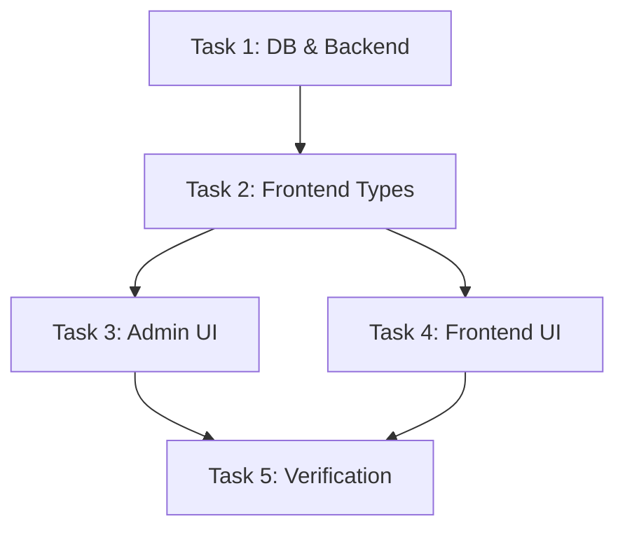

# Blog Authority — Planning Document

## Task Breakdown

### Task 1: Database & Backend (Foundation)
**Effort**: Small | **Priority**: P0 (blocking)

- [x] 1.1 Create migration `0019_blog_authority.sql`
- [x] 1.2 Update `server/src/types.ts` — PostRow with new fields
- [x] 1.3 Update `server/src/routes/posts.ts`
- [ ] 1.4 Deploy migration to D1

### Task 2: Frontend Types & API Layer
**Effort**: Small | **Priority**: P0 (blocking)

- [x] 2.1 Update `src/lib/admin-api.ts` — Post interface with new fields
- [x] 2.2 Update `src/types/index.ts` — Post type
- [x] 2.3 Update `src/components/admin/PostFormSheet.tsx` — PostFormData + defaultPostForm

### Task 3: Admin Reference Manager UI
**Effort**: Medium | **Priority**: P1

- [x] 3.1 Add `ReferenceManager` section inside PostFormSheet sidebar
- [x] 3.2 Add `reviewed_by` field to Publishing section
- [x] 3.3 Add "Whitepaper Template" button alongside existing template button
- [x] 3.4 Wire form state: serialize references to JSON on submit (AdminPosts.tsx)

### Task 4: Frontend Authority UI  
**Effort**: Large | **Priority**: P1

- [x] 4.1 Update BlogPost.tsx meta bar — add last_updated_at, reviewed_by
- [x] 4.2 Create `transformCitations()` function for content pipeline
- [x] 4.3 Create `ReferenceSection` component
- [x] ~~4.4 Add Print/PDF functionality~~ — **REMOVED** (user decision)
- [x] 4.5 Magazine typography refinement — verified existing line-height 1.85

### Task 5: Verification & Polish
**Effort**: Small | **Priority**: P2

- [ ] 5.1 Remove Print/PDF code from BlogPost.tsx and globals.css
- [ ] 5.2 TypeScript compile check
- [ ] 5.3 Visual verification in browser (admin + frontend)
- [ ] 5.4 Test backward compatibility (old posts without references)

## Dependencies

## Implementation Order
1. **Task 1** → Database migration + backend route updates ✅
2. **Task 2** → Frontend type definitions ✅
3. **Task 3 & 4** → Admin UI + Frontend UI ✅
4. **Task 5** → Cleanup print code + verification (IN PROGRESS)

## Scope Changes
- **Removed**: Print/PDF functionality (Task 4.4) — per user decision
- **Removed**: Print CSS from globals.css
- **Removed**: Test print layout (Task 5.3 old) 

## Risks

| Risk | Impact | Mitigation |
|------|--------|------------|
| D1 migration conflict with other features | Medium | Check migration numbering (currently at 0018) |
| `[N]` pattern conflicts with markdown links | Low | Only transform `[N]` where N is a digit and matches a reference index |
| Large refactor of BlogPost.tsx (972 lines) | Medium | Minimize changes, add functions rather than rewriting |
