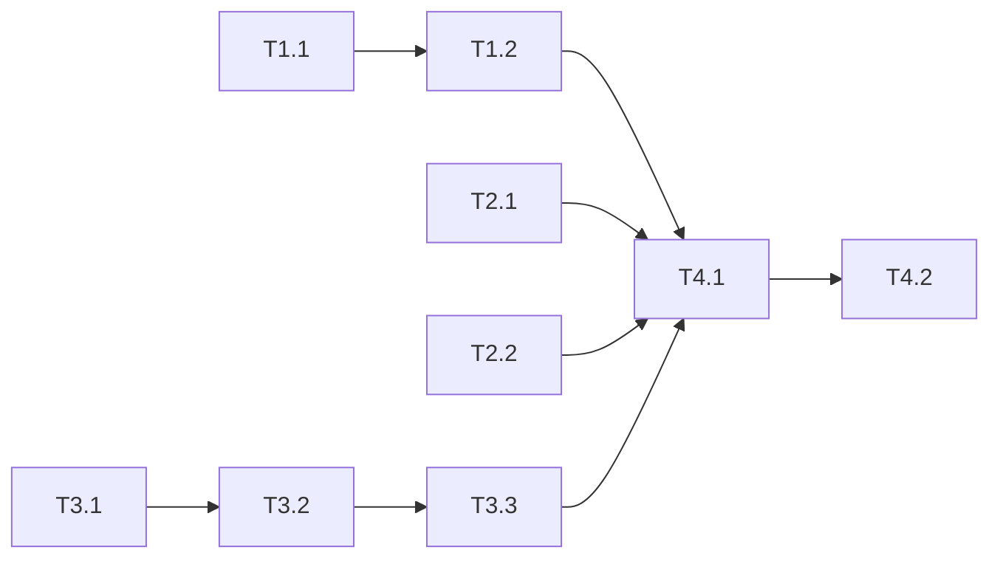

# Planning: Product UI Sync

## Task Breakdown

### Phase 1: Data Seeding (~5 min)
- [ ] **T1.1** Delete junk products ("TestSp*", "Axis-CO") via admin API or D1 SQL
- [ ] **T1.2** Insert 3 realistic products (Hikvision camera, Cisco switch, Legrand cable) with proper specs JSON, categories, and brands

### Phase 2: Listing Page UX (~20 min)
- [ ] **T2.1** Refactor sidebar in `Products.tsx` — wrap filter sections in shadcn `Accordion`
- [ ] **T2.2** Redesign `ProductCard` — move action buttons into card as hover-reveal bottom bar, add `mix-blend-multiply` to images, enforce consistent heights

### Phase 3: Detail Page UX (~15 min)
- [ ] **T3.1** Restructure `ProductDetail.tsx` layout — move brand/SKU/CTA to right sidebar, keep specs table in main content
- [ ] **T3.2** Add "Tải Datasheet" secondary CTA button (conditional on `spec_sheet_url`)
- [ ] **T3.3** Move feature badges above specs table for better visibility

### Phase 4: Verification (~5 min)
- [ ] **T4.1** Visual verification — screenshot both pages, check consistent card heights
- [ ] **T4.2** Functional verification — test "Add to Quote" and "Compare" workflows still work

## Dependencies

## Implementation Order

1. **T1.1 → T1.2** (Data first — needed to test UI changes)
2. **T2.1 → T2.2** (Listing page — sidebar then cards)
3. **T3.1 → T3.2 → T3.3** (Detail page — layout then CTAs then features)
4. **T4.1 → T4.2** (Verification)

## Risks

| Risk | Impact | Mitigation |
|------|--------|------------|
| Accordion component missing from shadcn/ui install | Medium | Check if installed first, install if needed |
| Product images without transparent BG break mix-blend-multiply | Low | Only apply to non-error images, fallback to normal blend |
| Cart/Compare workflows break after button relocation | High | Keep same event handlers, only change DOM position |
| Data seeding needs admin auth token | Low | Use D1 SQL directly if API auth is complex |
