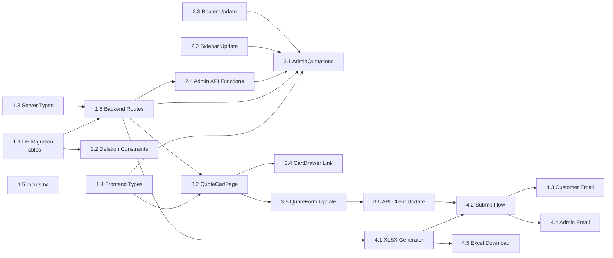

# Planning — Professional B2B RFQ System

## Task Breakdown

### Phase 1: Infrastructure & Security (Est: 2-3h)

| # | Task | Subtasks | Effort |
|---|------|----------|--------|
| 1.1 | **D1 Migration: New Tables** | Create `quotation_requests` table, `quotation_items` table with foreign keys, indices | 30min |
| 1.2 | **D1 Migration: Deletion Constraints** | Create triggers `prevent_category_delete`, `prevent_brand_delete` for products linkage | 20min |
| 1.3 | **Server Types Update** | Add `QuotationRequestRow`, `QuotationItemRow` to `server/src/types.ts` | 15min |
| 1.4 | **Frontend Types Update** | Add `QuotationRequest`, `QuotationItem`, `QuoteStatus`, update `QuoteFormData` with `project_name` | 15min |
| 1.5 | **robots.txt** | Create `public/robots.txt` with `Disallow: /admin` | 5min |
| 1.6 | **Backend: New Quotation Routes** | Create `server/src/routes/quotations.ts` with POST (public), GET list, GET detail, PUT status, DELETE (admin) | 1h |
| 1.7 | **Backend: Register Routes** | Mount new quotation routes in `server/src/index.ts` | 10min |
| 1.8 | **Backend: Deletion Guard** | Update `products.ts` DELETE routes: return 409 if category/brand has linked products (API-level guard alongside DB triggers) | 20min |

### Phase 2: Admin Quotation Management (Est: 3-4h)

| # | Task | Subtasks | Effort |
|---|------|----------|--------|
| 2.1 | **AdminQuotations Page** | Create `src/pages/admin/AdminQuotations.tsx` — list view with status filter, status toggle dropdown, detail expansion | 2h |
| 2.2 | **Admin Sidebar Update** | Add "Yêu cầu báo giá" sub-item to productSubItems in `AdminLayout.tsx` | 15min |
| 2.3 | **Router Update** | Add `admin/quotations` route in `src/router.tsx` | 10min |
| 2.4 | **Admin API Functions** | Add quotation CRUD functions to `src/lib/admin-api.ts` | 30min |
| 2.5 | **Admin Dashboard Widget** | Add RFQ count/stats card to `AdminDashboard.tsx` | 30min |

### Phase 3: Quotation Cart & User Flow (Est: 3-4h)

| # | Task | Subtasks | Effort |
|---|------|----------|--------|
| 3.1 | **CartContext Enhancement** | Add `updateItemNotes` method, ensure `project_name` flows through | 20min |
| 3.2 | **QuoteCartPage** | Create `src/pages/QuoteCart.tsx` — `/gio-hang-bao-gia` with full product table, quantity selectors, item notes, customer form | 2h |
| 3.3 | **Router: Add Cart Page** | Add `/gio-hang-bao-gia` route in `src/router.tsx` | 10min |
| 3.4 | **Update CartDrawer** | Link "Xem chi tiết" button to `/gio-hang-bao-gia` page | 15min |
| 3.5 | **Update QuoteForm** | Add `project_name` field, update API payload for new schema | 20min |
| 3.6 | **Update API Client** | Update `src/lib/api.ts` quotes.submit to match new payload format | 15min |
| 3.7 | **Empty State** | Design empty cart state with CTA to browse products | 15min |

### Phase 4: Automation Pipeline (Est: 3-4h)

| # | Task | Subtasks | Effort |
|---|------|----------|--------|
| 4.1 | **XLSX Generator Utility** | Create `server/src/utils/xlsx-generator.ts` — lightweight XLSX generation with SLTECH branding, customer details, product table, empty price columns | 1.5h |
| 4.2 | **Update Quote Submission Flow** | In POST `/api/quotes`: save to D1 → generate XLSX → upload to R2 → update `excel_url` → send emails | 45min |
| 4.3 | **Customer Email Template** | Create "Thank You" HTML email template in `server/src/services/email.ts` | 30min |
| 4.4 | **Admin Email Update** | Update admin notification to attach XLSX (not CSV) and use new data format | 30min |
| 4.5 | **Admin XLSX Download** | GET `/api/admin/quotations/:id/excel` — return XLSX from R2 or regenerate | 20min |

### Phase 5: Performance & Final Polish (Est: 1-2h)

| # | Task | Subtasks | Effort |
|---|------|----------|--------|
| 5.1 | **UX Polish** | Ensure consistent spacing/padding, hover effects, smooth transitions on cart page | 30min |
| 5.2 | **Smart Truncation** | Text truncation on long product names in cart table and admin list | 15min |
| 5.3 | **Loading States** | Skeleton loaders for admin quotation list, submit button states | 15min |
| 5.4 | **Error Handling** | User-friendly error messages for all failure scenarios | 15min |
| 5.5 | **Verification & Testing** | End-to-end test: add products → view cart → submit → check D1 → check emails | 30min |

## Dependencies

## Implementation Order

1. **D1 Migration** (foundation — tables + constraints + triggers)
2. **Server/Frontend Types** (type safety foundation)
3. **robots.txt** (quick win)
4. **Backend Routes** (quotation CRUD)
5. **Admin API Functions** (bridge between admin UI and backend)
6. **Admin Quotation Page + Sidebar/Router** (admin can view/manage)
7. **CartContext + QuoteCartPage** (user can review cart)
8. **QuoteForm + API Client Update** (user can submit)
9. **XLSX Generator** (professional output)
10. **Submit Flow Integration** (wire everything together)
11. **Email Templates** (admin notification + customer confirmation)
12. **Polish & Verification**

## Risks

| Risk | Impact | Mitigation |
|------|--------|------------|
| ExcelJS too large for Workers | Build fails if > 1MB | Use minimal XML-based XLSX generation or lightweight library like `xlsx-js-style` |
| R2 upload timeout | XLSX not saved | Generate XLSX synchronously before responding; upload async with retry |
| Resend rate limits | Emails not delivered | Rate limit quote submissions (already 5/hour). Queue failed emails for retry |
| D1 trigger syntax | Migration fails | Test triggers on dev D1 first. Fallback: API-level guards only |
| Cart localStorage cleared | User loses cart | Warn before cart clear. Consider session recovery |
| Legacy `quote_requests` data | Old data inaccessible | Keep old table read-only. New code uses `quotation_requests` exclusively |

## Verification Plan

### Automated Browser Tests
1. **Cart Flow Test**: Navigate to products → click "Thêm vào báo giá" → check CartDrawer badge → go to `/gio-hang-bao-gia` → verify product table
2. **Submit Test**: Fill form → submit → verify success toast → verify cart cleared
3. **Admin Test**: Login admin → navigate to "Yêu cầu báo giá" → verify list → change status → verify update

### API Tests
1. POST `/api/quotes` with valid payload → 200 + saved in D1
2. GET `/api/admin/quotations` → returns paginated list
3. PUT `/api/admin/quotations/:id/status` → status updated
4. DELETE category with linked products → 409 error

### Manual Verification
1. Check R2: XLSX file stored with correct naming convention
2. Check email: Admin receives notification with attachment
3. Check email: Customer receives confirmation
4. Open XLSX in Excel: verify branding, layout, empty price columns
