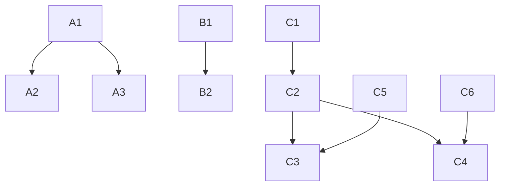

# UX & Content Refinement — Planning

## Task Breakdown

### Sprint A: Card Consistency (UI Fix)
**Effort**: ~1h | **Priority**: P0

| # | Task | File | Estimate |
|---|------|------|----------|
| A1 | Tạo `SolutionIcon` component map icon string → Lucide icon | `components/ui/SolutionIcon.tsx` [NEW] | 15min |
| A2 | Update `SolutionCards.tsx` — thêm icon + color accent vào mỗi card | `components/home/SolutionCards.tsx` | 15min |
| A3 | Update `Solutions.tsx` — đồng bộ icon rendering giống homepage | `pages/Solutions.tsx` | 10min |
| A4 | Improve `FeaturedProjects.tsx` placeholder — gradient + title overlay thay icon xám | `components/home/FeaturedProjects.tsx` | 20min |

### Sprint B: Product Page Content (Data + UI)
**Effort**: ~1.5h | **Priority**: P0

| # | Task | File | Estimate |
|---|------|------|----------|
| B1 | Thêm `SAMPLE_PRODUCTS` constant (15 items từ migration 0006 data) | `lib/constants.ts` | 30min |
| B2 | Refactor `Products.tsx` — thêm "Sản phẩm nổi bật" section dưới categories, product cards | `pages/Products.tsx` | 30min |
| B3 | Tạo `ProductCategoryPage.tsx` — grid products khi click vào 1 category | `pages/ProductCategory.tsx` [CHECK existing] | 20min |

### Sprint C: Content Formatting (Markdown Pipeline)
**Effort**: ~2h | **Priority**: P1

| # | Task | File | Estimate |
|---|------|------|----------|
| C1 | Install `marked` package | `package.json` | 2min |
| C2 | Tạo `useMarkdown.ts` hook | `hooks/useMarkdown.ts` [NEW] | 15min |
| C3 | Update `SolutionDetail.tsx` — sử dụng markdown parser | `pages/SolutionDetail.tsx` | 15min |
| C4 | Update `ProjectDetail.tsx` — sử dụng markdown parser | `pages/ProjectDetail.tsx` | 15min |
| C5 | Tạo migration `0007_rewrite_content_md.sql` — rewrite solutions content có cấu trúc | `server/migrations/0007` [NEW] | 45min |
| C6 | Rewrite projects content_md (HDBank, etc.) trong cùng migration | (same file) | 30min |

## Dependencies

## Implementation Order

1. **Sprint A** (cards) — independent, can start immediately
2. **Sprint B** (products fallback) — independent from A
3. **Sprint C** (markdown) — requires `marked` install

> Sprint A + B có thể chạy song song. Sprint C nên chạy sau vì cần install dependency.

## Risks

| Risk | Mitigation |
|------|------------|
| `marked` package size | Đã xác nhận gzip ~6KB, acceptable |
| Content rewrite quality | Tham khảo data thực từ WordPress legacy site |
| API/DB mismatch khi deploy migration | Client-side fallback data đảm bảo UX không bị ảnh hưởng |
| XSS từ `dangerouslySetInnerHTML` | `marked` + DOMPurify sanitize output |
