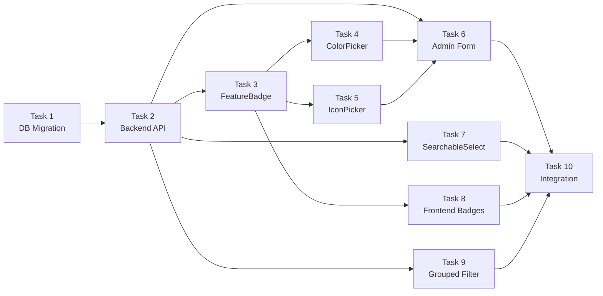

created: 2026-03-30
---
# Visual Feature System — Planning

## Task Breakdown

### Task 1: Database Migration (S — ~15 min)
- [x] 1.1 Create `server/migrations/0012_feature_visual_fields.sql`
- [x] 1.2 `ALTER TABLE product_features ADD COLUMN color TEXT DEFAULT NULL`
- [x] 1.3 `ALTER TABLE product_features ADD COLUMN icon TEXT DEFAULT NULL`
- [x] 1.4 `ALTER TABLE product_features ADD COLUMN is_priority INTEGER DEFAULT 0`
- [x] 1.5 Run migration locally via `wrangler d1 execute`
- [x] 1.6 Update `ProductFeatureRow` type in `server/src/routes/features.ts`

### Task 2: Backend API Update (S — ~20 min)
- [ ] 2.1 Update `GET /api/product-features` to include `color`, `icon`, `is_priority`
- [ ] 2.2 Update `GET /api/product-features/all` (admin) to include new fields
- [ ] 2.3 Update `GET /api/product-features/by-product/:productId` to include new fields
- [ ] 2.4 Update `POST /api/admin/product-features` to accept and insert new fields
- [ ] 2.5 Update `PUT /api/admin/product-features/:id` to accept and update new fields
- [ ] 2.6 Update TypeScript types: `src/types/index.ts`, `src/lib/admin-api.ts`

### Task 3: FeatureBadge Component (S — ~20 min)
- [ ] 3.1 Create `src/components/ui/FeatureBadge.tsx`
- [ ] 3.2 Implement `getContrastColor()` utility (WCAG luminance)
- [ ] 3.3 Dynamic icon rendering with Lucide `icons` map
- [ ] 3.4 Fallback for null color (use primary) and null icon (use Tag)

### Task 4: Admin — ColorPickerField (M — ~30 min)
- [ ] 4.1 Create `src/components/admin/ColorPickerField.tsx`
- [ ] 4.2 Hex input with validation
- [ ] 4.3 Color swatch preview
- [ ] 4.4 Preset color palette (10 B2B colors)
- [ ] 4.5 Popover interaction

### Task 5: Admin — IconPickerField (M — ~40 min)
- [ ] 5.1 Create `src/components/admin/IconPickerField.tsx`
- [ ] 5.2 Curated ELV icon suggestions (20 icons)
- [ ] 5.3 Search filter for all Lucide icons
- [ ] 5.4 Icon grid display with selection state
- [ ] 5.5 Selected icon preview

### Task 6: Admin — Feature Form & List Update (M — ~30 min)
- [ ] 6.1 Update `AdminFeatures.tsx` form: add ColorPickerField
- [ ] 6.2 Update `AdminFeatures.tsx` form: add IconPickerField
- [ ] 6.3 Update `AdminFeatures.tsx` form: add Priority toggle
- [ ] 6.4 Update `AdminFeatures.tsx` form: add Group datalist
- [ ] 6.5 Update `AdminFeatures.tsx` list: colored badge preview column
- [ ] 6.6 Update `defaultForm` to include new fields

### Task 7: Admin — SearchableFeatureSelect (L — ~45 min)
- [ ] 7.1 Create `src/components/admin/SearchableFeatureSelect.tsx`
- [ ] 7.2 Grouped feature display (collapsible groups)
- [ ] 7.3 Search/filter input
- [ ] 7.4 Multi-select toggle with badges
- [ ] 7.5 Replace checkbox grid in `AdminProducts.tsx`
- [ ] 7.6 Wire up `selectedFeatureIds` state

### Task 8: Frontend — Badge Rendering (M — ~30 min)
- [ ] 8.1 Update `ProductCard` in `Products.tsx` to use `FeatureBadge`
- [ ] 8.2 Use `product_features` array (with color/icon) instead of parsed JSON string
- [ ] 8.3 Update `ProductDetail.tsx` badge section to use `FeatureBadge`
- [ ] 8.4 Priority features shown first (sort by `is_priority`)

### Task 9: Frontend — Grouped Feature Filter (M — ~30 min)
- [ ] 9.1 Create `src/components/products/GroupedFeatureFilter.tsx`
- [ ] 9.2 Collapsible sections by `group_name`
- [ ] 9.3 Feature badges with color in filter
- [ ] 9.4 Replace flat tag list in `Products.tsx` sidebar
- [ ] 9.5 Maintain existing URL search param behavior (`?tag=...`)

### Task 10: Integration Test & Polish (S — ~20 min)
- [ ] 10.1 Test full CRUD flow: create feature with color+icon → verify in list
- [ ] 10.2 Test product form: search + select features → save → verify
- [ ] 10.3 Test frontend: product card + detail + filter all show colored badges
- [ ] 10.4 Test edge cases: null color, null icon, empty group
- [ ] 10.5 Verify backward compatibility with existing 30 seed features

## Dependencies

## Implementation Order

1. **Task 1** — Database Migration (foundation)
2. **Task 2** — Backend API (all consumers depend on this)
3. **Task 3** — FeatureBadge component (shared by admin + frontend)
4. **Task 4** — ColorPickerField (admin building block)
5. **Task 5** — IconPickerField (admin building block)
6. **Task 6** — Admin Feature Form & List (combines 3+4+5)
7. **Task 7** — SearchableFeatureSelect (improves product form)
8. **Task 8** — Frontend Badge Rendering (user-facing output)
9. **Task 9** — Frontend Grouped Filter (user-facing enhancement)
10. **Task 10** — Integration test & polish

## Risks

| Risk | Impact | Mitigation |
|------|--------|------------|
| D1 migration failure on prod | High | Test migration on local D1 first, keep columns nullable |
| Lucide dynamic import bundle bloat | Medium | Use `lucide-react` icon map (already tree-shaken), curate suggested list |
| Color picker accessibility | Low | Preset palette covers common cases, hex input for power users |
| Backward compat with seed data | Medium | All new fields nullable with defaults → existing data unaffected |

## Effort Estimate

| Size | Tasks | Time |
|------|-------|------|
| S (Small) | T1, T2, T3, T10 | ~75 min |
| M (Medium) | T4, T6, T8, T9 | ~120 min |
| L (Large) | T5, T7 | ~85 min |
| **Total** | **10 tasks** | **~280 min (~4.5 hours)** |
