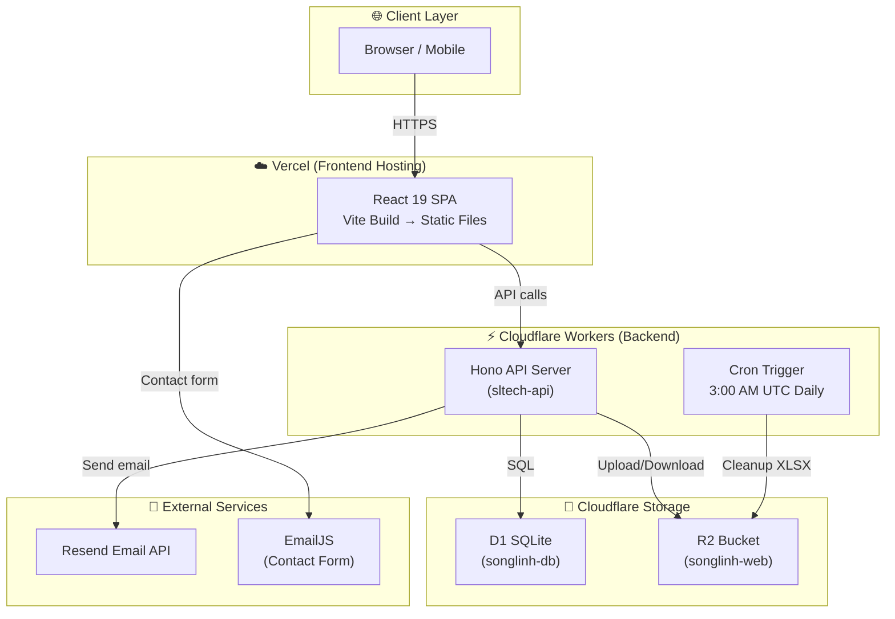
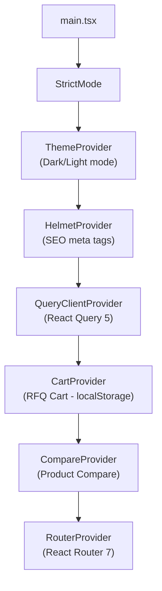
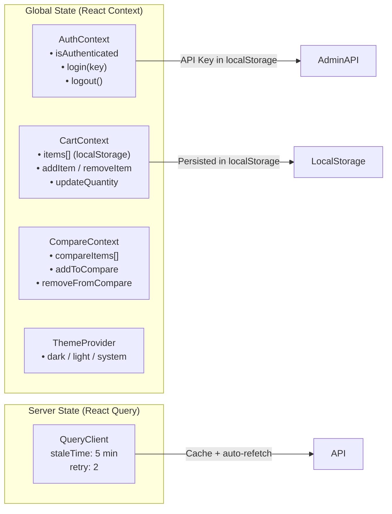
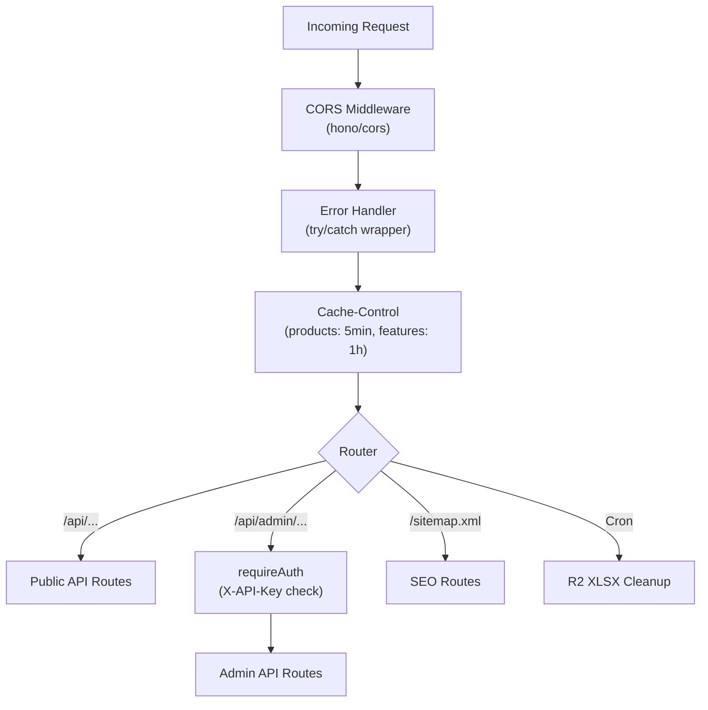
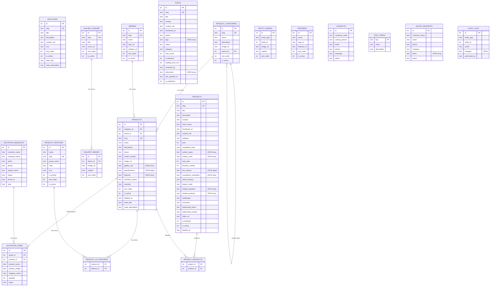
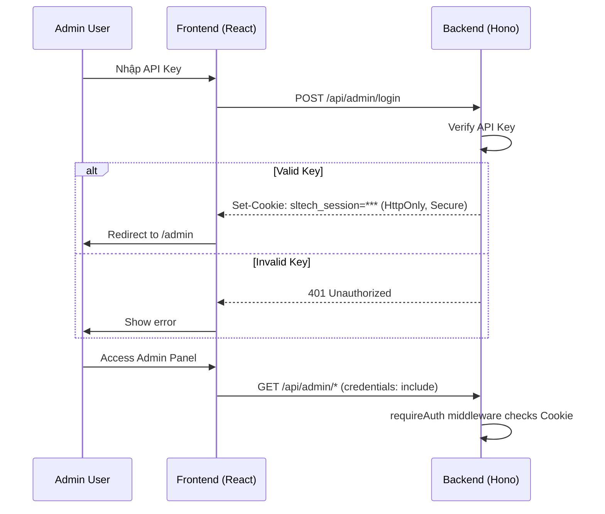
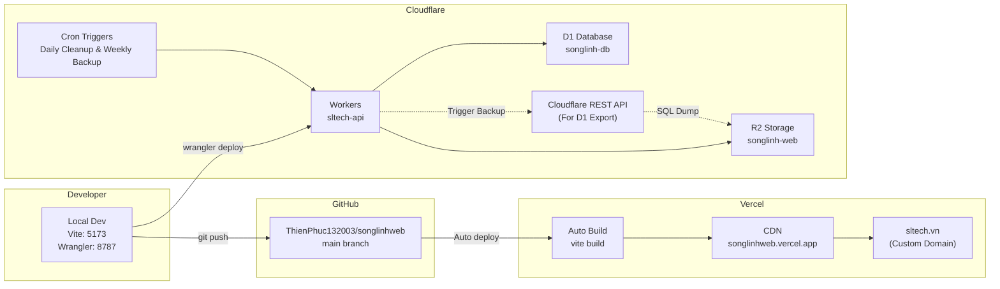
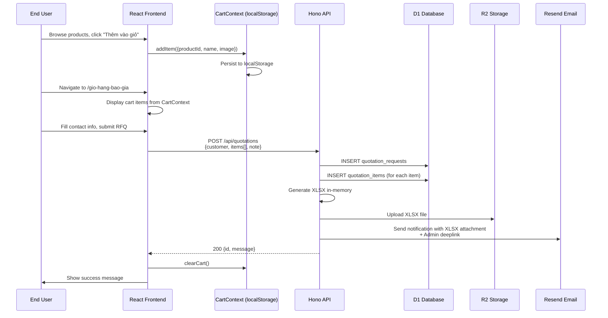

# 🏗️ Tổng quan Kiến trúc Dự án SLTECH

> **Phiên bản:** v1.0.0 | **Ngày review:** 06/04/2026  
> **Repo:** `ThienPhuc132003/songlinhweb` | **Domain:** `sltech.vn`

---

## 1. Kiến trúc Tổng thể (System Architecture)



### Tech Stack Tổng Hợp

| Layer | Technology | Version | Ghi chú |
|-------|-----------|---------|---------|
| **Frontend** | React | 19.x | SPA với React Router 7 |
| **Build Tool** | Vite | 6.x | HMR + code splitting |
| **Styling** | TailwindCSS | 4.x | + tw-animate-css |
| **UI Library** | Radix UI + shadcn/ui | latest | Dialog, Tabs, Dropdown, etc. |
| **State** | TanStack React Query | 5.x | Server state caching (5 min stale) |
| **Animation** | Framer Motion | 11.x | Page transitions, scroll reveals |
| **Backend** | Hono | 4.x | Cloudflare Workers framework |
| **Database** | Cloudflare D1 | — | SQLite at the Edge |
| **File Storage** | Cloudflare R2 | — | S3-compatible object storage |
| **Frontend Host** | Vercel | — | Auto-deploy from GitHub |
| **Backend Host** | Cloudflare Workers | — | Edge compute (wrangler deploy) |
| **Email** | Resend + EmailJS | — | Admin notif + Contact form |

---

## 2. Frontend (React SPA)

### 2.1 Entry Point & Provider Tree



**File:** [main.tsx](file:///d:/GitHub/SongLinh_Website/src/main.tsx)

### 2.2 Routing Map

| Route | Page Component | Mô tả |
|-------|---------------|--------|
| `/` | `Home.tsx` | Landing page (Hero, Solutions, Projects, Partners) |
| `/gioi-thieu` | `About.tsx` | Giới thiệu công ty |
| `/giai-phap` | `Solutions.tsx` | Listing giải pháp |
| `/giai-phap/:slug` | `SolutionDetail.tsx` | Chi tiết giải pháp |
| `/san-pham` | `Products.tsx` | Catalog sản phẩm (filter, search, pagination) |
| `/san-pham/:slug` | `ProductDetail.tsx` | Chi tiết sản phẩm (specs, gallery, related) |
| `/du-an` | `Projects.tsx` | Portfolio dự án |
| `/du-an/:slug` | `ProjectDetail.tsx` | Case study dự án |
| `/tin-tuc` | `Blog.tsx` | Listing bài viết (category, tag filter) |
| `/tin-tuc/:slug` | `BlogPost.tsx` | Chi tiết bài viết (authority citations) |
| `/thu-vien` | `Gallery.tsx` | Thư viện hình ảnh |
| `/gio-hang-bao-gia` | `QuoteCart.tsx` | Giỏ hàng RFQ |
| `/lien-he` | `Contact.tsx` | Form liên hệ |
| `/admin/login` | `AdminLogin.tsx` | Đăng nhập admin |
| `/admin` | `AdminDashboard.tsx` | Dashboard tổng quan |
| `/admin/projects` | `AdminProjects.tsx` | Quản lý dự án |
| `/admin/products` | `AdminProducts.tsx` | Quản lý sản phẩm |
| `/admin/brands` | `AdminBrands.tsx` | Quản lý thương hiệu |
| `/admin/categories` | `AdminCategories.tsx` | Quản lý danh mục SP |
| `/admin/posts` | `AdminPosts.tsx` | Quản lý bài viết |
| `/admin/gallery` | `AdminGallery.tsx` | Quản lý thư viện ảnh |
| `/admin/partners` | `AdminPartners.tsx` | Quản lý đối tác |
| `/admin/contacts` | `AdminContacts.tsx` | Quản lý liên hệ |
| `/admin/settings` | `AdminSettings.tsx` | Cài đặt website |
| `/admin/features` | `AdminFeatures.tsx` | Quản lý tính năng SP |
| `/admin/quotations` | `AdminQuotations.tsx` | Quản lý RFQ |

**File:** [router.tsx](file:///d:/GitHub/SongLinh_Website/src/router.tsx) — Tất cả pages đều lazy-loaded với `React.lazy()` + `Suspense`.

### 2.3 Cấu trúc Thư mục Frontend

```
src/
├── main.tsx                    # Entry point, provider tree
├── router.tsx                  # React Router 7 config (lazy loading)
├── vite-env.d.ts               # Vite type declarations
│
├── pages/                      # 📄 Page components (route-level)
│   ├── Home.tsx                # Landing page (composite of home/* components)
│   ├── About.tsx               # Giới thiệu
│   ├── Solutions.tsx           # Listing giải pháp
│   ├── SolutionDetail.tsx      # Chi tiết giải pháp
│   ├── Products.tsx            # Catalog sản phẩm (19KB)
│   ├── ProductDetail.tsx       # Chi tiết SP (21KB)
│   ├── Projects.tsx            # Portfolio dự án
│   ├── ProjectDetail.tsx       # Case study (12KB)
│   ├── Blog.tsx                # Listing tin tức (17KB)
│   ├── BlogPost.tsx            # Chi tiết bài viết (49KB) ⚠️ Largest file
│   ├── Gallery.tsx             # Thư viện ảnh
│   ├── QuoteCart.tsx           # Giỏ hàng RFQ (17KB)
│   ├── Contact.tsx             # Form liên hệ
│   ├── NotFound.tsx            # 404 page
│   └── admin/                  # 🔐 Admin pages (14 files)
│       ├── AdminDashboard.tsx  # Stats overview
│       ├── AdminProducts.tsx   # Product CRUD (25KB) ⚠️ Large
│       ├── AdminProjects.tsx   # Project CRUD (11KB)
│       ├── AdminPosts.tsx      # Blog CRUD (11KB)
│       ├── AdminQuotations.tsx # RFQ management (22KB)
│       └── ...                 # 9 more admin modules
│
├── components/                 # 🧩 Reusable components
│   ├── ui/                     # Base UI primitives (31 files)
│   │   ├── button.tsx          # CVA-styled button variants
│   │   ├── dialog.tsx          # Radix Dialog wrapper
│   │   ├── tabs.tsx            # Radix Tabs (with "line" variant)
│   │   ├── seo.tsx             # React Helmet SEO component
│   │   ├── error-boundary.tsx  # ErrorBoundary wrapper
│   │   └── ...                 # 26 more UI components
│   │
│   ├── admin/                  # Admin-specific components (11 files)
│   │   ├── AdminLayout.tsx     # Sidebar navigation (12KB)
│   │   ├── CrudHelpers.tsx     # DataTable, PageHeader, Bulk, etc. (21KB)
│   │   ├── PostFormSheet.tsx   # Blog editor dialog (27KB)
│   │   ├── ProjectFormSheet.tsx # Project editor dialog (25KB)
│   │   ├── ImageUploadField.tsx # Multi-image upload + WebP (10KB)
│   │   ├── TagInput.tsx        # Tag input with suggestions
│   │   ├── KeyMetricsEditor.tsx # JSON key-value editor
│   │   ├── RelationalMultiSelect.tsx # Many-to-many picker
│   │   ├── SearchableFeatureSelect.tsx # Feature tag selector
│   │   ├── ColorPickerField.tsx # Color picker
│   │   └── IconPickerField.tsx  # Icon picker (Lucide)
│   │
│   ├── home/                   # Homepage sections (10 files)
│   │   ├── HeroSlider.tsx      # Hero carousel
│   │   ├── SolutionCards.tsx   # Solution overview cards
│   │   ├── FeaturedProjects.tsx # Featured projects
│   │   ├── StatsBar.tsx        # Company statistics
│   │   ├── PartnerLogos.tsx    # Partner carousel
│   │   ├── CompanyIntro.tsx    # Company intro section
│   │   ├── ProcessSteps.tsx    # Work process
│   │   ├── CertificateGallery.tsx # Certificates
│   │   ├── Testimonials.tsx    # Client testimonials
│   │   └── CTABanner.tsx       # Call-to-action
│   │
│   ├── layout/                 # Layout components (6 files)
│   │   ├── Layout.tsx          # Public layout (Header + Footer)
│   │   ├── Header.tsx          # Main navigation (16KB)
│   │   ├── Footer.tsx          # Site footer
│   │   ├── TopBar.tsx          # Top info bar
│   │   ├── FloatingBar.tsx     # Floating action bar
│   │   └── PageHero.tsx        # Page hero banner
│   │
│   ├── products/               # Product-specific (4 files)
│   │   ├── CategorySidebar.tsx # Category tree navigation
│   │   ├── BrandFilter.tsx     # Brand checkboxes
│   │   ├── GroupedFeatureFilter.tsx # Feature tag filter
│   │   └── ProductSearchBar.tsx # Search input
│   │
│   ├── blog/                   # Blog components (empty — inline in BlogPost)
│   ├── cart/                   # Cart components
│   ├── compare/                # Product comparison
│   ├── contact/                # Contact form parts
│   ├── gallery/                # Gallery components
│   ├── projects/               # Project listing parts
│   ├── solutions/              # Solution components
│   ├── theme/                  # ThemeProvider (dark/light)
│   └── widgets/                # Global widgets
│       ├── GA4.tsx             # Google Analytics 4
│       └── ZaloWidget.tsx      # Zalo chat widget
│
├── contexts/                   # 🔄 React Context providers
│   ├── AuthContext.tsx          # Admin auth (API Key in localStorage)
│   ├── CartContext.tsx          # RFQ cart (localStorage persisted)
│   └── CompareContext.tsx       # Product comparison state
│
├── hooks/                      # 🪝 Custom hooks (5 files)
│   ├── useApi.ts               # Generic API fetcher with React Query
│   ├── useDebounce.ts          # Debounced value
│   ├── useMarkdown.ts          # Markdown → HTML (marked library)
│   ├── useScrollReveal.ts      # Intersection Observer animation
│   └── useWebPConverter.ts     # Client-side image → WebP conversion
│
├── lib/                        # 📦 Utilities & API clients
│   ├── api.ts                  # Public API client (fetchApi, fetchPaginated)
│   ├── admin-api.ts            # Admin API client (adminFetch + X-API-Key)
│   ├── constants.ts            # Static data, config (19KB)
│   ├── email.ts                # EmailJS integration
│   ├── motion.ts               # Framer Motion presets
│   ├── solutionImages.ts       # Solution image mapping
│   └── utils.ts                # cn() Tailwind merge helper
│
├── styles/
│   └── globals.css             # Global CSS (Tailwind directives + custom)
│
├── types/
│   └── index.ts                # TypeScript type definitions (312 lines)
│
└── data/
    └── solutions/              # Static solution data
```

### 2.4 Context / State Management



| Context | Persistence | Scope |
|---------|------------|-------|
| `AuthContext` | HttpOnly Cookie (`sltech_session`) | Admin panel only |
| `CartContext` | `localStorage` (`sltech-rfq-cart`) | Global (public pages) |
| `CompareContext` | In-memory (lost on refresh) | Global (product pages) |
| `ThemeProvider` | `localStorage` | Global |
| `React Query` | In-memory cache, 5 min stale | Global |

---

## 3. Backend (Cloudflare Workers)

### 3.1 Entry Point & Middleware Stack



**File:** [index.ts](file:///d:/GitHub/SongLinh_Website/server/src/index.ts)

### 3.2 API Routes Map

#### Public Routes (`/api/*`)

| Method | Endpoint | Route File | Mô tả |
|--------|---------|-----------|--------|
| `GET` | `/api/products` | [products.ts](file:///d:/GitHub/SongLinh_Website/server/src/routes/products.ts) | List SP (category, brand, search, tags, pagination) |
| `GET` | `/api/products/categories` | products.ts | List danh mục |
| `GET` | `/api/products/categories/tree` | products.ts | Dynamic Mega Menu Nested Tree |
| `GET` | `/api/products/:slug` | products.ts | Chi tiết SP + related |
| `GET` | `/api/brands` | [brands.ts](file:///d:/GitHub/SongLinh_Website/server/src/routes/brands.ts) | List thương hiệu |
| `GET` | `/api/projects` | [projects.ts](file:///d:/GitHub/SongLinh_Website/server/src/routes/projects.ts) | List dự án (category, industry, featured) |
| `GET` | `/api/projects/:slug` | projects.ts | Chi tiết dự án + images + linked solutions/products |
| `GET` | `/api/posts` | [posts.ts](file:///d:/GitHub/SongLinh_Website/server/src/routes/posts.ts) | List bài viết (tag, category, search) |
| `GET` | `/api/posts/:slug` | posts.ts | Chi tiết bài viết + view count increment |
| `GET` | `/api/solutions` | [solutions.ts](file:///d:/GitHub/SongLinh_Website/server/src/routes/solutions.ts) | List giải pháp |
| `GET` | `/api/gallery` | [gallery.ts](file:///d:/GitHub/SongLinh_Website/server/src/routes/gallery.ts) | Albums thư viện |
| `GET` | `/api/partners` | [partners.ts](file:///d:/GitHub/SongLinh_Website/server/src/routes/partners.ts) | List đối tác |
| `GET` | `/api/product-features` | [features.ts](file:///d:/GitHub/SongLinh_Website/server/src/routes/features.ts) | List tính năng SP |
| `POST` | `/api/contact` | [contact.ts](file:///d:/GitHub/SongLinh_Website/server/src/routes/contact.ts) | Submit form liên hệ |
| `POST` | `/api/quotations` | [quotations.ts](file:///d:/GitHub/SongLinh_Website/server/src/routes/quotations.ts) | Submit RFQ + email notification |
| `GET` | `/sitemap.xml` | [seo.ts](file:///d:/GitHub/SongLinh_Website/server/src/routes/seo.ts) | Dynamic sitemap |

#### Admin Routes (`/api/admin/*`) — tất cả yêu cầu `requireAuth`

| Method | Endpoint | Mô tả |
|--------|---------|--------|
| `GET` | `/api/admin/*/all` | List ALL records (including inactive/draft) |
| `POST` | `/api/admin/*` | Create new record |
| `PUT` | `/api/admin/*/:id` | Update record |
| `DELETE` | `/api/admin/*/:id` | Soft/Hard delete |
| `POST` | `/api/admin/*/bulk` | Bulk actions (products, posts) |
| `POST` | `/api/admin/upload` | Upload file to R2 (auto WebP) |
| `GET` | `/api/admin/dashboard/stats` | Dashboard statistics |
| `GET` | `/api/admin/audit-logs` | Audit trail |
| `GET` | `/api/admin/quotations/:id/excel` | Download RFQ as XLSX |

### 3.3 Middleware

| File | Chức năng |
|------|----------|
| [auth.ts](file:///d:/GitHub/SongLinh_Website/server/src/middleware/auth.ts) | Xác thực `X-API-Key` header so với `ADMIN_API_KEY` env secret |
| [cors.ts](file:///d:/GitHub/SongLinh_Website/server/src/middleware/cors.ts) | CORS policy (whitelist các domain) |
| [error-handler.ts](file:///d:/GitHub/SongLinh_Website/server/src/middleware/error-handler.ts) | Global try/catch, trả JSON error |
| [validators.ts](file:///d:/GitHub/SongLinh_Website/server/src/lib/validators.ts) | Zod Schema Validation (Products, Projects) chăn Injection vào JSON columns |
| [rate-limit.ts](file:///d:/GitHub/SongLinh_Website/server/src/middleware/rate-limit.ts) | In-memory rate limiting (active on `/api/contact` & `/api/quotations`: 5 req/IP/hour) |

### 3.4 Services

| File | Chức năng |
|------|----------|
| [email.ts](file:///d:/GitHub/SongLinh_Website/server/src/services/email.ts) | Resend API integration (contact notify) |
| [quotation-email.ts](file:///d:/GitHub/SongLinh_Website/server/src/services/quotation-email.ts) | RFQ email template + XLSX attachment (12KB) |
| [r2-cleanup.ts](file:///d:/GitHub/SongLinh_Website/server/src/services/r2-cleanup.ts) | Cron: xóa XLSX files cũ hơn 6 tháng |

### 3.5 Worker Bindings (wrangler.toml)

| Binding | Type | Name/ID |
|---------|------|---------|
| `DB` | D1 Database | `songlinh-db` |
| `IMAGES` | R2 Bucket | `songlinh-web` |
| `CORS_ORIGIN` | Env Var | `sltech.vn, songlinhweb.vercel.app, localhost` |
| `ADMIN_API_KEY` | Secret | (wrangler secret) |
| `RESEND_API_KEY` | Secret | (wrangler secret) |

---

## 4. Database (Cloudflare D1 — SQLite)

### 4.1 Lịch sử Migrations (20 files)

| # | File | Mô tả |
|---|------|--------|
| 1 | `0001_initial_schema.sql` | Schema gốc: solutions, products, projects, posts, gallery, partners, contacts, site_config, entity_images, quote_requests |
| 2 | `0002_product_module.sql` | Mở rộng products: brands, brand_id FK, specifications, features JSON |
| 3 | `0002_seed_data.sql` | Seed data ban đầu (solutions, categories, products) |
| 4 | `0003_enrich_seed_data.sql` | Thêm seed data (projects, posts, gallery) |
| 5 | `0004_project_case_study_fields.sql` | Projects: system_types, brands_used, area_sqm, key_metrics, compliance_standards |
| 6 | `0005_b2b_comprehensive_upgrade.sql` | Products: model_number, gallery_urls, inventory_status, warranty, meta fields |
| 7 | `0006_seed_b2b_products.sql` | Seed B2B products (cameras, networking) |
| 8 | `0007_rewrite_content_md.sql` | Rewrite markdown content |
| 9 | `0008_fix_categories_brands.sql` | Fix danh mục + thương hiệu inconsistencies |
| 10 | `0009_add_parent_id.sql` | Categories: parent_id (tree hierarchy) |
| 11 | `0010_product_b2b_fields.sql` | Products: client_industry, project_scale |
| 12 | `0011_product_features.sql` | product_features table + product_to_features junction |
| 13 | `0012_feature_visual_fields.sql` | Features: color, icon, is_priority |
| 14 | `0013_b2b_ecosystem.sql` | Products: deleted_at soft delete, audit_logs table |
| 15 | `0014_rfq_professional.sql` | quotation_requests + quotation_items (normalized RFQ) |
| 16 | `0015_project_soft_delete.sql` | Projects: deleted_at soft delete |
| 17 | `0016_b2b_portfolio.sql` | Projects: completion_year, related_solutions, related_products JSON |
| 18 | `0017_case_study_fields.sql` | Projects: challenges, outcomes, testimonial, video_url |
| 19 | `0018_news_module_upgrade.sql` | Posts: status, category, view_count, is_featured, reading_time_min |
| 20 | `0019_blog_authority.sql` | Posts: last_updated_at, reviewed_by, [references] JSON |

### 4.2 Entity Relationship Diagram



### 4.3 Bảng Tổng Hợp (17 tables)

| # | Table | Records Type | Soft Delete | JSON Fields |
|---|-------|-------------|------------|-------------|
| 1 | `solutions` | Giải pháp | ❌ (is_active) | — |
| 2 | `product_categories` | Danh mục SP | ❌ (is_active) | — |
| 3 | `products` | Sản phẩm | ✅ (deleted_at) | specifications, features, gallery_urls |
| 4 | `brands` | Thương hiệu | ❌ (is_active) | — |
| 5 | `projects` | Dự án | ✅ (deleted_at) | system_types, brands_used, key_metrics, compliance_standards, related_solutions, related_products |
| 6 | `posts` | Bài viết | ❌ (status) | tags, [references] |
| 7 | `gallery_albums` | Albums ảnh | ❌ (is_active) | — |
| 8 | `gallery_images` | Ảnh trong album | ❌ | — |
| 9 | `entity_images` | Ảnh polymorphic | ❌ | — |
| 10 | `partners` | Đối tác | ❌ (is_active) | — |
| 11 | `contacts` | Form liên hệ | ❌ | — |
| 12 | `site_config` | Config key-value | ❌ | — |
| 13 | `quote_requests` | RFQ cũ (legacy) | ❌ | items (JSON) |
| 14 | `quotation_requests` | RFQ mới (normalized) | ❌ | — |
| 15 | `quotation_items` | Items trong RFQ | ❌ | — |
| 16 | `product_features` | Tính năng SP | ❌ (is_active) | — |
| 17 | `product_to_features` | Junction: SP ↔ Features | ❌ | — |
| 18 | `project_products` | Junction: Project ↔ Product | ❌ | — |
| 19 | `audit_logs` | Lịch sử thay đổi | ❌ | changes (JSON) |

---

## 5. Authentication & Security

### 5.1 Auth Flow



> [!IMPORTANT]
> Hệ thống sử dụng **HttpOnly Cookies**. Không dùng JWT/localStorage. Hono Middleware chặn XSS token extraction. Mọi request cần kèm theo cờ `credentials: "include"`.

### 5.2 Security Measures

| Feature | Implementation |
|---------|---------------|
| **Admin Auth** | Static API Key via `X-API-Key` header |
| **CORS** | Whitelist: sltech.vn, vercel preview, localhost |
| **Rate Limiting** | Middleware có sẵn nhưng chưa active |
| **Soft Delete** | Products & Projects dùng `deleted_at` thay vì xóa vĩnh viễn |
| **Audit Trail** | `audit_logs` table ghi lại mọi CRUD operation |
| **XSS Prevention** | External links dùng `rel="nofollow noopener noreferrer"` |
| **Input Validation** | Server-side required field checks |

---

## 6. Deployment & Infrastructure



### Deploy Commands

| Component | Lệnh | Ghi chú |
|-----------|------|---------|
| **Frontend** | `git push origin main` | Auto-deploy via Vercel |
| **Backend** | `cd server && npx wrangler deploy` | Manual deploy to Workers |
| **DB Migration** | `cd server && npm run db:migrate` | Apply D1 migrations |
| **DB Migration (local)** | `npm run db:migrate:local` | Local D1 |

### Environment Variables

| Variable | Location | Purpose |
|----------|----------|---------|
| `VITE_API_URL` | `.env` (FE) | Backend API base URL |
| `ADMIN_API_KEY` | Wrangler Secret | Admin authentication |
| `RESEND_API_KEY` | Wrangler Secret | Email service |
| `ADMIN_NOTIFICATION_EMAIL` | Wrangler Secret | Admin email recipient |
| `CORS_ORIGIN` | `wrangler.toml` | Allowed origins |

---

## 7. Data Flow — Ví dụ: RFQ System



---

## 8. Admin Dashboard — Module Map

```mermaid
graph TB
    subgraph "Admin Dashboard"
        Dashboard["📊 Dashboard<br/>(Stats Overview)"]

        subgraph "Content Management"
            Posts["📝 Bài viết<br/>(PostFormSheet)"]
            Projects["🏗️ Dự án<br/>(ProjectFormSheet)"]
            Gallery["🖼️ Thư viện ảnh"]
        end

        subgraph "Product Catalog"
            Products["📦 Sản phẩm<br/>(Full CRUD + Bulk)"]
            Categories["📂 Danh mục"]
            Brands["🏷️ Thương hiệu"]
            Features["⭐ Tính năng SP"]
        end

        subgraph "Business"
            Quotations["📋 Yêu cầu báo giá<br/>(RFQ + Excel export)"]
            Contacts["📨 Liên hệ"]
        end

        subgraph "Settings"
            Partners["🤝 Đối tác"]
            Settings["⚙️ Cài đặt"]
        end
    end
```

### Admin UI Patterns

| Pattern | Components | Mô tả |
|---------|-----------|--------|
| **Unified DataTable** | `CrudHelpers.tsx` → `DataTable` | Filter, search (debounced), pagination, bulk select |
| **Side Sheet Editor** | `PostFormSheet`, `ProjectFormSheet` | Full-screen dialog, 2-column layout (content + sidebar) |
| **Bulk Actions** | `BulkActionBar` | Multi-select → batch publish/delete/archive |
| **Image Upload** | `ImageUploadField` | Drag-drop, auto WebP conversion, R2 upload, progress |
| **Relational Picker** | `RelationalMultiSelect` | Async-loaded multi-select for related entities |
| **Tag Manager** | `TagInput` | Autocomplete tags with suggestions |
| **Metrics Editor** | `KeyMetricsEditor` | Dynamic JSON key-value editor |

---

## 9. Codebase Statistics

| Metric | Value |
|--------|-------|
| **Frontend files** | ~100+ TSX/TS files |
| **Backend files** | ~25 TS files |
| **Database tables** | 17+ tables |
| **Migrations** | 20 SQL files |
| **UI Components** | 31 base (ui/) + 11 admin + 10 home + 6 layout |
| **API Routes** | 16 route modules |
| **Total LoC (est.)** | Frontend ~15,000 / Backend ~3,500 / SQL ~2,500 |
| **Largest files** | BlogPost.tsx (49KB), PostFormSheet.tsx (27KB), products.ts (26KB) |

> [!NOTE]
> Dự án này là một **B2B Corporate Website** hoàn chỉnh cho Song Linh Technologies, bao gồm: website công khai (landing, products, projects, blog, RFQ), admin CMS full-featured, và backend API edge-deployed. Toàn bộ chạy trên **serverless infrastructure** (Vercel + Cloudflare).
